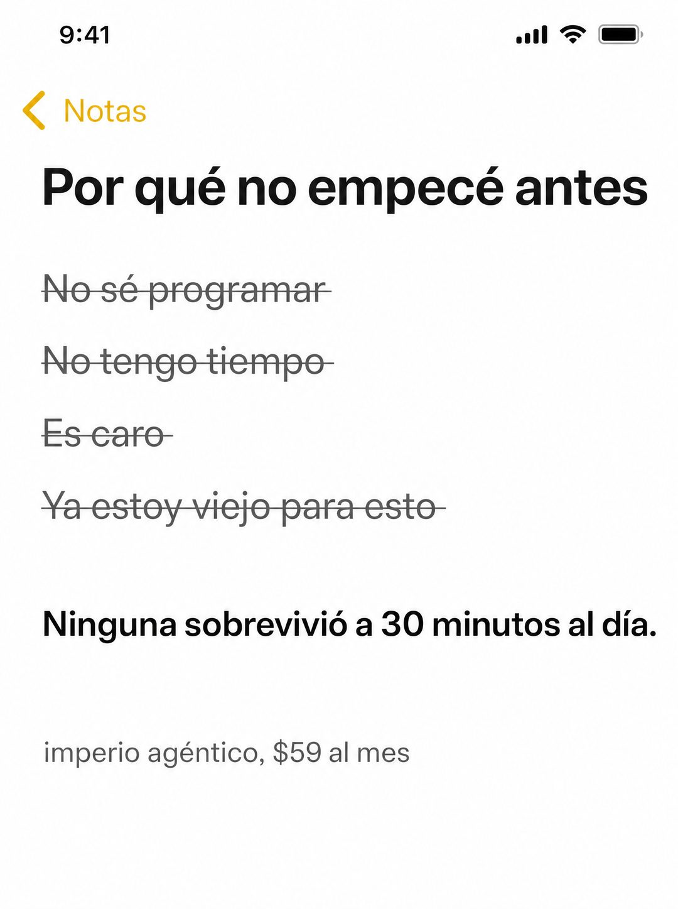

# 061 · Nota de excusas tachadas (Apple Notes)

**Familia:** Interfaz creíble · **Necesitas:** Nada · **Resultado en Meta:** $10 invertidos, 0 compras (cuenta de Imperio, sep 2026) (muestra chica)



## Qué es
Una nota del iPhone en modo claro con un título en primera persona y las cuatro excusas típicas de tu cliente, todas tachadas. Debajo, una sola línea en negrita dice qué las derribó.

## Por qué funciona
Responde las objeciones antes de que el lector las piense, y con su propia voz: son sus excusas, escritas como él las diría. El remate baja la fricción con una entrada chica y concreta ('30 minutos al día') en vez de una promesa grande.

## Cuándo usarlo
Público tibio o remarketing: gente que ya te conoce y sigue postergando. Sirve para cursos, gimnasios, servicios y cualquier compra que se aplaza con excusas; el objetivo es responder objeciones.

## Así lo hicimos para Imperio
- **Texto en la imagen:** 9:41 / Notas / Por qué no empecé antes / No sé programar / No tengo tiempo / Es caro / Ya estoy viejo para esto (las cuatro tachadas, en gris) / Ninguna sobrevivió a 30 minutos al día. / imperio agéntico, $59 al mes (gris, abajo)
- **Texto principal:**
  > Las cuatro excusas son las mismas para todos. Yo las usé dos años.
  >
  > Ninguna sobrevive a 30 minutos al día con alguien que te revisa lo que construiste. Adentro hay gente de 49 que jamás tocó código y ya automatizó su semana.
  >
  > $59 al mes 👇
- **Titular:** Imperio Agéntico · $59 al mes

## Receta para tu marca
- **Formato:** captura vertical de Notas del iPhone en modo claro, hora en la barra de estado y 'Notas' con flecha amarilla arriba a la izquierda.
- **Título:** [LA DUDA DE TU CLIENTE, EN PRIMERA PERSONA], en negrita negra y sin signos de pregunta.
- **Excusas:** cuatro líneas grises tachadas: [EXCUSA DE CAPACIDAD] / [EXCUSA DE TIEMPO] / [EXCUSA DE PRECIO] / [EXCUSA DE EDAD O DE MOMENTO].
- **Remate:** una línea en negrita negra, sin tachar: Ninguna sobrevivió a [TU ENTRADA MÁS CHICA Y CONCRETA].
- **Marca:** [TU MARCA], [TU PRECIO] en gris chico al pie.
- **Lo que no se toca:** las excusas tachadas y el remate limpio; sin logo, sin botón y sin colores de marca.

## Prompt con que se hizo el de Imperio (GPT Image 2.5)
```
[Nota: el de Imperio se generó con GPT Image 2 en 3:4. En GPT Image 2.5 pídelo en 4:5]
Vertical screenshot of the iPhone Notes app in LIGHT mode filling the frame: status bar, a yellow back chevron labelled 'Notas' at the top left. Inside the note, a bold black headline: 'Por qué no empecé antes'. Below, four lines each STRUCK THROUGH with a thin grey line, in grey text: 'No sé programar', 'No tengo tiempo', 'Es caro', 'Ya estoy viejo para esto'. Then a gap, then one line in plain bold black, not struck through: 'Ninguna sobrevivió a 30 minutos al día.' At the bottom of the note, a small grey line: 'imperio agéntico, $59 al mes'. Render every Spanish accent exactly. Authentic light mode notes app UI, nothing else in frame. No inverted punctuation, no em dashes.
```

## Ojo
- Usa las excusas que de verdad escuchas de tus clientes: si son inventadas, el lector no se reconoce.
- Si vas a hacer más de una nota, cambia la estructura (checklist, tareas tachadas, plan numerado) para que no compitan entre sí.
- Marca la casilla de contenido generado por IA en el Administrador de anuncios.
