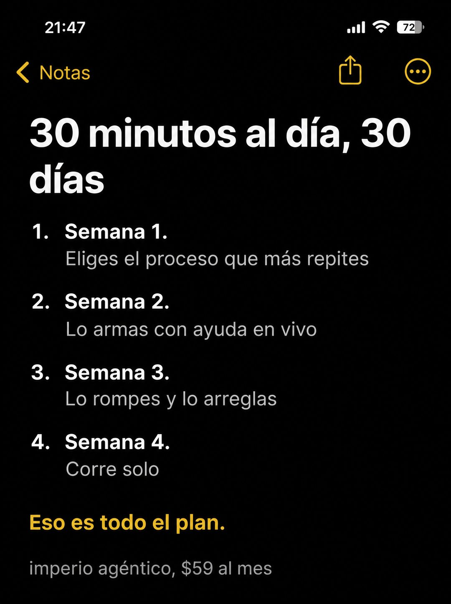

# 065 · Nota con plan numerado (Apple Notes)

**Familia:** Interfaz creíble · **Necesitas:** Nada · **Resultado en Meta:** $79 invertidos, 0 compras (cuenta de Imperio, sep 2026) (muestra chica)



## Qué es
Una nota del iPhone en modo oscuro con un plan de cuatro semanas, numerado, con una línea por semana. Cierra con una frase en amarillo que dice que no hay nada más.

## Por qué funciona
Un plan corto y concreto baja la fricción: el lector ve el camino entero y cuánto tiempo le pide al día. Incluir una semana para equivocarse ('Lo rompes y lo arreglas') lo vuelve creíble, porque nadie vende un plan perfecto.

## Cuándo usarlo
Público tibio que ya quiere empezar pero no sabe por dónde. Sirve para cursos, programas, entrenamientos, tratamientos y servicios por etapas; el objetivo es bajar la fricción de entrada.

## Así lo hicimos para Imperio
- **Texto en la imagen:** 21:47 / Notas / 30 minutos al día, 30 días / 1. Semana 1. Eliges el proceso que más repites / 2. Semana 2. Lo armas con ayuda en vivo / 3. Semana 3. Lo rompes y lo arreglas / 4. Semana 4. Corre solo / Eso es todo el plan. (amarillo) / imperio agéntico, $59 al mes (gris, abajo)
- **Texto principal:**
  > Semana 1 eliges el proceso. Semana 2 lo armas con ayuda en vivo. Semana 3 lo rompes y lo arreglas. Semana 4 corre solo.
  >
  > Ese es todo el plan. Sin promesas raras y sin garantías de resultado que nadie puede cumplir.
  >
  > $59 al mes 👇
- **Titular:** Imperio Agéntico · $59 al mes

## Receta para tu marca
- **Formato:** captura vertical de Notas del iPhone en modo oscuro, con la hora, 'Notas' con flecha amarilla y los botones de compartir y opciones.
- **Título:** [TIEMPO AL DÍA], [DURACIÓN TOTAL], en negrita blanca grande.
- **Plan:** cuatro ítems numerados, cada uno con la etapa en negrita y una línea gris debajo: [ETAPA 1: QUÉ ELIGE] / [ETAPA 2: QUÉ ARMA Y CON QUIÉN] / [ETAPA 3: DÓNDE SE EQUIVOCA Y LO CORRIGE] / [ETAPA 4: EL RESULTADO].
- **Cierre:** una línea en amarillo: 'Eso es todo el plan.' o [TU VERSIÓN].
- **Marca:** [TU MARCA], [TU PRECIO] en gris chico al pie.
- **Lo que no se toca:** el tiempo diario chico en el título y la etapa de error; sin logo ni colores de marca.

## Prompt con que se hizo el de Imperio (GPT Image 2.5)
```
[Nota: el de Imperio se generó con GPT Image 2 en 3:4. En GPT Image 2.5 pídelo en 4:5]
Vertical screenshot of the iPhone Notes app in DARK mode filling the frame: status bar, a yellow back chevron labelled 'Notas' at the top left. Inside the note, a bold white headline across two lines: '30 minutos al día, 30 días'. Below, a numbered list in white text with grey sub-lines, laid out with clear spacing: 'Semana 1. Eliges el proceso que más repites', 'Semana 2. Lo armas con ayuda en vivo', 'Semana 3. Lo rompes y lo arreglas', 'Semana 4. Corre solo'. Then a gap and one line in yellow: 'Eso es todo el plan.' At the bottom, a small grey line: 'imperio agéntico, $59 al mes'. Render every Spanish accent exactly. Authentic dark mode notes app UI. No inverted punctuation, no em dashes.
```

## Ojo
- El plan tiene que ser el que de verdad sigue tu cliente: no prometas plazos ni resultados que no puedes cumplir.
- Si vas a hacer más de una nota, cambia la estructura (checklist, tareas tachadas, plan numerado) para que no compitan entre sí.
- Marca la casilla de contenido generado por IA en el Administrador de anuncios.
