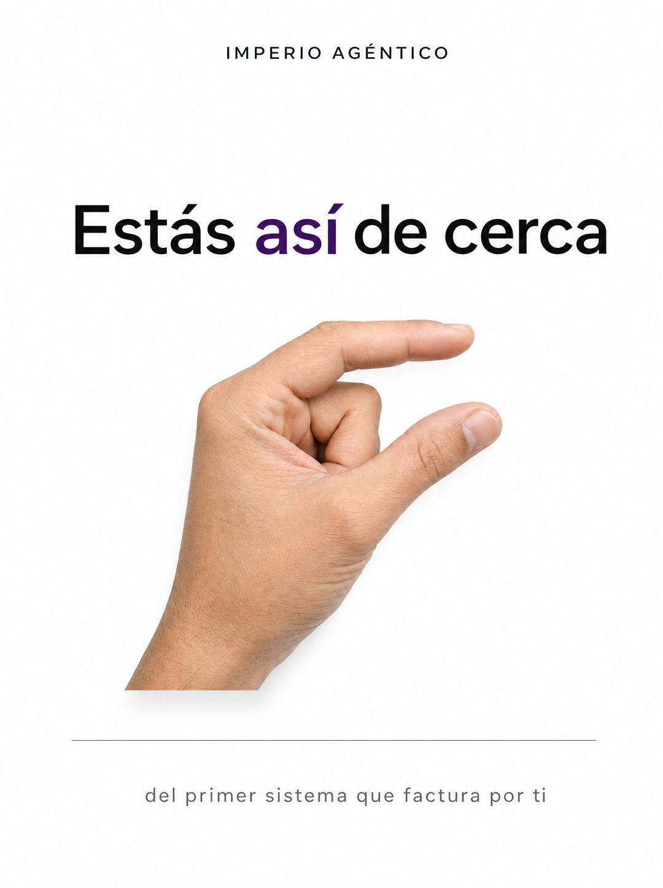

# 066 · Frase y gesto de mano (Script)

**Familia:** Tipografía dura · **Necesitas:** Nada · **Resultado en Meta:** $52 invertidos, 0 compras (cuenta de Imperio, sep 2026) (muestra chica)



## Qué es
Un anuncio minimalista sobre fondo blanco: una frase grande, la foto recortada de una mano haciendo el gesto de 'así de poquito' y una línea chica que completa la idea. Nada más.

## Por qué funciona
El gesto se entiende antes de leer y la frase lo confirma: el lector siente que le falta poco. El espacio vacío lo hace parecer campaña de agencia y no anuncio recargado, y la línea de abajo aterriza la idea en algo concreto que vendes.

## Cuándo usarlo
Público tibio o remarketing: gente que ya sabe qué vendes y cree que le falta mucho. Sirve para casi cualquier negocio; el objetivo es bajar la fricción y empujar la decisión.

## Así lo hicimos para Imperio
- **Texto en la imagen:** IMPERIO AGÉNTICO (mayúsculas chicas y espaciadas, arriba al centro) / Estás así de cerca ('así' en morado) / del primer sistema que factura por ti (gris, bajo una línea fina)
- **Texto principal:**
  > No te falta más información. Te falta terminar una sola cosa.
  >
  > Adentro eliges un proceso, lo armas con ayuda en vivo y lo dejas corriendo. La mediana por proyecto es $1.000.
  >
  > $59 al mes 👇
- **Titular:** Imperio Agéntico · $59 al mes

## Receta para tu marca
- **Formato:** vertical, fondo blanco limpio y mucho espacio vacío.
- **Marca:** [TU MARCA] en mayúsculas chicas y espaciadas, arriba al centro.
- **Titular:** 'Estás así de cerca' en negro, con 'así' en [TU COLOR DE MARCA].
- **Imagen:** foto de una mano recortada sobre el blanco, pulgar e índice apenas separados, piel natural y sombra suave.
- **Remate:** una línea fina y debajo, en gris chico: [DE QUÉ RESULTADO ESTÁ CERCA TU CLIENTE, EN 7 PALABRAS].
- **Lo que no se toca:** una frase, un gesto y un solo color de acento; nada de botón, precio ni íconos.

## Prompt con que se hizo el de Imperio (GPT Image 2.5)
```
[Nota: el de Imperio se generó con GPT Image 2 en 3:4. En GPT Image 2.5 pídelo en 4:5]
Vertical minimal ad on a clean white background with generous empty space. At the top center, a small dark wordmark [TU MARCA: logo y nombre]. In the upper middle, a large headline in black sans with one word in deep purple: 'Estás' then 'así' in purple then 'de cerca'. Below the headline, a photograph of a hand cut out over the white, thumb and index finger held a tiny distance apart in the classic 'this close' gesture, natural skin, soft shadow. At the bottom, a thin hairline rule and a single small grey line: 'del primer sistema que factura por ti'. Render every Spanish accent exactly. Extremely restrained agency-style layout, nothing else in frame. No inverted punctuation, no em dashes.
```

## Ojo
- Si sale texto roto, manos deformes o cifras mal escritas, se rehace.
- El remate tiene que nombrar un resultado concreto: si queda en una frase bonita sin promesa, el anuncio no dice nada.
- Marca la casilla de contenido generado por IA en el Administrador de anuncios.
