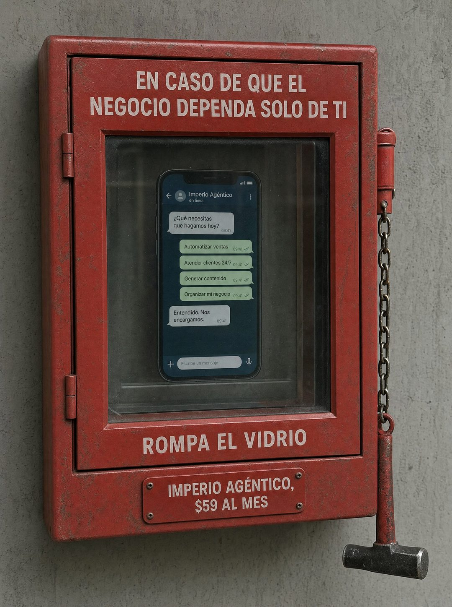

# 067 · Caja de emergencia con vidrio (Emergency)

**Familia:** Objeto físico con texto · **Necesitas:** Nada · **Resultado en Meta:** $5 invertidos, 0 compras (cuenta de Imperio, sep 2026) (muestra chica)



## Qué es
La foto de una caja roja de emergencia en una pared de concreto, con el letrero de las de incendio adaptado al dolor de tu cliente: detrás del vidrio, en vez de la llave, está tu producto. Un martillo cuelga de una cadena al costado.

## Por qué funciona
Convierte el miedo del cliente (que todo dependa de él) en una emergencia visible con una salida obvia. Es un objeto real con letrero industrial, se lee como algo fotografiado en el mundo y no como diseño, y esa rareza frena el scroll.

## Cuándo usarlo
Público frío, para frenar el scroll con un dolor fuerte. Sirve para negocios que venden respaldo o tranquilidad: automatización, soporte, seguros, mantenimiento, asistentes.

## Así lo hicimos para Imperio
- **Texto en la imagen:** EN CASO DE QUE EL NEGOCIO DEPENDA SOLO DE TI / Teléfono detrás del vidrio: Imperio Agéntico, en linea / Qué necesitas que hagamos hoy? / Automatizar ventas / Atender clientes 24/7 / Generar contenido / Organizar mi negocio / Entendido. Nos encargamos. / ROMPA EL VIDRIO / Placa: IMPERIO AGÉNTICO, $59 AL MES
- **Texto principal:**
  > Si mañana te enfermas una semana, tu negocio factura o se detiene.
  >
  > Esa es la pregunta que ordena todo lo demás. Glenda la resolvió y lo escribió así: mi hostal funciona solo.
  >
  > +3.300 personas construyendo lo mismo, en español. $59 al mes 👇
- **Titular:** Imperio Agéntico · $59 al mes

## Receta para tu marca
- **Escena:** caja roja de emergencia atornillada a una pared de concreto, foto de frente, algo gastada, con un martillo colgando de una cadena.
- **Arriba del vidrio:** mayúsculas blancas: EN CASO DE QUE [EL DOLOR DE TU CLIENTE EN 8 PALABRAS].
- **Detrás del vidrio:** [TU PRODUCTO O UN TELÉFONO CON TU SERVICIO EN PANTALLA].
- **Abajo:** 'ROMPA EL VIDRIO' en mayúsculas y, en una placa atornillada, [TU MARCA], [TU PRECIO].
- **Lo que no se toca:** el rojo de emergencia y la orden de las cajas reales; tu marca solo en la placa.

## Prompt con que se hizo el de Imperio (GPT Image 2.5)
```
[Nota: el de Imperio se generó con GPT Image 2 en 3:4. En GPT Image 2.5 pídelo en 4:5]
Vertical photograph of a red emergency break-glass box mounted on a plain concrete wall, shot straight on, realistic and slightly worn. Behind the glass, instead of a fire key, there is a small smartphone showing a chat interface. Printed on the metal frame above the glass in white caps: 'EN CASO DE QUE EL NEGOCIO DEPENDA SOLO DE TI'. Printed below the glass in smaller caps: 'ROMPA EL VIDRIO'. On a small plate at the very bottom: 'IMPERIO AGÉNTICO, $59 AL MES'. A tiny hammer hangs on a chain beside the box. Render every Spanish accent exactly. Photoreal, industrial, authentic signage. No inverted punctuation, no em dashes.
```

## Ojo
- En el ejemplo de Imperio se colaron signos de apertura en el texto: pide en el prompt que no aparezcan.
- Si la pantalla muestra un chat, que sea una demostración de tu producto y no la conversación de un cliente real.
- Marca la casilla de contenido generado por IA en el Administrador de anuncios.
