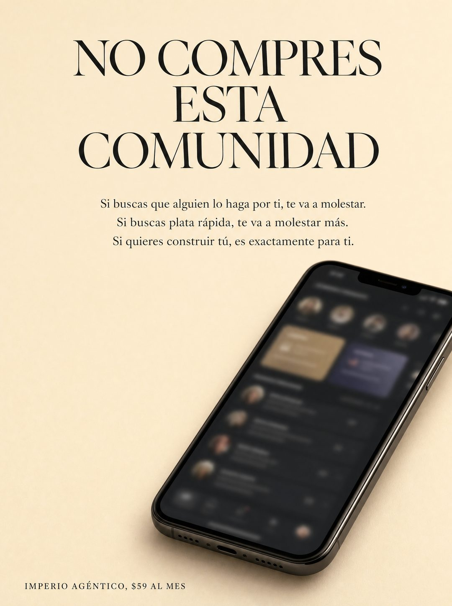

# 068 · No compres esto (Don't buy this)

**Familia:** Tipografía dura · **Necesitas:** Nada. Una captura de tu producto ayuda, aunque va desenfocada · **Resultado en Meta:** $6 invertidos, 0 compras (cuenta de Imperio, sep 2026) (muestra chica)



## Qué es
Una anti-venta en tipografía editorial: un titular serif enorme que le pide al lector no comprar, tres líneas que separan a quién no le sirve de a quién sí, y un teléfono con tu producto desenfocado.

## Por qué funciona
No es normal ver a una marca pidiendo que no le compren, y esa curiosidad engancha. Al decir para quién no es, el que se queda siente que lo eligieron, y la promesa se vuelve creíble porque no le habla a todo el mundo.

## Cuándo usarlo
Público frío o tibio, cuando quieres filtrar curiosos y atraer al cliente que sí va a hacer el trabajo. Sirve para cursos, comunidades, servicios premium y productos que exigen compromiso.

## Así lo hicimos para Imperio
- **Texto en la imagen:** NO COMPRES ESTA COMUNIDAD / Si buscas que alguien lo haga por ti, te va a molestar. / Si buscas plata rápida, te va a molestar más. / Si quieres construir tú, es exactamente para ti. / [teléfono con la app totalmente desenfocada, sin texto legible] / IMPERIO AGÉNTICO, $59 AL MES (mayúsculas chicas, abajo a la izquierda)
- **Texto principal:**
  > Va en serio. Si esperas que alguien lo haga por ti, esto te va a molestar.
  >
  > Acá se construye 30 minutos al día, con 5 sesiones en vivo por semana para cuando te trabas.
  >
  > Si eso te suena bien, $59 al mes 👇
- **Titular:** Imperio Agéntico · $59 al mes

## Receta para tu marca
- **Formato:** fondo crema cálido y aire de marca de belleza aplicado a tu rubro.
- **Titular:** serif negra enorme en tres líneas: NO COMPRES / [ESTE O ESTA] / [TU PRODUCTO].
- **Filtro:** tres líneas cortas centradas: Si buscas [LO QUE TU PRODUCTO NO HACE], te va a molestar. / Si buscas [EL ATAJO QUE NO EXISTE], te va a molestar más. / Si quieres [LO QUE HACE TU CLIENTE IDEAL], es exactamente para ti.
- **Imagen:** abajo a la derecha, un teléfono en ángulo con la pantalla de tu producto totalmente desenfocada.
- **Marca:** [TU MARCA], [TU PRECIO] en mayúsculas chicas, abajo a la izquierda.
- **Lo que no se toca:** la tercera línea es la única que invita; la pantalla no puede tener nada legible.

## Prompt con que se hizo el de Imperio (GPT Image 2.5)
```
[Nota: el de Imperio se generó con GPT Image 2 en 3:4. En GPT Image 2.5 pídelo en 4:5]
Vertical ad on a warm cream background, editorial and calm. Centered at the top, a large headline in black serif stacked across three lines: 'NO COMPRES' 'ESTA' 'COMUNIDAD'. Below it, a small dark paragraph in three short lines: 'Si buscas que alguien lo haga por ti, te va a molestar.' 'Si buscas plata rápida, te va a molestar más.' 'Si quieres construir tú, es exactamente para ti.' In the lower right corner, a photograph of a smartphone lying at an angle, its screen showing a dark app interface where all the content is HEAVILY BLURRED and completely unreadable, no legible names, no legible words, just soft shapes suggesting cards. At the bottom left, small caps: 'IMPERIO AGÉNTICO, $59 AL MES'. Critical: absolutely no readable text on the phone screen. Render every Spanish accent exactly. Premium beauty-brand typography applied to tech. No inverted punctuation, no em dashes.
```

## Ojo
- La pantalla va totalmente desenfocada: ningún nombre, foto ni dato de tus clientes puede leerse.
- Marca la casilla de contenido generado por IA en el Administrador de anuncios.
