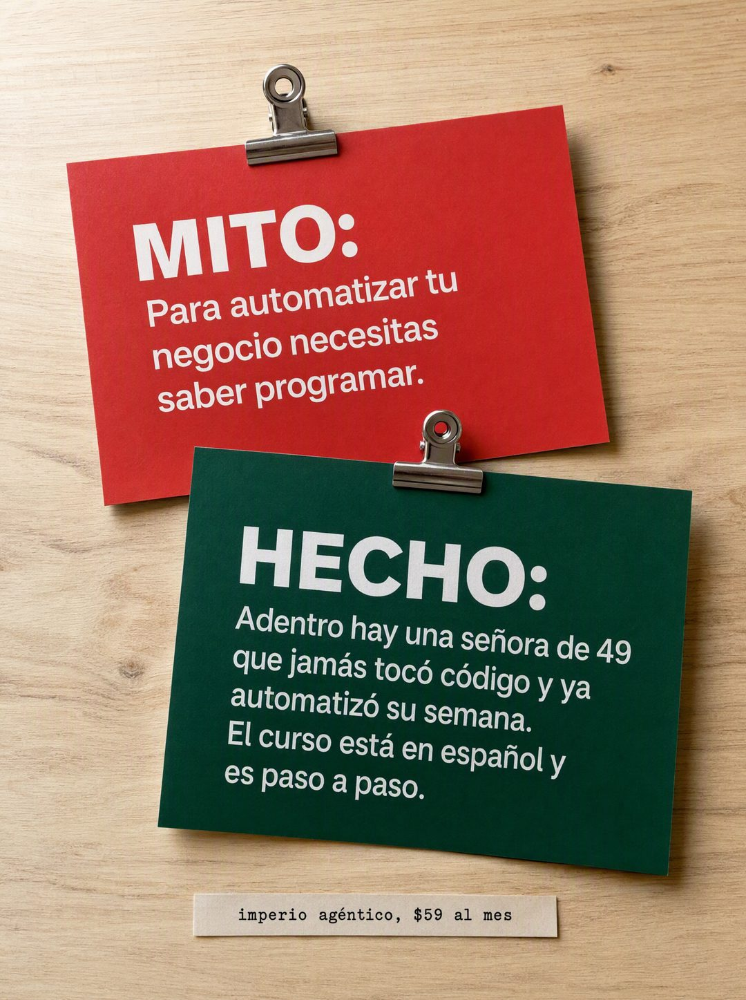

# 070 · Mito y hecho en tarjetas (Myth vs fact)

**Familia:** Objeto físico con texto · **Necesitas:** Nada · **Resultado en Meta:** Sin datos propios todavía



## Qué es
Dos tarjetas de cartulina sujetas con clips sobre un escritorio de madera, fotografiadas desde arriba: la roja dice el mito que frena a tu cliente y la verde lo desmiente con un hecho.

## Por qué funciona
Nombra en voz alta la creencia que bloquea la compra y la derriba con algo concreto, no con una opinión. Al ser tarjetas reales fotografiadas, se ve capturado del mundo y no hecho en Canva.

## Cuándo usarlo
Público frío o tibio frenado por una creencia falsa sobre tu rubro (es caro, es difícil, no es para mí). Sirve para casi cualquier negocio; el objetivo es responder la objeción principal.

## Así lo hicimos para Imperio
- **Texto en la imagen:** MITO: / Para automatizar tu negocio necesitas saber programar. (tarjeta roja) / HECHO: / Adentro hay una señora de 49 que jamás tocó código y ya automatizó su semana. El curso está en español y es paso a paso. (tarjeta verde) / imperio agéntico, $59 al mes (tira de papel con letra de máquina, abajo)
- **Texto principal:**
  > El mito es que necesitas saber programar. Lo repite todo el mundo y es falso.
  >
  > Adentro hay gente de 49 años que jamás tocó código y ya automatizó su semana. El curso está en español y es paso a paso.
  >
  > $59 al mes 👇

## Receta para tu marca
- **Escena:** foto cenital de un escritorio de madera clara con luz de día suave y dos tarjetas rectangulares con clips de metal, apenas superpuestas.
- **Tarjeta roja (arriba):** 'MITO:' en blanco grande y debajo [LA CREENCIA QUE FRENA A TU CLIENTE].
- **Tarjeta verde (abajo):** 'HECHO:' en blanco grande y debajo [EL DATO O CASO VERIFICABLE QUE LA DESMIENTE] + [CÓMO LO RESUELVE TU PRODUCTO].
- **Marca:** tira de papel con letra de máquina de escribir: [TU MARCA], [TU PRECIO].
- **Lo que no se toca:** rojo para el mito y verde para el hecho; el hecho más largo y más concreto que el mito.

## Prompt con que se hizo el de Imperio (GPT Image 2.5)
```
[Nota: el de Imperio se generó con GPT Image 2 en 3:4. En GPT Image 2.5 pídelo en 4:5]
Vertical ad photographed from above: a light wooden desk surface with two rectangular cards pinned to it with small metal clips, slightly overlapping. The upper card is red with white text, headed 'MITO:' and below it in smaller white text: 'Para automatizar tu negocio necesitas saber programar.' The lower card is deep green with white text, headed 'HECHO:' and below it in smaller white text: 'Adentro hay una señora de 49 que jamás tocó código y ya automatizó su semana. El curso está en español y es paso a paso.' At the bottom of the frame on the wood, a small printed label: 'imperio agéntico, $59 al mes'. Render every Spanish accent exactly. Clean product photography, soft daylight. No inverted punctuation, no em dashes.
```

## Ojo
- El HECHO tiene que ser verdadero y verificable: si citas el caso de un cliente, que sea real y con su permiso.
- Marca la casilla de contenido generado por IA en el Administrador de anuncios.
