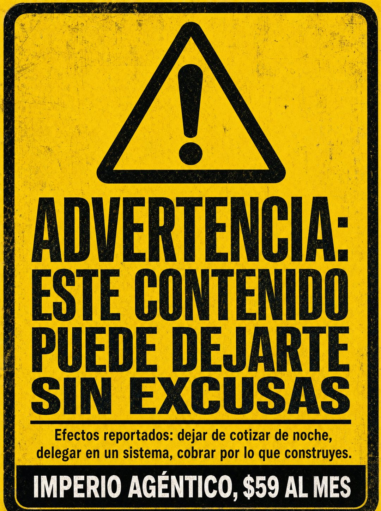

# 071 · Etiqueta de advertencia industrial (Warning)

**Familia:** Objeto físico con texto · **Necesitas:** Nada · **Resultado en Meta:** $15 invertidos, 0 compras (cuenta de Imperio, sep 2026) (muestra chica)



## Qué es
Una etiqueta de peligro industrial a pantalla completa: fondo amarillo, borde negro, triángulo de advertencia y un titular que avisa del 'riesgo' de comprarte. Debajo, la lista de efectos y tu marca en una banda negra.

## Por qué funciona
El amarillo y negro de seguridad está hecho para que el ojo se detenga, y advertir sobre un beneficio genera curiosidad. Los 'efectos' son resultados concretos que el lector quiere tener, dichos sin sonar a promesa.

## Cuándo usarlo
Público frío, para frenar el scroll. Sirve para cualquier negocio con resultados que se puedan decir como efecto secundario: cursos, software, servicios, productos de bienestar.

## Así lo hicimos para Imperio
- **Texto en la imagen:** ADVERTENCIA: ESTE CONTENIDO PUEDE DEJARTE SIN EXCUSAS (bajo un triángulo de advertencia) / Efectos reportados: dejar de cotizar de noche, delegar en un sistema, cobrar por lo que construyes. / IMPERIO AGÉNTICO, $59 AL MES (banda negra, abajo)
- **Texto principal:**
  > Efectos reportados: dejar de cotizar de noche, delegar en un sistema, cobrar por lo que construyes.
  >
  > No es para todos. Si vienes a mirar, no entres.
  >
  > +3.300 ya están adentro. $59 al mes 👇
- **Titular:** Imperio Agéntico · $59 al mes

## Receta para tu marca
- **Formato:** etiqueta de advertencia que llena todo el cuadro, amarillo intenso con borde negro grueso y textura de impresión gastada.
- **Ícono:** triángulo negro grande con signo de exclamación, arriba al centro.
- **Titular:** mayúsculas negras condensadas: ADVERTENCIA: [TU PRODUCTO] PUEDE [EL CAMBIO QUE PROVOCA, DICHO COMO RIESGO].
- **Texto:** una línea fina y debajo, en negro chico: Efectos [REPORTADOS O SECUNDARIOS]: [EFECTO 1], [EFECTO 2], [EFECTO 3].
- **Marca:** banda negra al pie con [TU MARCA], [TU PRECIO] en mayúsculas blancas.
- **Lo que no se toca:** el amarillo y negro de seguridad, y el beneficio dicho como advertencia, nunca como promesa directa.

## Prompt con que se hizo el de Imperio (GPT Image 2.5)
```
[Nota: el de Imperio se generó con GPT Image 2 en 3:4. En GPT Image 2.5 pídelo en 4:5]
Vertical ad designed as a hazard warning label, filling the frame: a bright yellow background with a thick black border and a large black warning triangle containing an exclamation mark at the top. Below the triangle, bold black condensed caps across three lines: 'ADVERTENCIA: ESTE CONTENIDO PUEDE DEJARTE SIN EXCUSAS'. Then a thin black rule, then smaller black text in two lines: 'Efectos reportados: dejar de cotizar de noche, delegar en un sistema, cobrar por lo que construyes.' At the bottom inside a black band, white caps: 'IMPERIO AGÉNTICO, $59 AL MES'. Render every Spanish accent exactly. Authentic industrial hazard label design, slightly worn print texture. No inverted punctuation, no em dashes.
```

## Ojo
- Escribe 'efectos reportados' solo si tus clientes de verdad te los han contado; si no, usa 'efectos secundarios'.
- Marca la casilla de contenido generado por IA en el Administrador de anuncios.
