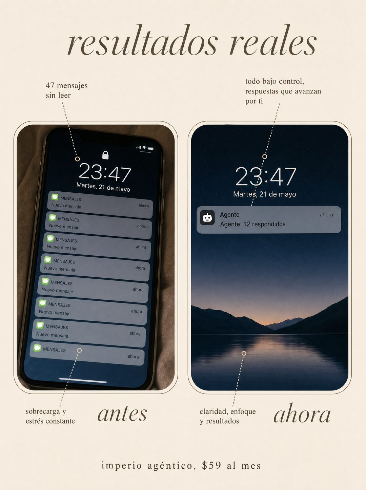

# 073 · Antes y ahora con anotaciones (Transformation)

**Familia:** Diagrama y dato · **Necesitas:** Tus cifras reales de antes y después · **Resultado en Meta:** Sin datos propios todavía



## Qué es
Un antes y después al estilo de los anuncios de cuidado de la piel: dos paneles lado a lado con la misma escena, el problema a la izquierda y la calma a la derecha, con líneas punteadas que señalan los detalles. En el ejemplo, un teléfono lleno de mensajes sin leer contra uno con una sola notificación del agente.

## Por qué funciona
El ojo compara dos imágenes casi iguales más rápido de lo que lee un párrafo, y las anotaciones le dicen dónde mirar. Las cifras en las dos escenas hacen que el cambio se vea medible y no solo prometido.

## Cuándo usarlo
Público frío o tibio, para mostrar el resultado de tu producto. Sirve para servicios, software y cualquier negocio con un antes y un después visible.

## Así lo hicimos para Imperio
- **Texto en la imagen:** resultados reales / 47 mensajes sin leer / todo bajo control, respuestas que avanzan por ti / [teléfono de antes: 23:47, Martes, 21 de mayo, con 8 notificaciones 'MENSAJES, Nuevo mensaje, ahora'] / [teléfono de ahora: 23:47, Martes, 21 de mayo] / Agente: 12 respondidos (única notificación) / sobrecarga y estrés constante / antes / claridad, enfoque y resultados / ahora / imperio agéntico, $59 al mes
- **Texto principal:**
  > 47 mensajes sin responder contra 12 respondidos por un agente mientras dormías.
  >
  > No es un truco. Es un flujo conectado a tu WhatsApp y a tu calendario, y el curso está adentro.
  >
  > Vincent cobró $750 por construir uno. $59 al mes 👇

## Receta para tu marca
- **Formato:** fondo neutro suave; arriba, en serif itálica, [TU TITULAR DE RESULTADO].
- **Paneles:** dos rectángulos redondeados lado a lado con borde fino: a la izquierda [LA ESCENA DEL PROBLEMA] y a la derecha [LA MISMA ESCENA RESUELTA CON TU PRODUCTO].
- **Anotaciones:** líneas punteadas hacia los detalles, con texto chico: [TU CIFRA REAL DE ANTES] / [TU CIFRA REAL DE AHORA] / [CÓMO SE VIVÍA ANTES] / [CÓMO SE VIVE AHORA].
- **Etiquetas:** 'antes' y 'ahora' en serif itálica grande bajo cada panel.
- **Marca:** [TU MARCA], [TU PRECIO] en letra chica centrada abajo.
- **Lo que no se toca:** la misma escena en los dos lados, para que la única diferencia sea el resultado.

## Prompt con que se hizo el de Imperio (GPT Image 2.5)
```
[Nota: el de Imperio se generó con GPT Image 2 en 3:4. En GPT Image 2.5 pídelo en 4:5]
Vertical before-and-after ad on a soft neutral background. At the top, elegant italic serif text: 'resultados reales'. Below, two rounded rectangular panels side by side, each framed with a thin line. The left panel is labelled 'antes' underneath and shows a photograph of a phone screen at night with 47 unread message notifications stacked up, dense and stressful. The right panel is labelled 'ahora' underneath and shows the same phone screen clean and empty with a single notification reading 'Agente: 12 respondidos'. Thin dotted callout lines point at details in each panel, like a skincare before-after ad. At the bottom, small centered text: 'imperio agéntico, $59 al mes'. Render every Spanish accent exactly. No inverted punctuation, no em dashes.
```

## Ojo
- Nunca inventes testimonios, chats de clientes, reseñas ni capturas de resultados: si el formato muestra prueba social, usa material real o déjalo fuera.
- Si el titular dice 'resultados reales', las cifras tienen que salir de un caso que puedas mostrar; si son ilustrativas, cambia el titular.
- Marca la casilla de contenido generado por IA en el Administrador de anuncios.
