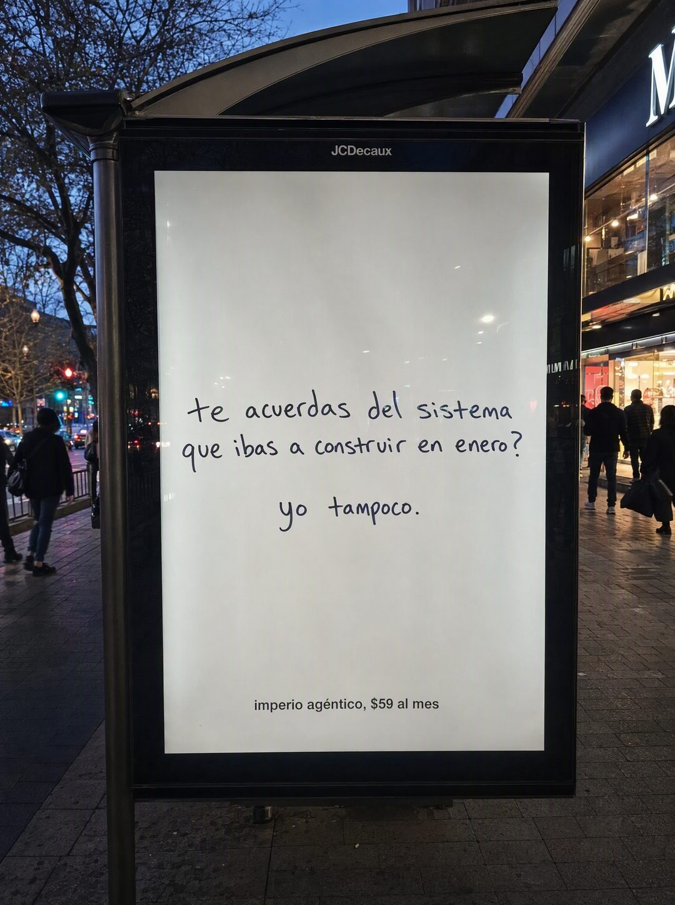

# 074 · Valla de calle escrita a mano (Whiteboard)

**Familia:** Objeto físico con texto · **Necesitas:** Nada · **Resultado en Meta:** $9 invertidos, 0 compras (cuenta de Imperio, sep 2026) (muestra chica)



## Qué es
La foto de un panel publicitario iluminado junto a una parada de bus, al atardecer, con un póster blanco que solo tiene una pregunta escrita a mano con marcador y una respuesta corta debajo.

## Por qué funciona
Parece una foto tomada en la calle y no un anuncio del feed, y la letra a mano se siente como una persona hablándote. La pregunta toca una promesa que el lector se hizo y no cumplió, y el 'yo tampoco' lo vuelve cómplice en vez de retarlo.

## Cuándo usarlo
Público frío o remarketing, sobre todo en fechas de propósitos (enero, mitad de año, vuelta de vacaciones). Sirve para cursos, gimnasios y cualquier compra que se posterga; el objetivo es frenar el scroll.

## Así lo hicimos para Imperio
- **Texto en la imagen:** JCDecaux (marco del panel, arriba) / te acuerdas del sistema que ibas a construir en enero? / yo tampoco. / imperio agéntico, $59 al mes (letra impresa chica, abajo)
- **Texto principal:**
  > El que ibas a construir en enero. El de la nota que todavía tienes guardada.
  >
  > Adentro se construye en 30 minutos al día, con alguien revisando lo tuyo en vivo.
  >
  > +1.800 personas ya publicaron el suyo. $59 al mes 👇
- **Titular:** Imperio Agéntico · $59 al mes

## Receta para tu marca
- **Escena:** foto de calle al atardecer: panel publicitario iluminado junto a una parada de bus, transeúntes desenfocados y reflejos en el vidrio.
- **Póster:** fondo blanco liso con una pregunta escrita a mano con marcador negro, en minúsculas: [LA PROMESA QUE TU CLIENTE SE HIZO Y NO CUMPLIÓ, COMO PREGUNTA]; debajo, más chico: [UNA RESPUESTA DE 2 PALABRAS].
- **Marca:** una línea impresa chica al pie del póster: [TU MARCA], [TU PRECIO].
- **Colores:** los de la calle; el póster sin colores de marca.
- **Lo que no se toca:** la letra a mano, nunca tipografía; solo el signo de pregunta de cierre; el panel sin logos de empresas reales.

## Prompt con que se hizo el de Imperio (GPT Image 2.5)
```
[Nota: el de Imperio se generó con GPT Image 2 en 3:4. En GPT Image 2.5 pídelo en 4:5]
Vertical street photograph of a real backlit digital advertising panel on a city sidewalk at dusk, the kind mounted beside a bus stop, with blurred passers-by and shop lights behind it. The panel shows a plain white poster with a single line of casual handwritten marker text across the middle: 'te acuerdas del sistema que ibas a construir en enero?'. Below it, in smaller handwriting: 'yo tampoco.' At the bottom of the poster, a small clean printed line: 'imperio agéntico, $59 al mes'. Realistic out-of-home advertising photograph, reflections on the glass, natural evening light. The question uses only a closing question mark, never an opening inverted one. Render every Spanish accent exactly. No em dashes.
```

## Ojo
- Pide en el prompt que el panel no lleve marcas: en el ejemplo de Imperio apareció el nombre de una empresa real de publicidad exterior.
- Marca la casilla de contenido generado por IA en el Administrador de anuncios.
