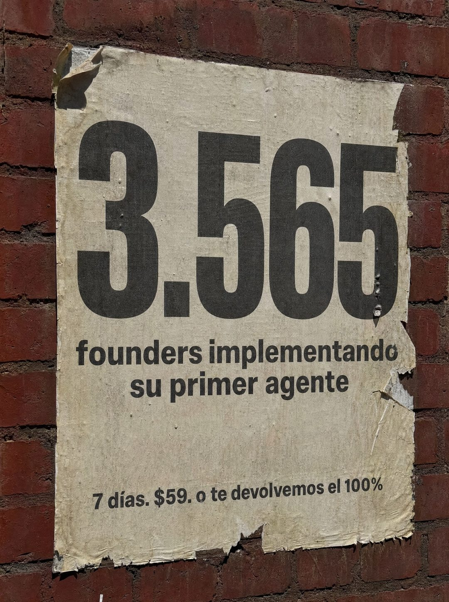

# 075 · Cartel pegado con tu cifra

**Familia:** Objeto físico con texto · **Necesitas:** Tu cifra real de clientes o usuarios activos · **Resultado en Meta:** Sin datos propios todavía



## Qué es
Un póster de papel pegado en una pared de ladrillo, gastado y medio roto, con una cifra gigante, una línea que explica qué cuenta y la oferta en letra chica.

## Por qué funciona
Un número enorme sin adornos afirma algo concreto y se lee en un segundo. Es tu propia cifra, no una autoridad prestada, y el cartel gastado en la calle se ve capturado del mundo, no hecho en Canva.

## Cuándo usarlo
Público frío, para mostrar prueba con un dato propio sin pelear por precio. Sirve para cualquier negocio con una cifra que impresione: clientes, pedidos, alumnos, años en el rubro.

## Así lo hicimos para Imperio
- **Texto en la imagen:** 3.565 / founders implementando su primer agente / 7 días. $59. o te devolvemos el 100%
- **Texto principal:**
  > 3.565 personas ya están montando su primer agente.
  >
  > No es una lista de espera. Es gente implementando.
  >
  > En 7 días sales con el agente andando, o te devolvemos el 100%. $59 al mes 👇
- **Titular:** 3.565 ya lo están montando

## Receta para tu marca
- **Escena:** foto de un póster de papel crema pegado en una pared de ladrillo rojo, con bordes rotos, una esquina levantada y luz de sol dura.
- **Cifra:** [TU CIFRA REAL] en negro condensado gigante, ocupando el tercio de arriba.
- **Explicación:** dos líneas en negrita: [QUIÉNES SON] [QUÉ ESTÁN HACIENDO CON TU PRODUCTO].
- **Oferta:** una línea chica abajo: [PLAZO]. [TU PRECIO]. [TU GARANTÍA].
- **Lo que no se toca:** la cifra es lo único grande; sin logo y sin colores de marca, solo tinta negra sobre papel gastado.

## Prompt con que se hizo el de Imperio (GPT Image 2.5)
```
[Prompt reconstruido mirando la imagen: el original de Imperio no quedó guardado]
Photorealistic street photo, vertical. A weathered cream-colored paper poster pasted flat onto an old red brick wall, shot almost straight on in hard direct sunlight with crisp shadows along the torn edges. The paper is wrinkled and stained, with ragged torn borders, the top left corner peeling and folded over, and a ripped strip along the right edge that shows the bricks underneath. Everything is printed in heavy black ink and centered, from top to bottom: a giant bold condensed number '3.565' filling the upper third of the sheet; below it, two lines of bold black sans-serif reading 'founders implementando' and 'su primer agente'; near the bottom, one smaller bold line reading '7 días. $59. o te devolvemos el 100%'. The ink is slightly faded and follows the paper grain, like a real street poster that has been on the wall for weeks. Vertical 4:5 Instagram/Facebook feed ad, sharp and professional. All on-image text is Spanish and must be rendered EXACTLY as written inside the quotes, with every accent and ñ correct and every digit exact. Never use inverted question marks or inverted exclamation marks. No em dashes. Do not add any other words, logos or watermarks.
```

## Ojo
- Imprime solo una cifra real y verificable: es la única prueba del anuncio y alguien la va a cuestionar.
- Si tu garantía tiene condiciones, no la reduzcas a 'o te devolvemos el 100%': escríbela completa o déjala fuera.
- Marca la casilla de contenido generado por IA en el Administrador de anuncios.
