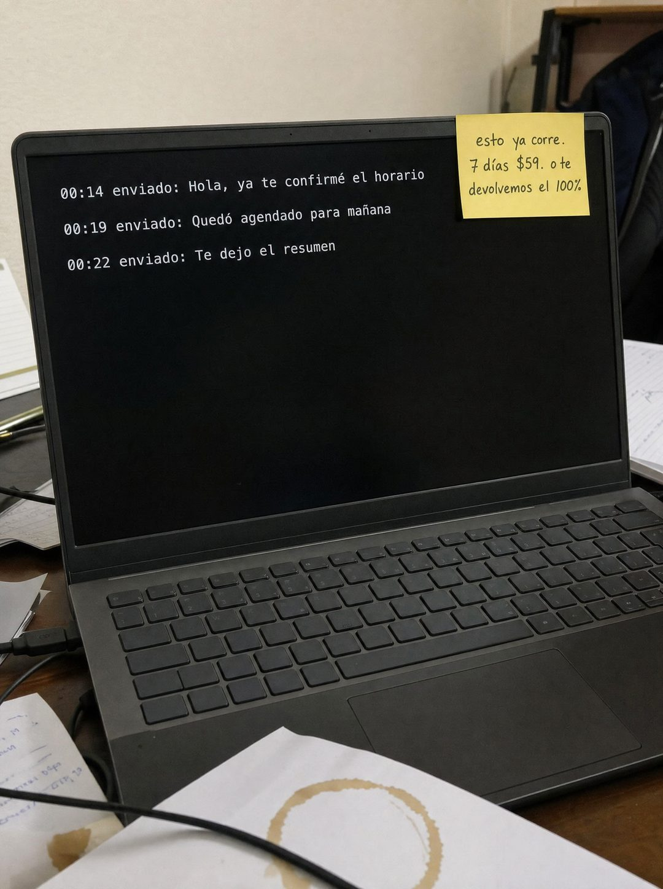

# 076 · Sistema corriendo con post-it

**Familia:** Foto nativa · **Necesitas:** Nada · **Resultado en Meta:** Sin datos propios todavía



## Qué es
Una foto casual de un escritorio desordenado de noche: un laptop con la pantalla negra donde se ve el registro de lo que tu producto hizo solo, y un post-it amarillo en la esquina con la oferta escrita a mano.

## Por qué funciona
No parece anuncio: parece una foto que alguien sacó de su escritorio pasada la medianoche. Las horas del registro (00:14, 00:19, 00:22) muestran el producto trabajando mientras nadie lo mira, y el post-it hace toda la venta en tres líneas.

## Cuándo usarlo
Público frío cansado de anuncios producidos. Sirve para software, automatizaciones y cualquier negocio que pueda mostrar su producto funcionando en una pantalla o una máquina; el objetivo es mostrar el producto en uso.

## Así lo hicimos para Imperio
- **Texto en la imagen:** Pantalla: 00:14 enviado: Hola, ya te confirmé el horario / 00:19 enviado: Quedó agendado para mañana / 00:22 enviado: Te dejo el resumen / Post-it: esto ya corre. 7 días $59. o te devolvemos el 100% / [papeles con anotaciones a mano, ilegibles]
- **Texto principal:**
  > Este no es un prompt. Es un agente que ya responde.
  >
  > Mientras tú lees esto, el log sigue.
  >
  > Monta el tuyo en 7 días. $59 al mes 👇
- **Titular:** Esto ya corre

## Receta para tu marca
- **Escena:** foto vertical tipo celular de un escritorio real y algo desordenado, de noche: [TU PRODUCTO O LA PANTALLA DE TU SISTEMA] al centro, papeles con manchas de café y cables alrededor.
- **Pantalla:** fondo negro con tres líneas en letra monoespaciada: [HORA DE MADRUGADA] enviado: [ACCIÓN 1] / [HORA] enviado: [ACCIÓN 2] / [HORA] enviado: [ACCIÓN 3].
- **Post-it:** amarillo, pegado en la esquina de la pantalla, escrito a mano: [TU FRASE DE 3 PALABRAS]. [PLAZO] [TU PRECIO]. [TU GARANTÍA].
- **Colores:** los de la escena real; no agregues los colores de tu marca.
- **Lo que no se toca:** cero titular, cero logo, cero botón; toda la venta va en el post-it.

## Prompt con que se hizo el de Imperio (GPT Image 2.5)
```
[Prompt reconstruido mirando la imagen: el original de Imperio no quedó guardado]
Casual amateur smartphone photo, vertical, slightly tilted, taken late at night in a small home office under warm, dim indoor light. A plain dark grey laptop with no brand mark sits open on a cluttered wooden desk. Its screen is completely black and shows only three lines of white monospaced text in the upper left, like a terminal log: '00:14 enviado: Hola, ya te confirmé el horario', then '00:19 enviado: Quedó agendado para mañana', then '00:22 enviado: Te dejo el resumen'. The rest of the screen is empty black. A square yellow sticky note is stuck to the top right corner of the screen, handwritten in black marker in casual handwriting on three lines: 'esto ya corre.' / '7 días $59. o te' / 'devolvemos el 100%'. Around the laptop: loose white papers in the foreground with a brown coffee ring stain, a black cable crossing the desk, a notebook and pens on the left, and sheets with handwritten notes that are out of focus and completely illegible. Background: a beige wall and the back of a dark office chair, softly blurred. Realistic phone camera grain and slight noise. Vertical 4:5 Instagram/Facebook feed ad, sharp and professional. All on-image text is Spanish and must be rendered EXACTLY as written inside the quotes, with every accent and ñ correct and every digit exact. Never use inverted question marks or inverted exclamation marks. No em dashes. Do not add any other words, logos or watermarks.
```

## Ojo
- El registro de la pantalla es una demostración de tu producto: no muestres nombres ni datos de clientes reales.
- Si tu garantía tiene condiciones, no la reduzcas a 'o te devolvemos el 100%': escríbela completa o déjala fuera.
- Marca la casilla de contenido generado por IA en el Administrador de anuncios.
