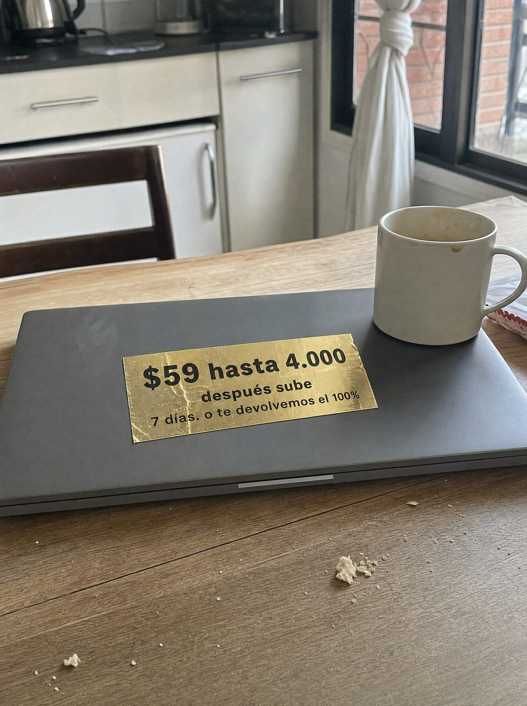

# 077 · Etiqueta dorada de precio congelado

**Familia:** Oferta y precio · **Necesitas:** Nada · **Resultado en Meta:** Sin datos propios todavía



## Qué es
Una foto casera de una mesa de cocina con un laptop cerrado, una taza a medio tomar y migas; sobre la tapa, una etiqueta dorada con el precio, hasta cuándo se mantiene y la garantía.

## Por qué funciona
La foto se ve tomada al pasar, no producida, así que el ojo no la salta. La etiqueta concentra la oferta en tres líneas y el 'después sube' da una razón concreta para decidir ahora sin inventar un descuento de 48 horas.

## Cuándo usarlo
Público tibio o remarketing que ya conoce tu producto y duda por el precio. Sirve para suscripciones, membresías y cualquier oferta con un precio que de verdad va a subir; el objetivo es empujar la compra.

## Así lo hicimos para Imperio
- **Texto en la imagen:** $59 hasta 4.000 / después sube / 7 días. o te devolvemos el 100% (etiqueta dorada pegada en la tapa del laptop)
- **Texto principal:**
  > $59 se queda en $59 hasta los 4.000.
  >
  > No es un descuento de 48 horas. Es el precio que congelas al entrar.
  >
  > Primer agente en 7 días. $59 al mes 👇
- **Titular:** $59 hasta los 4.000

## Receta para tu marca
- **Escena:** foto vertical tipo celular de una mesa de madera en una cocina real, con luz de ventana: [TU PRODUCTO O UN OBJETO DE TU RUBRO] al centro, una taza usada y migas.
- **Etiqueta:** rectángulo de papel dorado metalizado, algo arrugado, pegado sobre el objeto, con letra negra en negrita: [TU PRECIO] hasta [EL LÍMITE REAL: FECHA O CUPOS] / después sube / [TU GARANTÍA EN UNA LÍNEA].
- **Jerarquía:** el precio con su límite en grande; lo demás en dos líneas chicas.
- **Colores:** los de la cocina; el único brillo es el dorado de la etiqueta.
- **Lo que no se toca:** la escena sin producir, sin logo ni botón; el límite tiene que ser real.

## Prompt con que se hizo el de Imperio (GPT Image 2.5)
```
[Prompt reconstruido mirando la imagen: el original de Imperio no quedó guardado]
Casual amateur smartphone photo, vertical, taken standing and looking down at a wooden kitchen table in soft overcast daylight from a nearby window. A closed dark grey laptop with no brand mark lies on the worn table. On the top right corner of the lid stands a white ceramic mug with dried coffee stains inside, and a few bread crumbs are scattered on the table in the foreground. Stuck on the lid, slightly left of center, is a rectangular sticker of gold foil paper, a little wrinkled, with bold black sans-serif text on three centered lines: '$59 hasta 4.000' (the largest line), 'después sube', '7 días. o te devolvemos el 100%'. Softly blurred background: white kitchen cabinets with metal handles, a stainless steel kettle on a dark countertop, the back of a dark wooden chair, and a window with a knotted white curtain and a brick wall outside. Natural colors and light phone camera grain. Vertical 4:5 Instagram/Facebook feed ad, sharp and professional. All on-image text is Spanish and must be rendered EXACTLY as written inside the quotes, with every accent and ñ correct and every digit exact. Never use inverted question marks or inverted exclamation marks. No em dashes. Do not add any other words, logos or watermarks.
```

## Ojo
- Escribe 'después sube' solo si el precio de verdad sube en ese límite; si no, es urgencia falsa.
- Si tu garantía tiene condiciones, no la reduzcas a 'o te devolvemos el 100%': escríbela completa o déjala fuera.
- Marca la casilla de contenido generado por IA en el Administrador de anuncios.
