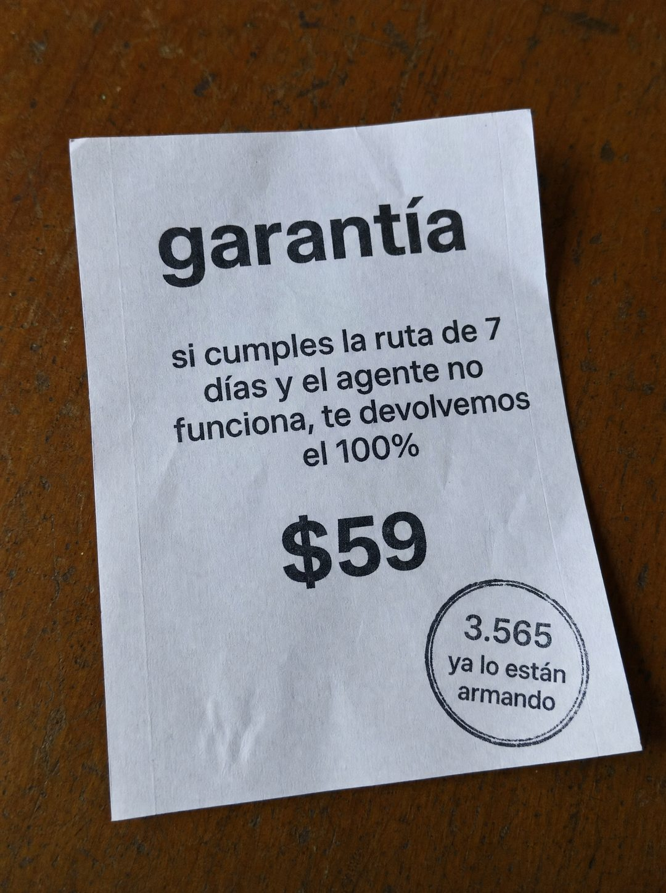

# 078 · Papel de garantía con sello

**Familia:** Oferta y precio · **Necesitas:** Nada. Para el sello, una cifra real de clientes (opcional) · **Resultado en Meta:** Sin datos propios todavía



## Qué es
Una foto cenital de una hoja impresa sobre una mesa de madera, como un comprobante: la palabra garantía, la condición en pocas líneas, el precio grande y un sello de tinta en la esquina.

## Por qué funciona
La garantía impresa en papel se siente como un documento, no como una promesa de diseño. Deja la condición a la vista (si cumples, te devolvemos) y eso la hace creíble en vez de sospechosa; el sello suma prueba con una cifra propia.

## Cuándo usarlo
Público tibio o remarketing, para responder el miedo a perder el dinero. Sirve para cursos, programas, servicios y productos con una garantía de devolución real.

## Así lo hicimos para Imperio
- **Texto en la imagen:** garantía / si cumples la ruta de 7 días y el agente no funciona, te devolvemos el 100% / $59 / Sello circular: 3.565 ya lo están armando
- **Texto principal:**
  > Si cumples la ruta y a los 7 días no tienes el agente, te devolvemos el 100%.
  >
  > La condición es que hagas el trabajo. No que veas videos.
  >
  > $59 al mes 👇
- **Titular:** Cumples la ruta o te devolvemos

## Receta para tu marca
- **Escena:** foto cenital de una hoja blanca impresa, algo arrugada, sobre una mesa de madera oscura, con luz natural.
- **Título:** 'garantía' en negrita negra grande y en minúsculas.
- **Condición:** tres o cuatro líneas centradas: si [LO QUE TU CLIENTE TIENE QUE HACER] y [EL RESULTADO QUE NO LLEGA], te devolvemos [CUÁNTO].
- **Precio:** [TU PRECIO] en negrita grande al centro.
- **Sello:** círculo de tinta en la esquina inferior derecha con [TU CIFRA REAL] y [QUÉ ESTÁN HACIENDO], o con otro dato verdadero.
- **Lo que no se toca:** la condición escrita completa, sin letra chica escondida; nada de logo ni colores de marca.

## Prompt con que se hizo el de Imperio (GPT Image 2.5)
```
[Prompt reconstruido mirando la imagen: el original de Imperio no quedó guardado]
Overhead amateur phone photo, vertical, of one sheet of white printed paper lying slightly rotated on a dark brown wooden table with visible grain and worn spots, in soft natural daylight. The sheet is a little wrinkled and has faint printer marks along its edges. Printed in black sans-serif and centered, from top to bottom: a large bold lowercase word 'garantía'; four centered lines of medium black text reading 'si cumples la ruta de 7' / 'días y el agente no' / 'funciona, te devolvemos' / 'el 100%'; then a large bold price '$59'. In the lower right corner, a round double-ring black ink rubber stamp, slightly uneven and faded in spots, with three centered lines inside: '3.565' / 'ya lo están' / 'armando'. Realistic paper texture and ink. Vertical 4:5 Instagram/Facebook feed ad, sharp and professional. All on-image text is Spanish and must be rendered EXACTLY as written inside the quotes, with every accent and ñ correct and every digit exact. Never use inverted question marks or inverted exclamation marks. No em dashes. Do not add any other words, logos or watermarks.
```

## Ojo
- La garantía del papel tiene que decir exactamente lo que dicen tus términos: misma condición, mismo plazo y mismo monto.
- Si el sello lleva una cifra, que sea real y verificable.
- Marca la casilla de contenido generado por IA en el Administrador de anuncios.
