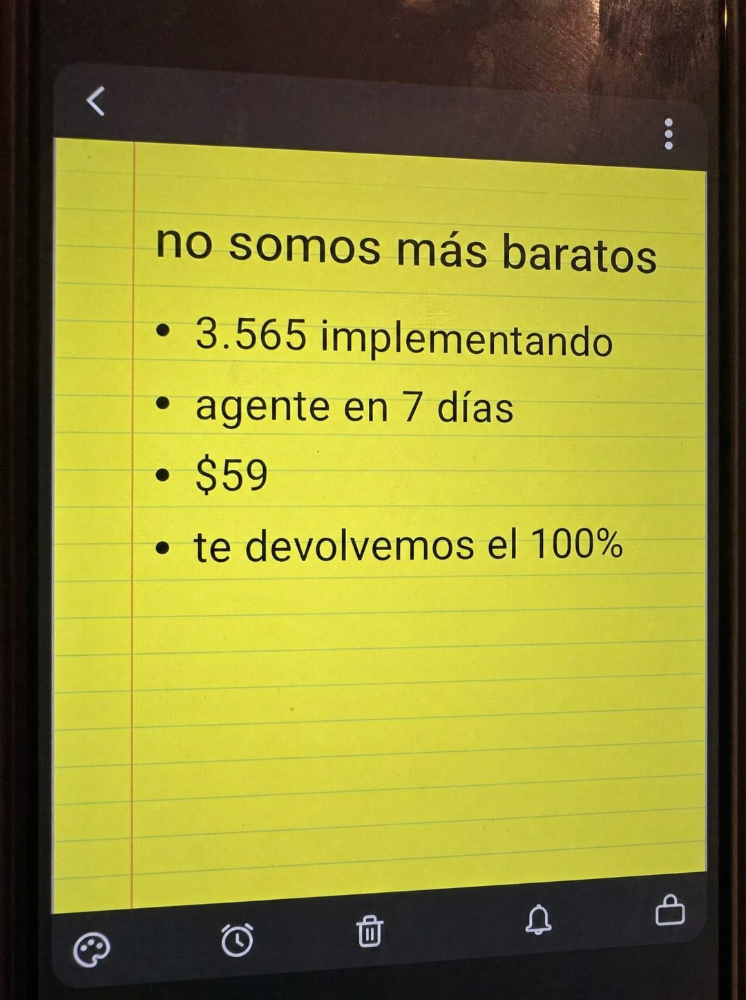

# 079 · Nota amarilla: no somos más baratos

**Familia:** Interfaz creíble · **Necesitas:** Nada. Si tienes una cifra real de clientes, súmala · **Resultado en Meta:** Sin datos propios todavía



## Qué es
La foto de la pantalla de un teléfono con una nota amarilla de hoja rayada: un título que admite que no eres el más barato y cuatro viñetas cortas con lo que el cliente recibe por esa diferencia.

## Por qué funciona
Admitir que no eres el más barato desarma la comparación de precio antes de que el lector la haga. Las viñetas responden con hechos (prueba, plazo, precio, garantía) y la nota se ve tan simple que no parece anuncio.

## Cuándo usarlo
Público tibio o remarketing que te está comparando con una opción más barata. Sirve para cualquier negocio que compite contra alternativas de menor precio; el objetivo es responder la objeción de precio.

## Así lo hicimos para Imperio
- **Texto en la imagen:** no somos más baratos / 3.565 implementando / agente en 7 días / $59 / te devolvemos el 100% / [barra de íconos de la app de notas]
- **Texto principal:**
  > No somos los $38.
  >
  > Somos el agente conectado a una tarea real en 7 días, con 3.565 personas ya implementando.
  >
  > $59 al mes 👇
- **Titular:** No somos más baratos

## Receta para tu marca
- **Formato:** foto de la pantalla de un teléfono Android con una app de notas abierta: hoja amarilla rayada con margen rojo, flecha de volver arriba y barra de íconos abajo.
- **Título:** 'no somos más baratos' en minúsculas negras, o [TU VERSIÓN DE ESA ADMISIÓN].
- **Viñetas:** cuatro líneas cortas: [TU PRUEBA REAL CON CIFRA] / [TU PLAZO DE RESULTADO] / [TU PRECIO] / [TU GARANTÍA].
- **Colores:** el amarillo de la nota y el gris de la app; nada de colores de marca.
- **Lo que no se toca:** la admisión en el título y solo cuatro viñetas; sin logo y sin nombrar al competidor.

## Prompt con que se hizo el de Imperio (GPT Image 2.5)
```
[Prompt reconstruido mirando la imagen: el original de Imperio no quedó guardado]
Close-up amateur photo of a smartphone screen, vertical, taken in a dim room, with faint reflections and smudges on the glass and the dark phone edges visible on both sides. The screen shows an Android notes app: a dark grey top bar with a white back arrow on the left and a three-dot menu on the right; below it, a bright yellow lined note page like a legal pad, with thin pale blue horizontal lines and a red vertical margin line on the left. Text on the note in black sans-serif, from top to bottom: a title 'no somos más baratos', then four bullet points: '3.565 implementando', 'agente en 7 días', '$59', 'te devolvemos el 100%'. Empty lined space fills the lower half of the page. At the bottom, a dark grey toolbar with five white outline icons: a palette, an alarm clock, a trash can, a bell and a lock. Realistic photo of a screen with slight moiré and grain. Vertical 4:5 Instagram/Facebook feed ad, sharp and professional. All on-image text is Spanish and must be rendered EXACTLY as written inside the quotes, with every accent and ñ correct and every digit exact. Never use inverted question marks or inverted exclamation marks. No em dashes. Do not add any other words, logos or watermarks.
```

## Ojo
- No nombres al competidor ni muestres su logo: la nota funciona sin decir contra quién compites.
- La cifra y la garantía de las viñetas tienen que ser reales: si tu garantía tiene condiciones, no la reduzcas a 'te devolvemos el 100%'.
- Marca la casilla de contenido generado por IA en el Administrador de anuncios.
