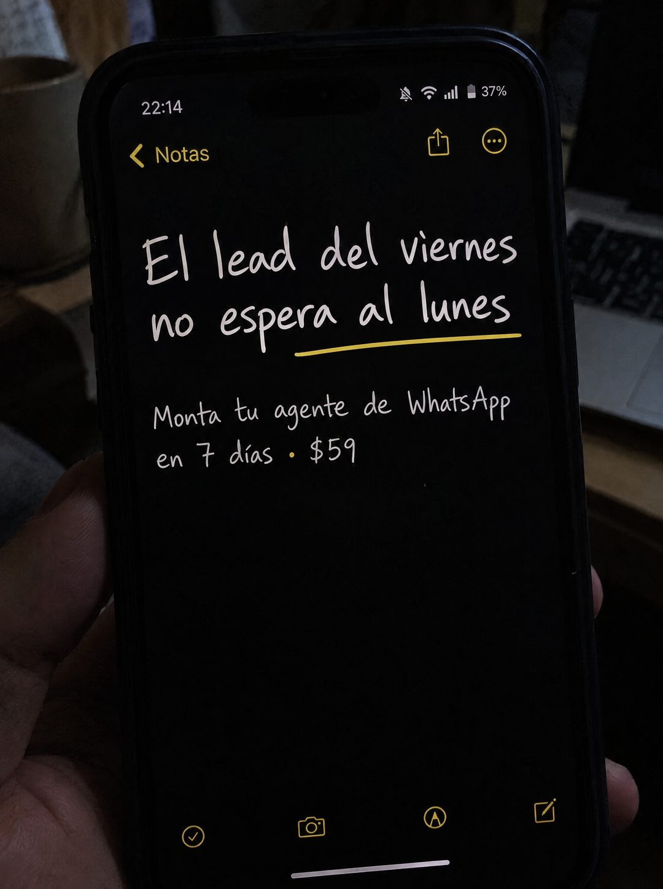

# 080 · Nota del teléfono con letra manuscrita

**Familia:** Interfaz creíble · **Necesitas:** Nada · **Resultado en Meta:** Sin datos propios todavía



## Qué es
Una foto de noche del teléfono en la mano, con la app de notas en modo oscuro y el titular escrito en letra manuscrita con un subrayado de color. Abajo va la oferta en una línea, como si fuera un recordatorio que alguien se escribió a sí mismo.

## Por qué funciona
Se ve tan simple que no parece anuncio: es una nota personal, con la hora y la batería a la vista. El titular nombra un momento exacto del dolor (el cliente que escribe el viernes y nadie atiende hasta el lunes), y la letra a mano lo vuelve una confesión más que un eslogan.

## Cuándo usarlo
Público frío de negocios que atienden por mensaje y pierden consultas fuera de horario o el fin de semana. Sirve para frenar el scroll y nombrar un dolor con día y hora.

## Así lo hicimos para Imperio
- **Texto en la imagen:** [barra de estado: 22:14, batería 37%] / Notas / El lead del viernes no espera al lunes (letra manuscrita blanca, subrayado amarillo bajo espera al lunes) / Monta tu agente de WhatsApp en 7 días · $59
- **Texto principal:**
  > El lead del viernes no espera al lunes. Monta tu agente de WhatsApp que responda y filtre en 7 días. $59 al mes.
- **Titular:** El lead del viernes no espera.

## Receta para tu marca
- **Escena:** foto vertical de noche, tu teléfono en la mano con la app de notas en modo oscuro; al fondo, un escritorio o un portátil apenas visible.
- **Titular:** [EL MOMENTO EXACTO EN QUE PIERDES AL CLIENTE] en letra manuscrita blanca y grande, con un subrayado de color bajo la parte que duele.
- **Texto:** una sola línea más chica abajo: [TU OFERTA EN POCAS PALABRAS] en [PLAZO] · [TU PRECIO].
- **Colores:** los de la app en modo oscuro; el subrayado va en el color de acento de la app, no en el de tu marca.
- **Lo que no se toca:** la barra de estado real (hora y batería), la letra manuscrita y cero logos, botones o marcos de diseño sobre la pantalla.

## Prompt con que se hizo el de Imperio (GPT Image 2.5)
```
[Prompt reconstruido mirando la imagen: el original de Imperio no quedó guardado]
Amateur phone photo taken at night in a dim room: a hand holds a black smartphone upright, filling most of the vertical frame, slightly angled, with the thumb and fingers visible at the edges. Behind it, out of focus, a laptop keyboard on a wooden desk and a mug. The phone shows the notes app in dark mode: status bar with '22:14', a silenced bell icon, wifi, signal and battery '37%'; at the top, a yellow back arrow with 'Notas' and yellow share and more icons. The note text is in a large white handwriting-style font: 'El lead del viernes' / 'no espera al lunes', with a hand-drawn yellow underline under 'espera al lunes'. Below, in smaller white handwriting: 'Monta tu agente de WhatsApp' / 'en 7 días · $59'. The rest of the note is empty black, with yellow toolbar icons at the bottom (checklist, camera, pen, new note). Low light, slight grain, soft screen glow on the fingers, realistic reflections, no graphic overlays. Vertical 4:5 Instagram/Facebook feed ad, sharp and professional. All on-image text is Spanish and must be rendered EXACTLY as written inside the quotes, with every accent and ñ correct and every digit exact. Never use inverted question marks or inverted exclamation marks. No em dashes. Do not add any other words, logos or watermarks.
```

## Ojo
- Si sale texto roto, manos deformes o cifras mal escritas, se rehace.
- Si ya usas la versión en negrita de la nota, alterna con esta: cambiar la estructura de la nota evita que se canibalicen.
- Marca la casilla de contenido generado por IA en el Administrador de anuncios.
