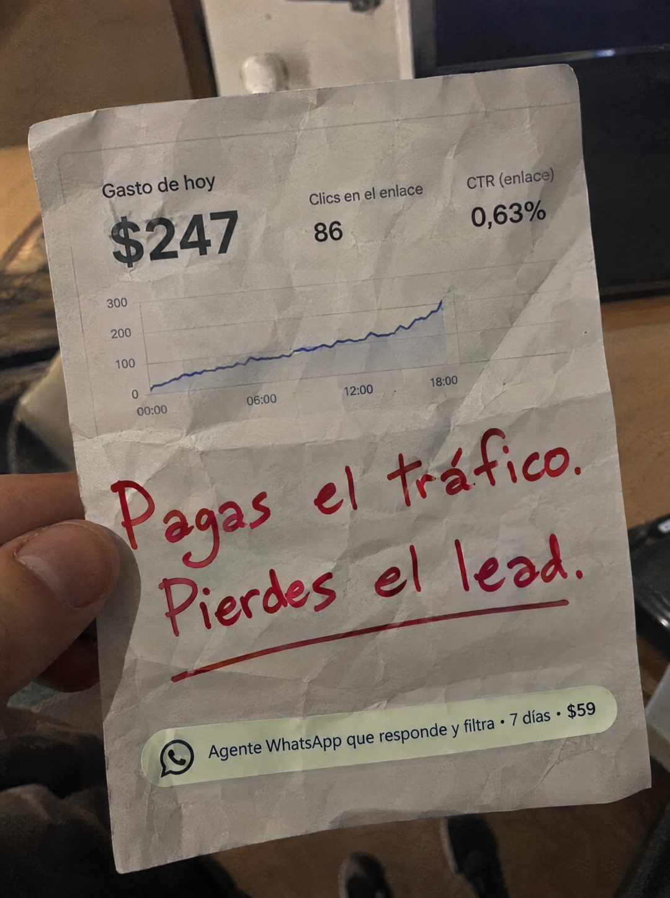

# 081 · Reporte de gasto impreso y rayado

**Familia:** Objeto físico con texto · **Necesitas:** Nada · **Resultado en Meta:** Sin datos propios todavía



## Qué es
Una hoja impresa y arrugada con el reporte que tu cliente revisa todos los días (en el ejemplo, el panel de gasto publicitario), sostenida con la mano y rayada con marcador rojo. Abajo lleva pegada una etiqueta con la oferta.

## Por qué funciona
El que pauta reconoce su propio panel al instante: gasto, clics y CTR son su rutina. El marcador rojo hace de jefe que corrige el reporte y señala la fuga real, que no está en el anuncio sino en lo que pasa después del clic. Un papel impreso y arrugado parece capturado del mundo, no hecho en Canva.

## Cuándo usarlo
Público frío o tibio que ya invierte en anuncios y siente que no rinden. Sirve para negocios cuya venta se juega después del clic (atención, seguimiento, cierre) y para responder la objeción de que el problema es el anuncio.

## Así lo hicimos para Imperio
- **Texto en la imagen:** Gasto de hoy / $247 / Clics en el enlace / 86 / CTR (enlace) / 0,63% / [gráfico de línea que sube, eje de 0 a 300 y de 00:00 a 18:00] / Pagas el tráfico. Pierdes el lead. (marcador rojo, subrayado) / Agente WhatsApp que responde y filtra · 7 días · $59 (etiqueta verde con ícono de WhatsApp)
- **Texto principal:**
  > Pagas el tráfico. Pierdes el lead. Monta un agente de WhatsApp que responda y filtre en 7 días. $59.
- **Titular:** Pagas el tráfico. Pierdes el lead.

## Receta para tu marca
- **Objeto:** hoja impresa con [EL REPORTE QUE TU CLIENTE MIRA TODOS LOS DÍAS], arrugada y sostenida con la mano, con un escritorio desenfocado detrás.
- **Cifras:** [3 MÉTRICAS DE ESE REPORTE] arriba y un gráfico simple; son la escena del problema, no tu resultado.
- **Titular:** [LO QUE PAGA]. / [LO QUE PIERDE]. escrito a mano con marcador rojo y subrayado.
- **Oferta:** etiqueta pegada abajo con [QUÉ HACE TU SOLUCIÓN] · [PLAZO] · [TU PRECIO] y un ícono genérico del canal; el verde puede pasar al color de tu marca.
- **Lo que no se toca:** el papel arrugado de verdad, el rojo a mano sobre lo impreso y la mano real que lo sostiene.

## Prompt con que se hizo el de Imperio (GPT Image 2.5)
```
[Prompt reconstruido mirando la imagen: el original de Imperio no quedó guardado]
Amateur phone photo in dim indoor light: a hand holds up a crumpled sheet of white printer paper in front of a blurred desk. The paper is a printout of an ad dashboard in clean grey and black sans-serif: top left 'Gasto de hoy' with a big bold '$247', in the middle 'Clics en el enlace' with '86', top right 'CTR (enlace)' with '0,63%'. Below, a simple line chart with a thin blue line climbing from left to right, y-axis labels '300', '200', '100', '0' and x-axis labels '00:00', '06:00', '12:00', '18:00'. Over the lower half of the paper, handwritten in thick red marker: 'Pagas el tráfico.' / 'Pierdes el lead.' with a red underline. At the bottom, a pale green rounded sticker-like label with a black outline chat icon and the text 'Agente WhatsApp que responde y filtra · 7 días · $59'. Visible paper creases and shadows, a realistic thumb holding the left edge. Vertical 4:5 Instagram/Facebook feed ad, sharp and professional. All on-image text is Spanish and must be rendered EXACTLY as written inside the quotes, with every accent and ñ correct and every digit exact. Never use inverted question marks or inverted exclamation marks. No em dashes. Do not add any other words, logos or watermarks.
```

## Ojo
- Las cifras del panel son la escena del problema de tu cliente, no un resultado tuyo: no las presentes como logro ni uses una captura con datos de otra cuenta.
- Si sale texto roto, manos deformes o cifras mal escritas, se rehace.
- Marca la casilla de contenido generado por IA en el Administrador de anuncios.
