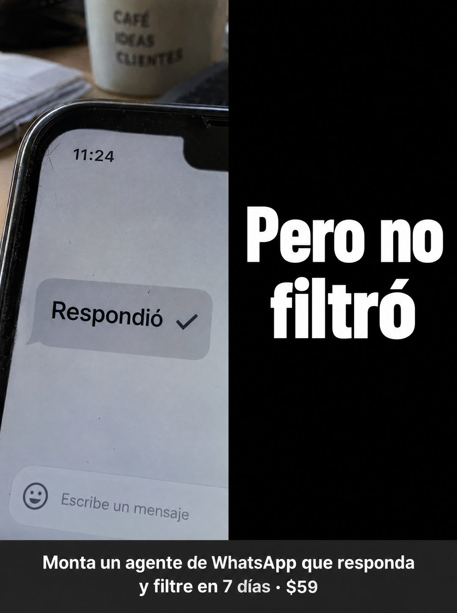

# 082 · Foto partida con remate en negro

**Familia:** Interfaz creíble · **Necesitas:** Nada · **Resultado en Meta:** Sin datos propios todavía



## Qué es
Una pieza partida en dos mitades: a la izquierda, una foto real con lo que sí está pasando (en el ejemplo, un chat con una sola burbuja que dice Respondió); a la derecha, un bloque negro con letra blanca gigante que dice lo que falta. Una franja abajo lleva la oferta.

## Por qué funciona
La frase se arma en dos tiempos: la foto deja el alivio y el bloque negro lo corta con el remate. Ese giro rompe una creencia que el cliente ya tiene (que contestar basta) y se lee en un segundo, sin explicar nada.

## Cuándo usarlo
Público tibio que ya usa un bot, respuestas automáticas o un asistente y cree tener el problema resuelto. Sirve para diferenciarte de la opción barata y mover a quien está conforme.

## Así lo hicimos para Imperio
- **Texto en la imagen:** [taza al fondo: CAFÉ IDEAS CLIENTES] / 11:24 / Respondió ✓ (burbuja de chat) / Escribe un mensaje / Pero no filtró (mitad derecha negra, letra blanca gigante) / Monta un agente de WhatsApp que responda y filtre en 7 días · $59 (franja gris oscura abajo)
- **Texto principal:**
  > Respondió. Pero no filtró. Monta un agente de WhatsApp que responda y filtre en 7 días. $59.
- **Titular:** Respondió. Pero no filtró.

## Receta para tu marca
- **Formato:** vertical partido en dos mitades; a la izquierda una foto real de [LO QUE TU CLIENTE YA TIENE FUNCIONANDO], a la derecha un bloque negro liso.
- **Mitad izquierda:** una sola burbuja o etiqueta con [LO QUE YA HACE BIEN] y un check.
- **Mitad derecha:** Pero no + [LO QUE LE FALTA] en letra blanca condensada gigante, en dos líneas.
- **Oferta:** franja gris oscura de lado a lado abajo con [QUÉ MONTAS] en [PLAZO] · [TU PRECIO] en blanco.
- **Lo que no se toca:** la mitad negra solo lleva el remate en blanco sobre negro, sin precio, logo ni colores de marca; la frase se completa leyendo de izquierda a derecha.

## Prompt con que se hizo el de Imperio (GPT Image 2.5)
```
[Prompt reconstruido mirando la imagen: el original de Imperio no quedó guardado]
Vertical split-screen composition. Left half: amateur close-up photo of a smartphone lying on a wooden desk, shot from above at an angle, with a stack of papers and a white mug printed 'CAFÉ' / 'IDEAS' / 'CLIENTES' in grey capitals blurred in the background. The phone screen shows a light grey chat: status time '11:24', one grey message bubble with 'Respondió' followed by a dark check mark, and at the bottom a text field with a smiley icon and the placeholder 'Escribe un mensaje'. The phone is cut off by the center line. Right half: solid black panel with huge bold white condensed sans-serif text, centered: 'Pero no' / 'filtró'. Across the full width at the bottom, a dark charcoal band with white bold sans-serif text in two lines: 'Monta un agente de WhatsApp que responda' / 'y filtre en 7 días · $59'. Natural window light on the photo side, slight screen texture, crisp graphic black side. Vertical 4:5 Instagram/Facebook feed ad, sharp and professional. All on-image text is Spanish and must be rendered EXACTLY as written inside the quotes, with every accent and ñ correct and every digit exact. Never use inverted question marks or inverted exclamation marks. No em dashes. Do not add any other words, logos or watermarks.
```

## Ojo
- El remate tiene que cerrar la frase que empieza en la foto: si se leen como dos ideas sueltas, el formato no funciona.
- Marca la casilla de contenido generado por IA en el Administrador de anuncios.
