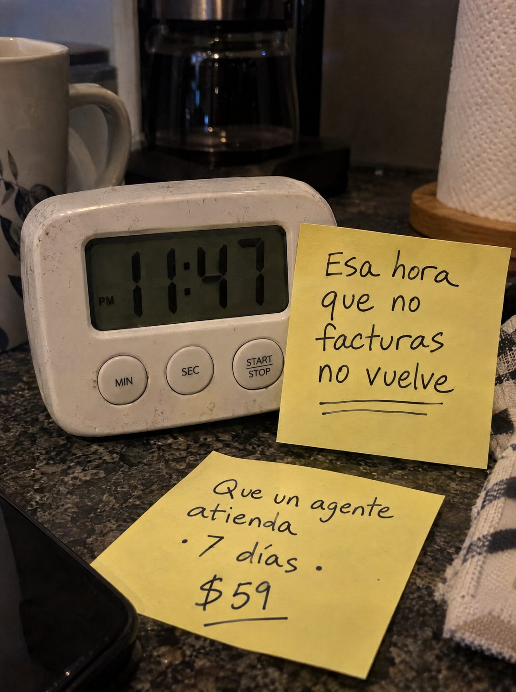

# 083 · Post-its junto al temporizador

**Familia:** Objeto físico con texto · **Necesitas:** Nada · **Resultado en Meta:** Sin datos propios todavía



## Qué es
Una foto de noche en la cocina: un temporizador digital marca una hora tardía y al lado hay dos post-its escritos a mano, uno con el dolor y otro con la oferta. Funciona con cualquier reloj que muestre la hora en el lugar donde tu cliente sigue trabajando.

## Por qué funciona
La hora en la pantalla del reloj trabaja antes que el titular: es tarde y alguien sigue pendiente del negocio. Los post-its a mano son un objeto real, no un diseño, y la frase convierte el tiempo en plata perdida, que es como el dueño lo siente.

## Cuándo usarlo
Público frío de dueños que atienden solos y cobran por hora o por venta (servicios, oficios, comercio chico). Sirve para frenar el scroll y nombrar el costo de trabajar fuera de horario.

## Así lo hicimos para Imperio
- **Texto en la imagen:** 11:47 / PM / MIN / SEC / START / STOP (temporizador de cocina) / Esa hora que no facturas no vuelve (post-it amarillo, doble subrayado) / Que un agente atienda · 7 días · $59 (segundo post-it, precio subrayado)
- **Texto principal:**
  > Esa hora que no facturas no vuelve. Que un agente atienda. Monta el tuyo en 7 días. $59.
- **Titular:** Esa hora no vuelve.

## Receta para tu marca
- **Escena:** foto de noche con luz cálida en [EL LUGAR DONDE TU CLIENTE SIGUE TRABAJANDO], con un reloj o temporizador que marque [UNA HORA FUERA DE HORARIO].
- **Post-it 1:** [EL COSTO DEL DOLOR EN UNA FRASE] con marcador negro y doble subrayado, apoyado en el reloj.
- **Post-it 2:** [LO QUE RESUELVE TU PRODUCTO] · [PLAZO] · [TU PRECIO], con el precio subrayado, sobre la superficie.
- **Colores:** post-its amarillos clásicos y los colores reales de la escena; no agregues tu paleta de marca.
- **Lo que no se toca:** la hora visible en el reloj, la letra a mano y cero logos o franjas de diseño.

## Prompt con que se hizo el de Imperio (GPT Image 2.5)
```
[Prompt reconstruido mirando la imagen: el original de Imperio no quedó guardado]
Photorealistic phone photo at night on a dark speckled granite kitchen counter, warm dim light. In the center, a worn white digital kitchen timer with a grey LCD showing '11:47' with a small 'PM' label, and three round buttons labeled 'MIN', 'SEC' and 'START' / 'STOP'. Behind it, out of focus: a glass coffee maker, a white mug with a blue leaf pattern and a paper towel roll on a wooden holder; a checkered dish towel on the right edge and the corner of a black phone at the bottom left. Leaning against the timer on the right, a yellow sticky note handwritten in black marker: 'Esa hora' / 'que no' / 'facturas' / 'no vuelve' with a double underline. Lying flat on the counter in front, a second yellow sticky note: 'Que un agente' / 'atienda' / '· 7 días ·' / '$59' with the price underlined. Casual, slightly messy real handwriting, soft shadows, slight grain. Vertical 4:5 Instagram/Facebook feed ad, sharp and professional. All on-image text is Spanish and must be rendered EXACTLY as written inside the quotes, with every accent and ñ correct and every digit exact. Never use inverted question marks or inverted exclamation marks. No em dashes. Do not add any other words, logos or watermarks.
```

## Ojo
- Si sale texto roto, manos deformes o cifras mal escritas, se rehace.
- Elige una hora que tu cliente reconozca como fuera de horario: es la hora la que vende el dolor.
- Marca la casilla de contenido generado por IA en el Administrador de anuncios.
