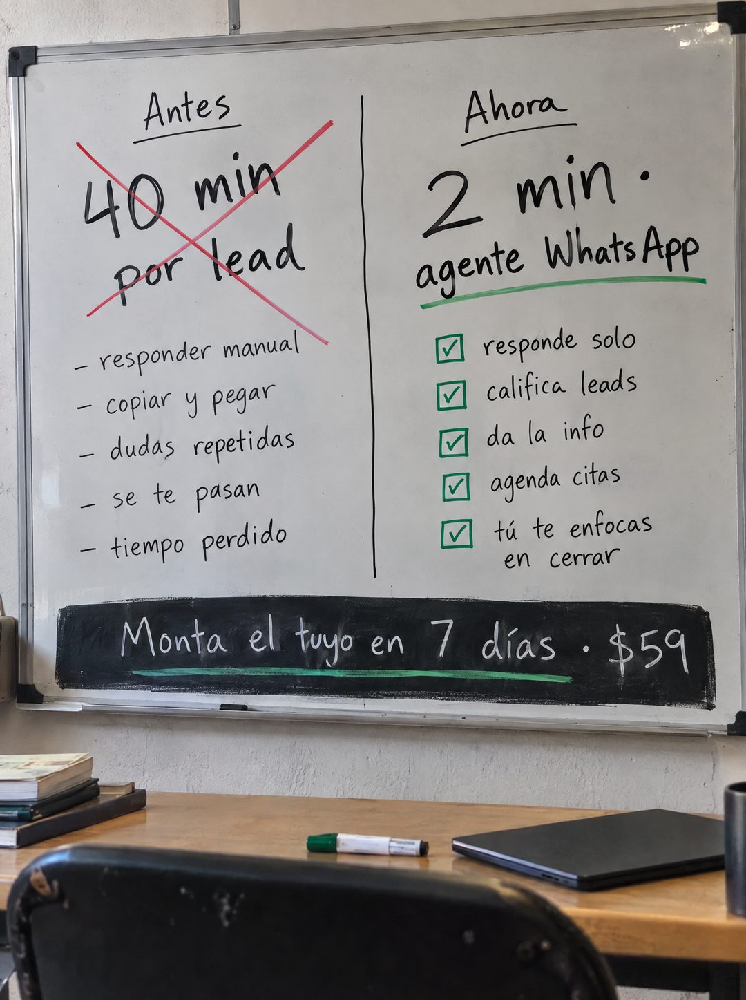

# 084 · Pizarra de antes y ahora

**Familia:** Objeto físico con texto · **Necesitas:** Tus tiempos reales de antes y después · **Resultado en Meta:** Sin datos propios todavía



## Qué es
Una pizarra blanca de oficina dividida en dos columnas: a la izquierda el antes, con la cifra tachada en rojo y las tareas que duelen; a la derecha el ahora, con la cifra nueva y una lista con checks verdes. La oferta va en una franja negra al pie de la pizarra.

## Por qué funciona
Afirma algo concreto y medible (de tanto tiempo a tan poco) en un objeto real, como si alguien lo hubiera explicado en una reunión. El tachón rojo y los checks verdes se leen sin esfuerzo, y la columna del antes deja que el cliente se reconozca en cada tarea.

## Cuándo usarlo
Público tibio que ya entiende el problema y compara opciones. Sirve para servicios o herramientas que ahorran un tiempo que puedes medir, con el objetivo de mostrar el cambio en una sola mirada.

## Así lo hicimos para Imperio
- **Texto en la imagen:** Antes / 40 min por lead (tachado con una X roja) / - responder manual / - copiar y pegar / - dudas repetidas / - se te pasan / - tiempo perdido / Ahora / 2 min · agente WhatsApp (subrayado verde) / responde solo / califica leads / da la info / agenda citas / tú te enfocas en cerrar (con casillas marcadas en verde) / Monta el tuyo en 7 días · $59 (franja negra al pie, subrayado verde)
- **Texto principal:**
  > De 40 min a 2 por lead. Monta tu agente de WhatsApp en 7 días. $59.
- **Titular:** De 40 min a 2 por lead.

## Receta para tu marca
- **Escena:** pizarra blanca colgada en la pared, foto de frente, con un escritorio, un marcador y un portátil cerrado abajo.
- **Columna izquierda:** Antes / [TU CIFRA REAL DE ANTES] tachada con una X roja / 5 tareas que hoy duelen, con guiones.
- **Columna derecha:** Ahora / [TU CIFRA REAL DE AHORA] · [TU SOLUCIÓN] con subrayado verde / 5 cosas que pasan solas, con casillas marcadas en verde.
- **Oferta:** franja negra al pie con [LLAMADO] en [PLAZO] · [TU PRECIO] en letra blanca a mano.
- **Colores:** negro para el texto, rojo solo para el tachón y verde solo para lo nuevo; el verde puede pasar al color de tu marca.
- **Lo que no se toca:** cifras reales y medidas, todo escrito a mano en la pizarra y la línea vertical que separa las dos columnas.

## Prompt con que se hizo el de Imperio (GPT Image 2.5)
```
[Prompt reconstruido mirando la imagen: el original de Imperio no quedó guardado]
Photorealistic photo of a slightly used white whiteboard with an aluminum frame hanging on a pale wall, shot straight on, with a wooden desk below it holding a stack of books, a green dry-erase marker and a closed dark laptop, and the back of a black chair in the foreground. The board is divided by a vertical black line into two columns, all written by hand in black dry-erase marker. Left column: 'Antes' underlined, then large '40 min' / 'por lead' crossed out with a big red X, then a list: '- responder manual', '- copiar y pegar', '- dudas repetidas', '- se te pasan', '- tiempo perdido'. Right column: 'Ahora' underlined, then large '2 min ·' / 'agente WhatsApp' with a green marker underline, then a list with green checked boxes: 'responde solo', 'califica leads', 'da la info', 'agenda citas', 'tú te enfocas' / 'en cerrar'. Across the bottom of the board, a rough black painted band with white chalk-like handwriting: 'Monta el tuyo en 7 días · $59' with a green underline. Soft daylight, faint marker smudges, real photo texture. Vertical 4:5 Instagram/Facebook feed ad, sharp and professional. All on-image text is Spanish and must be rendered EXACTLY as written inside the quotes, with every accent and ñ correct and every digit exact. Never use inverted question marks or inverted exclamation marks. No em dashes. Do not add any other words, logos or watermarks.
```

## Ojo
- El antes y el después tienen que ser tiempos reales que puedas sostener: si no los mediste, compara las dos listas sin cifras.
- Si sale texto roto, manos deformes o cifras mal escritas, se rehace.
- Marca la casilla de contenido generado por IA en el Administrador de anuncios.
