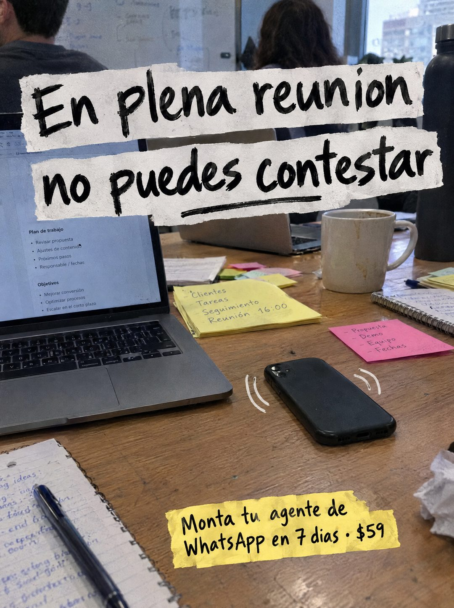

# 085 · Foto de reunión con titular rasgado

**Familia:** Foto nativa · **Necesitas:** Nada. Si tienes una foto real de tu oficina, mejor · **Resultado en Meta:** Sin datos propios todavía



## Qué es
Una foto de una mesa en plena reunión (portátiles, post-its, tazas, gente al fondo) donde el teléfono vibra boca abajo sin que nadie pueda tomarlo. El titular va encima en tiras de papel rasgado escritas con pincel, como un collage.

## Por qué funciona
Retrata una situación que todo dueño vivió: el cliente escribe justo cuando estás ocupado. Las rayas de vibración dibujadas a mano señalan el teléfono sin explicar nada, y el papel rasgado hace que el texto se sienta parte de la foto y no un banner encima.

## Cuándo usarlo
Público frío de dueños y equipos chicos con la agenda llena (agencias, consultoras, servicios profesionales). Sirve para frenar el scroll con una escena reconocible y nombrar el costo de estar ocupado.

## Así lo hicimos para Imperio
- **Texto en la imagen:** En plena reunion no puedes contestar (tiras de papel blanco rasgado, letra de pincel negra) / [portátil con un plan de trabajo y post-its con tareas: Clientes, Tareas, Seguimiento, Reunión 16:00 / Propuesta, Demo, Equipo, Fechas] / Monta tu agente de WhatsApp en 7 dias · $59 (tira de papel amarillo rasgado, abajo)
- **Texto principal:**
  > En plena reunion no puedes contestar. Monta tu agente de WhatsApp en 7 dias. $59.
- **Titular:** En plena reunion no contestas

## Receta para tu marca
- **Escena:** foto real de [EL MOMENTO EN QUE TU CLIENTE ESTÁ OCUPADO], con mesa, portátiles, post-its y tazas; las personas del fondo de espalda o desenfocadas.
- **Protagonista:** el teléfono boca abajo en el centro de la mesa, con dos rayas blancas de vibración dibujadas a mano.
- **Titular:** [LA SITUACIÓN] / [LO QUE NO PUEDES HACER] con letra de pincel negra sobre tiras de papel blanco rasgado, con un trazo de subrayado.
- **Oferta:** una tira de papel amarillo rasgado abajo con [QUÉ MONTAS] en [PLAZO] · [TU PRECIO].
- **Lo que no se toca:** la escena tiene que verse ocupada y real; el texto va en papel rasgado, nunca en cajas de diseño ni con tus colores de marca.

## Prompt con que se hizo el de Imperio (GPT Image 2.5)
```
[Prompt reconstruido mirando la imagen: el original de Imperio no quedó guardado]
Photorealistic phone photo of a busy shared meeting table in an office, daylight from big windows with city buildings outside. In the blurred background, two people sitting with their backs or faces turned away and a whiteboard with notes. On the warm wooden table: an open laptop on the left showing a document titled 'Plan de trabajo' with short bullet points, a second laptop behind, a white ceramic mug, a black water bottle, a stack of yellow sticky notes handwritten '- Clientes' / '- Tareas' / '- Seguimiento' / '- Reunión 16:00', a pink sticky note '- Propuesta' / '- Demo' / '- Equipo' / '- Fechas', a spiral notebook with illegible blue handwriting and a blue pen, and a crumpled tissue. In the center, a black smartphone lying face down with two small hand-drawn white curved vibration marks on each side. Collage-style headline at the top on torn strips of off-white paper, black brush lettering: 'En plena reunión' / 'no puedes contestar', with a black brush underline. At the bottom right, a torn strip of yellow paper with black brush lettering: 'Monta tu agente de' / 'WhatsApp en 7 días · $59'. Natural light, realistic textures. Vertical 4:5 Instagram/Facebook feed ad, sharp and professional. All on-image text is Spanish and must be rendered EXACTLY as written inside the quotes, with every accent and ñ correct and every digit exact. Never use inverted question marks or inverted exclamation marks. No em dashes. Do not add any other words, logos or watermarks.
```

## Ojo
- En el ejemplo de Imperio se cayeron las tildes del titular y de la tira de abajo: revisa cada palabra antes de publicar.
- Las personas del fondo van de espalda o desenfocadas: que nadie sea reconocible.
- Marca la casilla de contenido generado por IA en el Administrador de anuncios.
