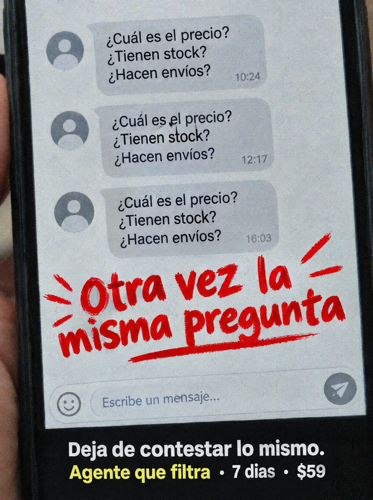

# 086 · Chat repetido con rayón rojo

**Familia:** Interfaz creíble · **Necesitas:** Nada · **Resultado en Meta:** Sin datos propios todavía



## Qué es
Una foto del teléfono en la mano con un chat donde llegan exactamente las mismas tres preguntas a distintas horas del día. Encima, una frase escrita con pincel rojo grita el cansancio, y una franja negra abajo trae la salida.

## Por qué funciona
La repetición se ve antes de leerla: tres burbujas iguales bastan para que cualquier dueño sienta el hastío. El rojo a mano funciona como el comentario que uno haría en voz alta, y la franja de abajo da la salida concreta sin explicar de más.

## Cuándo usarlo
Público frío y tibio de negocios que reciben las mismas consultas por chat (tiendas, comida, servicios con precio fijo). Sirve para frenar el scroll y mostrar el problema antes de nombrar la solución.

## Así lo hicimos para Imperio
- **Texto en la imagen:** Cuál es el precio? / Tienen stock? / Hacen envíos? (10:24) / Cuál es el precio? / Tienen stock? / Hacen envíos? (12:17) / Cuál es el precio? / Tienen stock? / Hacen envíos? (16:03) / Otra vez la misma pregunta (pincel rojo con rayas de énfasis) / Escribe un mensaje... / Deja de contestar lo mismo. / Agente que filtra · 7 dias · $59 (franja negra abajo, Agente que filtra en amarillo)
- **Texto principal:**
  > Otra vez la misma pregunta. Deja de contestar lo mismo. Monta un agente que filtre en 7 dias. $59.
- **Titular:** Otra vez la misma pregunta

## Receta para tu marca
- **Escena:** foto del teléfono en la mano, muy cerca, con un chat en modo claro y avatares genéricos, sin nombres.
- **Chat:** tres burbujas idénticas con [LAS 3 PREGUNTAS QUE MÁS TE REPITEN], cada una con una hora distinta del día.
- **Titular:** [LA QUEJA QUE TU CLIENTE DIRÍA EN VOZ ALTA] con pincel rojo, rayas de énfasis y un subrayado.
- **Oferta:** franja negra abajo: [LO QUE DEJA DE HACER] en blanco / [TU SOLUCIÓN] en amarillo · [PLAZO] · [TU PRECIO]; el amarillo puede pasar al color de tu marca.
- **Lo que no se toca:** las burbujas tienen que ser idénticas palabra por palabra; si cambian, se pierde la repetición.

## Prompt con que se hizo el de Imperio (GPT Image 2.5)
```
[Prompt reconstruido mirando la imagen: el original de Imperio no quedó guardado]
Amateur phone photo of a hand holding a black smartphone very close to the camera, the screen filling most of the frame, slightly grainy. The screen shows a light grey chat with three incoming grey bubbles, each next to the same generic grey avatar, each bubble with the identical three lines 'Cuál es el precio?' / 'Tienen stock?' / 'Hacen envíos?' and the timestamps '10:24', '12:17' and '16:03'. Over the lower half of the chat, bold red brush handwriting slightly tilted: 'Otra vez la' / 'misma pregunta', with short red emphasis strokes around it and a red brush underline. At the bottom of the screen, a message field with a smiley icon, the placeholder 'Escribe un mensaje...' and a grey send button. Below the phone, a black band with bold sans-serif text: white 'Deja de contestar lo mismo.' and on the next line yellow 'Agente que filtra' followed by white '· 7 días · $59'. Realistic screen texture and fingers. Vertical 4:5 Instagram/Facebook feed ad, sharp and professional. All on-image text is Spanish and must be rendered EXACTLY as written inside the quotes, with every accent and ñ correct and every digit exact. Never use inverted question marks or inverted exclamation marks. No em dashes. Do not add any other words, logos or watermarks.
```

## Ojo
- En el ejemplo de Imperio se colaron signos de apertura en el texto: pide en el prompt que no aparezcan.
- Los mensajes son una escena genérica del problema: sin nombres, fotos ni números de clientes reales.
- Marca la casilla de contenido generado por IA en el Administrador de anuncios.
