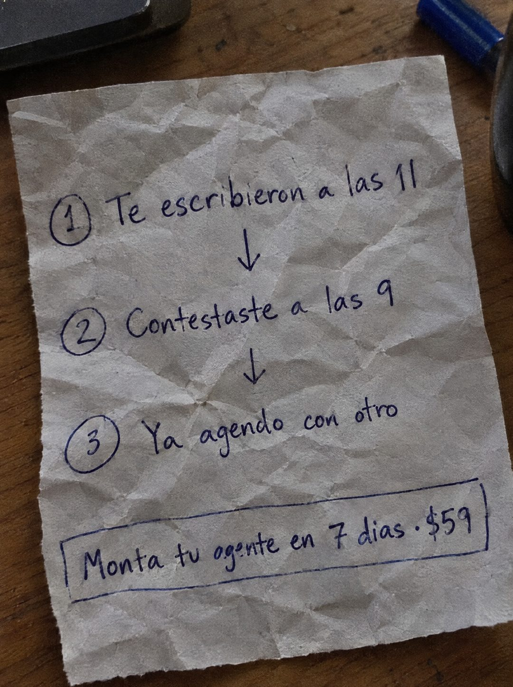

# 088 · Secuencia en papel arrugado

**Familia:** Objeto físico con texto · **Necesitas:** Nada · **Resultado en Meta:** Sin datos propios todavía



## Qué es
Una hoja arrugada y vuelta a estirar sobre un escritorio, con tres pasos escritos a mano en tinta azul, numerados y unidos por flechas: la consulta, la respuesta tardía y la venta perdida. La oferta va en un recuadro dibujado abajo.

## Por qué funciona
Cuenta una historia completa en tres líneas y el final duele porque el cliente ya lo vivió: contestó tarde y el otro ya había vendido. El papel arrugado sugiere que alguien lo escribió con rabia y casi lo tira, y eso lo hace sentir real, no publicitario.

## Cuándo usarlo
Público frío de negocios que agendan citas o cierran ventas por mensaje (clínicas, salones, talleres, inmobiliarias). Sirve para frenar el scroll y mostrar el costo de la demora con una historia.

## Así lo hicimos para Imperio
- **Texto en la imagen:** (1) Te escribieron a las 11 / ↓ / (2) Contestaste a las 9 / ↓ / (3) Ya agendo con otro / Monta tu ogente en 7 dias · $59 (en un recuadro; todo a mano con tinta azul y números en círculo)
- **Texto principal:**
  > Te escribieron a las 11. Contestaste a las 9. Ya agendo con otro. Monta tu agente en 7 dias. $59.
- **Titular:** Contestaste tarde. Ya se fue.

## Receta para tu marca
- **Objeto:** hoja de papel muy arrugada y vuelta a estirar sobre un escritorio de madera, con un marcador y una taza cortados en el borde.
- **Paso 1:** [CUÁNDO LLEGA LA CONSULTA, CON HORA].
- **Paso 2:** [CUÁNDO LA CONTESTASTE, CON HORA].
- **Paso 3:** [QUÉ HIZO EL CLIENTE MIENTRAS ESPERABA]; los tres numerados en círculo y unidos por flechas.
- **Oferta:** recuadro dibujado a mano con [LLAMADO] en [PLAZO] · [TU PRECIO].
- **Lo que no se toca:** todo a mano con la misma tinta azul, sin tipografía digital ni colores de marca; el tercer paso es el golpe y va solo.

## Prompt con que se hizo el de Imperio (GPT Image 2.5)
```
[Prompt reconstruido mirando la imagen: el original de Imperio no quedó guardado]
Photorealistic photo, top-down at a slight angle, of a heavily crumpled and re-flattened sheet of off-white paper lying on a dark wooden desk, with a blue marker, the edge of a dark mug and the corner of a laptop cut off at the edges. Soft window light from the side, deep crease shadows. Handwritten in blue ink, neat casual handwriting: a circled '1' and 'Te escribieron a las 11', a down arrow, a circled '2' and 'Contestaste a las 9', a down arrow, a circled '3' and 'Ya agendó con otro'. Below, a hand-drawn rectangle containing 'Monta tu agente en 7 días · $59'. Real ink texture following the paper creases. Vertical 4:5 Instagram/Facebook feed ad, sharp and professional. All on-image text is Spanish and must be rendered EXACTLY as written inside the quotes, with every accent and ñ correct and every digit exact. Never use inverted question marks or inverted exclamation marks. No em dashes. Do not add any other words, logos or watermarks.
```

## Ojo
- En el ejemplo de Imperio la letra a mano salió con errores (una a que se lee como o y tildes perdidas): revisa palabra por palabra, porque en manuscrito se escapan fácil.
- Marca la casilla de contenido generado por IA en el Administrador de anuncios.
