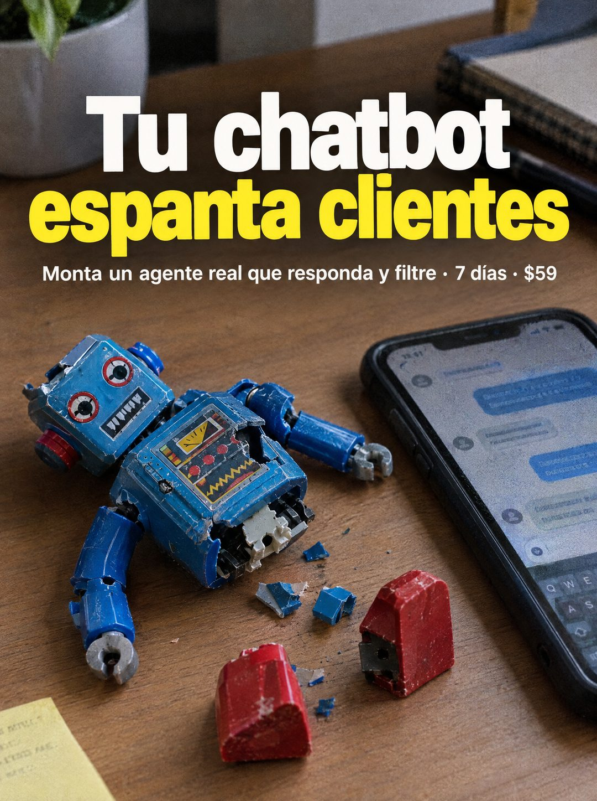

# 089 · Metáfora del robot roto

**Familia:** Humor y meme · **Necesitas:** Nada · **Resultado en Meta:** Sin datos propios todavía



## Qué es
Una foto de escritorio donde un objeto roto representa la alternativa mala que tu cliente ya probó (en el ejemplo, un robot de juguete antiguo despedazado junto al teléfono). El titular en dos colores le pone nombre a la metáfora.

## Por qué funciona
La imagen hace el chiste antes del texto: un robot de lata en pedazos es exactamente lo que uno piensa de un chatbot que responde mal. Ataca a la opción barata que el cliente ya usó y lo deja listo para escuchar que existe algo distinto.

## Cuándo usarlo
Público tibio que ya probó bots o respuestas automáticas y quedó desconfiado. Sirve para diferenciarte de la competencia y responder la objeción de que eso no funciona.

## Así lo hicimos para Imperio
- **Texto en la imagen:** Tu chatbot (blanco) / espanta clientes (amarillo) / Monta un agente real que responda y filtre · 7 días · $59 / [teléfono con chat desenfocado y post-it ilegible]
- **Texto principal:**
  > Tu chatbot espanta clientes. Monta un agente real que responda y filtre en 7 dias. $59.
- **Titular:** Tu chatbot espanta clientes

## Receta para tu marca
- **Escena:** foto de escritorio con luz natural y [UN OBJETO QUE REPRESENTE LA ALTERNATIVA MALA, ROTO O DESARMADO] al centro, con piezas sueltas alrededor.
- **Apoyo:** el teléfono o la herramienta real a un costado, con la pantalla desenfocada.
- **Titular:** [LA ALTERNATIVA QUE TU CLIENTE YA PROBÓ] en blanco / [EL DAÑO QUE LE HACE] en amarillo, letra muy gruesa, arriba.
- **Oferta:** una línea blanca debajo con [TU SOLUCIÓN] · [PLAZO] · [TU PRECIO]; el amarillo puede pasar al color de tu marca.
- **Lo que no se toca:** el objeto roto tiene que entenderse en un segundo como metáfora, sin logos ni nombres de competidores.

## Prompt con que se hizo el de Imperio (GPT Image 2.5)
```
[Prompt reconstruido mirando la imagen: el original de Imperio no quedó guardado]
Photorealistic photo of a wooden desk in soft natural light, shot from above at an angle. In the center, a vintage blue tin wind-up toy robot lies broken on its back: one leg and one arm detached, its chest panel cracked open showing gears, small chipped blue paint fragments and two red tin pieces scattered around. On the right, a black smartphone lies on the desk with a chat open on screen, completely blurred and unreadable. In the background, a pot plant, a notebook and a dark pouch out of focus; in the bottom left corner, a yellow sticky note with illegible writing. At the top, a big bold headline in heavy sans-serif: 'Tu chatbot' in white on the first line and 'espanta clientes' in bright yellow on the second line, then a smaller white line: 'Monta un agente real que responda y filtre · 7 días · $59'. Realistic shadows and textures. Vertical 4:5 Instagram/Facebook feed ad, sharp and professional. All on-image text is Spanish and must be rendered EXACTLY as written inside the quotes, with every accent and ñ correct and every digit exact. Never use inverted question marks or inverted exclamation marks. No em dashes. Do not add any other words, logos or watermarks.
```

## Ojo
- La pantalla del teléfono va desenfocada: si se lee un chat, compite con el titular y abre la puerta a errores de texto.
- No muestres el logo ni la interfaz de un competidor real: la burla es a la alternativa genérica, no a una marca con nombre.
- Marca la casilla de contenido generado por IA en el Administrador de anuncios.
