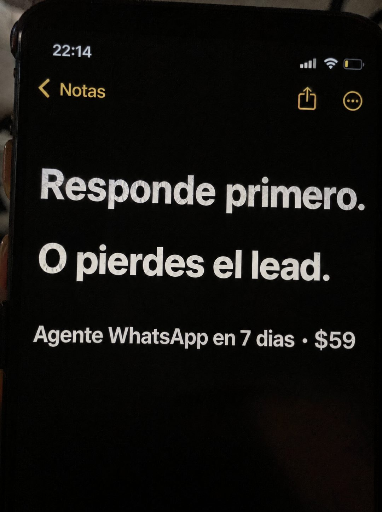

# 090 · Nota del teléfono en primer plano

**Familia:** Interfaz creíble · **Necesitas:** Nada · **Resultado en Meta:** Sin datos propios todavía



## Qué es
Un primer plano de noche de la pantalla del teléfono, tan cerca que ocupa todo el cuadro, con la app de notas en modo oscuro y dos frases cortas en negrita blanca. Abajo, en letra más chica, va la oferta en una línea.

## Por qué funciona
Se ve tan simple que no parece anuncio: es una regla que alguien anotó para no olvidarla. Las dos frases funcionan como orden y advertencia, y la textura real de la pantalla (reflejos, batería baja, de noche) la vuelve creíble. Si ya usas la nota manuscrita, esta versión cambia la estructura y no compiten entre sí.

## Cuándo usarlo
Público frío de rubros donde gana el que contesta primero (inmobiliarias, autos, servicios a domicilio, educación). Sirve para frenar el scroll con una regla de negocio fácil de aceptar.

## Así lo hicimos para Imperio
- **Texto en la imagen:** [barra de estado: 22:14, batería baja] / Notas / Responde primero. / O pierdes el lead. (negrita blanca grande) / Agente WhatsApp en 7 dias · $59
- **Texto principal:**
  > Responde primero. O pierdes el lead. Monta tu agente de WhatsApp en 7 dias. $59.
- **Titular:** Responde primero o pierdes

## Receta para tu marca
- **Escena:** primer plano de noche de la pantalla del teléfono, un poco inclinada, con reflejos y la textura real del vidrio.
- **App:** notas en modo oscuro, con la barra de estado y los íconos de la app visibles arriba.
- **Titular:** [UNA ORDEN CORTA]. / [LO QUE PIERDES SI NO LA CUMPLES]. en negrita blanca grande, cada frase en su línea.
- **Texto:** una línea más chica abajo: [QUÉ MONTAS] en [PLAZO] · [TU PRECIO].
- **Lo que no se toca:** la letra del sistema (no manuscrita), el modo oscuro y cero logos, colores de marca o botones sobre la pantalla.

## Prompt con que se hizo el de Imperio (GPT Image 2.5)
```
[Prompt reconstruido mirando la imagen: el original de Imperio no quedó guardado]
Amateur extreme close-up phone photo taken at night of a smartphone screen, slightly tilted, the screen filling the whole frame, with visible glass texture, faint scratches and soft reflections. The notes app is open in dark mode: status bar with '22:14', signal, wifi and a low yellow battery icon; a yellow back arrow with 'Notas' and yellow share and more icons. The note shows large bold white system sans-serif text: 'Responde primero.' and on the next line 'O pierdes el lead.', then below in smaller white text: 'Agente WhatsApp en 7 días · $59'. The rest of the screen is black. A sliver of a finger and a dark room visible at the left edge. Vertical 4:5 Instagram/Facebook feed ad, sharp and professional. All on-image text is Spanish and must be rendered EXACTLY as written inside the quotes, with every accent and ñ correct and every digit exact. Never use inverted question marks or inverted exclamation marks. No em dashes. Do not add any other words, logos or watermarks.
```

## Ojo
- En el ejemplo de Imperio se perdió la tilde de días: revisa la línea chica tanto como el titular.
- Mantén los reflejos y la textura de la pantalla: una nota perfecta y plana parece diseño.
- Marca la casilla de contenido generado por IA en el Administrador de anuncios.
