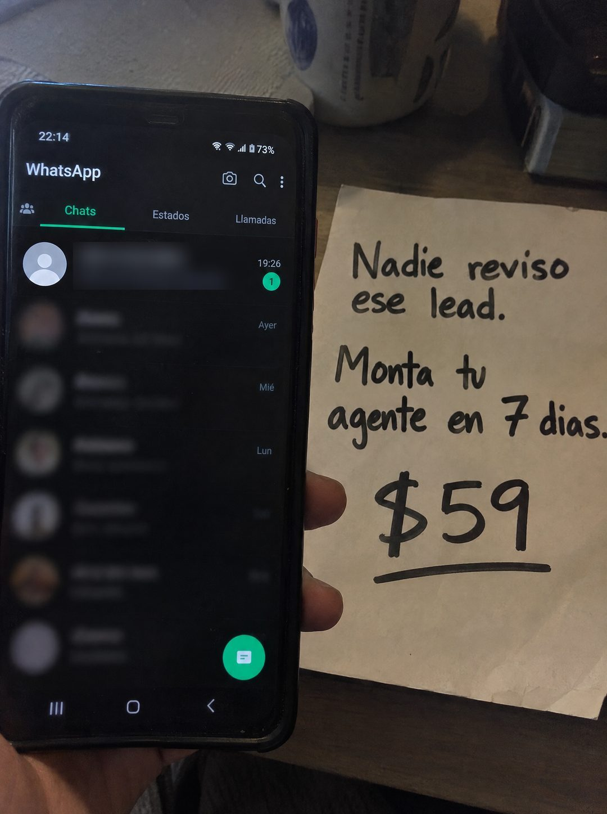

# 091 · Chat pendiente con cartel manuscrito

**Familia:** Objeto físico con texto · **Necesitas:** Nada · **Resultado en Meta:** Sin datos propios todavía



## Qué es
Una foto de cerca con la mano sosteniendo el teléfono en la lista de chats, donde arriba hay una consulta nueva sin leer, y al lado una hoja blanca escrita con marcador negro que nombra el problema. El resto de los chats está desenfocado.

## Por qué funciona
La prueba del problema está en la mano: alguien interesado escribió y el mensaje sigue sin abrir. La hoja escrita a mano parece una nota que alguien dejó para el equipo, y el precio grande y subrayado cierra sin rodeos.

## Cuándo usarlo
Público frío y tibio de negocios con varios encargados o un solo teléfono para todo, donde las consultas se quedan sin dueño. Sirve para nombrar la fuga y empujar la compra con el precio a la vista.

## Así lo hicimos para Imperio
- **Texto en la imagen:** [teléfono con WhatsApp en modo oscuro: 22:14, 73%, pestañas Chats, Estados, Llamadas] / [número de teléfono, ver Ojo] / Hola, me interesa más info / 19:26 / 1 / [resto de chats desenfocados: Ayer, Mié, Lun] / Nadie reviso ese lead. / Monta tu agente en 7 dias. / $59 (hoja blanca con marcador negro, precio subrayado)
- **Texto principal:**
  > Nadie reviso ese lead. Monta tu agente de WhatsApp en 7 dias. $59.
- **Titular:** Nadie reviso ese lead

## Receta para tu marca
- **Escena:** foto de cerca de una mano con [EL TELÉFONO O LA BANDEJA DONDE LLEGAN TUS CONSULTAS] y, al lado, una hoja blanca apoyada en el escritorio.
- **Pantalla:** un solo chat nítido arriba, de un número ficticio o borroso, con [UNA CONSULTA DE COMPRA TÍPICA] y el contador de no leído; el resto, desenfocado.
- **Hoja:** [LO QUE NADIE HIZO CON ESA CONSULTA] / [QUÉ MONTAS] en [PLAZO] / [TU PRECIO] grande y subrayado, todo con marcador negro.
- **Colores:** los reales de la app y del papel; no agregues tu paleta de marca.
- **Lo que no se toca:** un solo mensaje legible, el resto borroso, y la hoja escrita a mano en la misma toma.

## Prompt con que se hizo el de Imperio (GPT Image 2.5)
```
[Prompt reconstruido mirando la imagen: el original de Imperio no quedó guardado]
Photorealistic amateur photo at night, warm indoor light, slight grain. On the left, a hand holds an Android smartphone showing a chat list in dark mode: status bar '22:14' and battery '73%', the app title 'WhatsApp' with camera, search and menu icons, and the tabs 'Chats' (active, green underline), 'Estados' and 'Llamadas'. The top chat has a grey default avatar, an unsaved phone number as the contact name that is softly blurred and unreadable, the preview 'Hola, me interesa más info', the time '19:26' and a green unread badge '1'. All the chats below are heavily blurred, with only 'Ayer', 'Mié' and 'Lun' readable on the right, and a round green button at the bottom right. On the right, a sheet of white paper propped on a wooden desk, handwritten in thick black marker: 'Nadie revisó' / 'ese lead.' / 'Monta tu' / 'agente en 7 días.' / a big '$59' underlined. A white mug and a dark object out of focus at the top. Vertical 4:5 Instagram/Facebook feed ad, sharp and professional. All on-image text is Spanish and must be rendered EXACTLY as written inside the quotes, with every accent and ñ correct and every digit exact. Never use inverted question marks or inverted exclamation marks. No em dashes. Do not add any other words, logos or watermarks.
```

## Ojo
- En este ejemplo desenfocamos el número de teléfono del chat: tenía formato de número real. En tu versión, nunca muestres un número legible.
- No muestres un número de teléfono real: usa uno claramente ficticio o desenfócalo, igual que los demás chats.
- Si sale texto roto, manos deformes o cifras mal escritas, se rehace.
- Marca la casilla de contenido generado por IA en el Administrador de anuncios.
