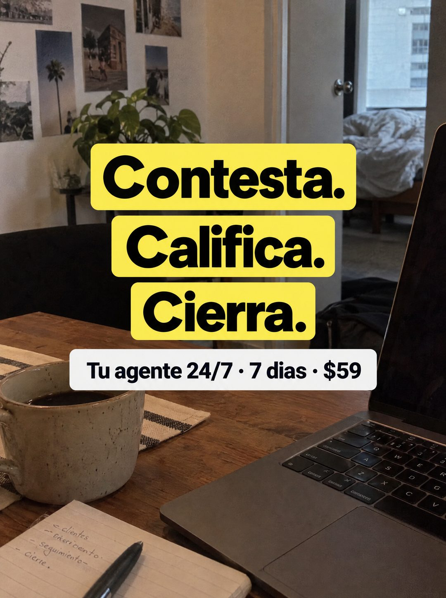

# 092 · Tres verbos resaltados sobre foto

**Familia:** Foto nativa · **Necesitas:** Nada. Si tienes una foto real de tu escritorio, mejor · **Resultado en Meta:** Sin datos propios todavía



## Qué es
Una foto de escritorio en casa (mesa de madera, café, portátil y cuaderno) con tres verbos en negro sobre cajas amarillas, uno por línea, como si estuvieran marcados con resaltador. Una cápsula blanca debajo lleva la oferta.

## Por qué funciona
Tres verbos con punto final explican el producto entero sin una palabra técnica: es el trabajo que el cliente quiere sacarse de encima. La foto de casa, cálida y un poco desordenada, dice que esto lo usa alguien como él y no una empresa grande.

## Cuándo usarlo
Público tibio que ya entiende el problema y necesita ver qué hace la solución en concreto. Sirve para servicios y herramientas que se pueden resumir en tres pasos.

## Así lo hicimos para Imperio
- **Texto en la imagen:** Contesta. / Califica. / Cierra. (negro sobre cajas amarillas, uno por línea) / Tu agente 24/7 · 7 dias · $59 (cápsula blanca) / [cuaderno con lista a mano: clientes, seguimiento, cierre]
- **Texto principal:**
  > Contesta. Califica. Cierra. Monta tu agente de WhatsApp en 7 dias. $59.
- **Titular:** Contesta. Califica. Cierra.

## Receta para tu marca
- **Escena:** foto real de [TU ESPACIO DE TRABAJO O EL DE TU CLIENTE] con luz de mañana, taza, cuaderno y portátil; nada posado.
- **Titular:** [VERBO 1]. / [VERBO 2]. / [VERBO 3]. en negro muy grueso, cada uno sobre su propia caja de color, apilados al centro.
- **Oferta:** cápsula blanca debajo con [TU PRODUCTO Y SU HORARIO] · [PLAZO] · [TU PRECIO].
- **Colores:** las cajas pueden ir en el color de tu marca si es claro y contrasta con el negro.
- **Lo que no se toca:** tres verbos en el orden real del proceso, con punto final, y la foto sin filtros ni marcos de diseño.

## Prompt con que se hizo el de Imperio (GPT Image 2.5)
```
[Prompt reconstruido mirando la imagen: el original de Imperio no quedó guardado]
Photorealistic phone photo of a cozy home office corner in soft morning light: a dark wooden table with a striped cloth placemat, a speckled ceramic mug of black coffee on the left, an open dark grey laptop on the right with its screen off, and a lined notebook at the bottom with a black pen and a short handwritten list '- clientes', '- seguimiento', '- cierre'. In the background, a wall with a few pinned travel photos, a pothos plant, an open door to a bedroom with an unmade bed and a window with a building outside. Centered headline: three stacked words in heavy black sans-serif, each on its own bright yellow rectangular highlight box: 'Contesta.' / 'Califica.' / 'Cierra.'. Below, a white rounded capsule with bold black text: 'Tu agente 24/7 · 7 días · $59'. Natural colors, slight grain. Vertical 4:5 Instagram/Facebook feed ad, sharp and professional. All on-image text is Spanish and must be rendered EXACTLY as written inside the quotes, with every accent and ñ correct and every digit exact. Never use inverted question marks or inverted exclamation marks. No em dashes. Do not add any other words, logos or watermarks.
```

## Ojo
- Los tres verbos tienen que ser lo que tu producto hace de verdad, en el orden en que lo hace.
- Revisa las tildes de la cápsula: en el ejemplo de Imperio se perdió la de días.
- Marca la casilla de contenido generado por IA en el Administrador de anuncios.
