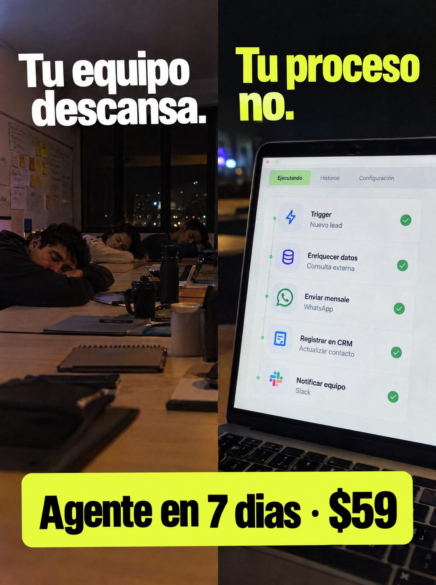

# 093 · Equipo dormido y flujo encendido

**Familia:** Foto nativa · **Necesitas:** Nada · **Resultado en Meta:** Sin datos propios todavía



## Qué es
Una foto partida en dos mitades de noche: a la izquierda, un equipo dormido sobre los escritorios de la oficina; a la derecha, un portátil con un flujo automático que sigue corriendo paso por paso con checks verdes. El titular se reparte entre las dos mitades.

## Por qué funciona
El contraste es la idea completa: las personas se cansan y el proceso no. La pantalla con pasos concretos (llega el contacto, se le escribe, se registra, se avisa al equipo) muestra cómo funciona sin explicarlo en texto.

## Cuándo usarlo
Público tibio de negocios con equipo, donde las consultas llegan fuera de horario. Sirve para mostrar el proceso por dentro y responder la duda de qué hace exactamente la automatización.

## Así lo hicimos para Imperio
- **Texto en la imagen:** Tu equipo descansa. (blanco, mitad izquierda) / Tu proceso no. (amarillo verdoso, mitad derecha) / [pantalla con un flujo: Ejecutando, Historial, Configuración / Trigger, Nuevo lead / Enriquecer datos, Consulta externa / Enviar mensaie, WhatsApp / Registrar en CRM, Actualizar contacto / Notificar equipo, Slack; cada paso con check verde] / Agente en 7 dias · $59 (caja lima, abajo)
- **Texto principal:**
  > Tu equipo descansa. Tu proceso no. Monta tu agente en 7 dias. $59.
- **Titular:** Tu equipo descansa. Tu proceso no.

## Receta para tu marca
- **Formato:** foto partida en dos mitades verticales, ambas de noche.
- **Mitad izquierda:** [TU EQUIPO O TU LUGAR DE TRABAJO] descansando, con luz baja y caras de lado o tapadas.
- **Mitad derecha:** pantalla con [LOS 4 O 5 PASOS QUE TU PROCESO HACE SOLO], cada uno con un check verde e íconos genéricos.
- **Titular:** [LO QUE DESCANSA] en blanco sobre la izquierda / [LO QUE NO SE DETIENE] en amarillo verdoso sobre la derecha.
- **Oferta:** caja lima abajo con [TU PRODUCTO] en [PLAZO] · [TU PRECIO] en negro; el lima puede pasar al color de tu marca.
- **Lo que no se toca:** los pasos de la pantalla tienen que ser reales y la frase tiene que partirse justo en el corte de la foto.

## Prompt con que se hizo el de Imperio (GPT Image 2.5)
```
[Prompt reconstruido mirando la imagen: el original de Imperio no quedó guardado]
Vertical split image, both halves photographed at night. Left half: photorealistic shot of a shared office table late at night, three young people asleep with their heads on their arms, faces turned or partly hidden, a whiteboard with sticky notes on the left wall, dark windows with city lights, mugs, a water bottle and notebooks on the table, warm dim light. Right half: close-up of an open laptop screen in a dark room showing a clean light automation app: tabs 'Ejecutando' (active, green), 'Historial' and 'Configuración'; a vertical list of five step cards connected by a thin green line, each with a simple flat icon (lightning bolt, database, chat bubble, document, team) and a green check: 'Trigger' / 'Nuevo lead', 'Enriquecer datos' / 'Consulta externa', 'Enviar mensaje' / 'WhatsApp', 'Registrar en CRM' / 'Actualizar contacto', 'Notificar equipo' / 'Slack'. Headline split across the top: on the left in bold white condensed sans-serif 'Tu equipo' / 'descansa.', on the right in bold neon yellow-green 'Tu proceso' / 'no.'. At the bottom, a wide lime-yellow rounded box with heavy black condensed text: 'Agente en 7 días · $59'. Vertical 4:5 Instagram/Facebook feed ad, sharp and professional. All on-image text is Spanish and must be rendered EXACTLY as written inside the quotes, with every accent and ñ correct and every digit exact. Never use inverted question marks or inverted exclamation marks. No em dashes. Do not add any other words, logos or watermarks.
```

## Ojo
- No pongas logos de terceros (como WhatsApp o Slack) si no tienes permiso para usarlos: en la pantalla bastan íconos genéricos.
- El flujo de la pantalla es una demo de lo que tu producto hace de verdad: no muestres pasos que no entregas.
- Marca la casilla de contenido generado por IA en el Administrador de anuncios.
