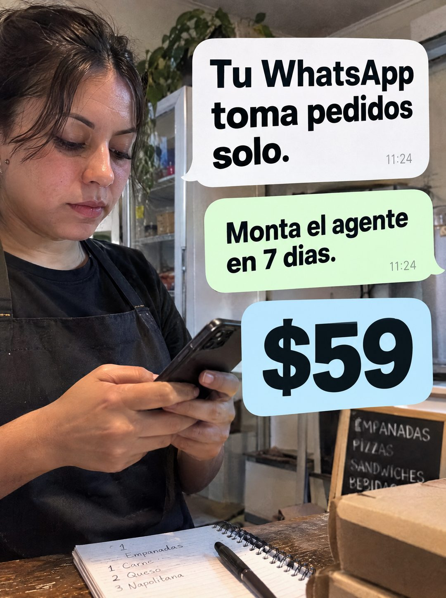

# 094 · Local con burbujas de chat

**Familia:** Foto nativa · **Necesitas:** Nada. Si tienes una foto real de tu local, mejor · **Resultado en Meta:** Sin datos propios todavía



## Qué es
Una foto de la persona que atiende un negocio (en el ejemplo, la dueña de un local de comida con delantal) mirando su teléfono detrás del mostrador, con el titular y la oferta puestos como tres burbujas de chat apiladas a su lado. El menú del local y el cuaderno de pedidos dan el contexto.

## Por qué funciona
El cliente se ve a sí mismo: delantal puesto, cuaderno de pedidos y teléfono en la mano. Las burbujas hablan el idioma del canal que se quiere automatizar, y el precio en su propia burbuja se lee como un mensaje más, no como una etiqueta de oferta.

## Cuándo usarlo
Público frío de comercios que reciben pedidos por mensaje (comida, panadería, ferretería, delivery). Sirve para frenar el scroll con alguien del rubro y presentar la promesa en una frase.

## Así lo hicimos para Imperio
- **Texto en la imagen:** Tu WhatsApp toma pedidos solo. 11:24 (burbuja blanca) / Monta el agente en 7 dias. 11:24 (burbuja verde) / $59 (burbuja celeste) / [pizarra del local: EMPANADAS, PIZZAS, SANDWICHES, BEBIDAS] / [cuaderno de pedidos: Empanadas, 1 Carne, 2 Queso, 3 Napolitana]
- **Texto principal:**
  > Tu WhatsApp toma pedidos solo. Monta el agente en 7 dias. $59.
- **Titular:** Tu WhatsApp toma pedidos solo

## Receta para tu marca
- **Escena:** foto real de [UNA PERSONA DE TU RUBRO EN SU LUGAR DE TRABAJO] mirando el teléfono, con ropa de trabajo, el mostrador y [UN DETALLE DEL RUBRO, COMO EL MENÚ O EL CUADERNO DE PEDIDOS].
- **Burbuja 1 (blanca):** [TU PROMESA EN UNA FRASE] con la hora en chico.
- **Burbuja 2 (verde):** [QUÉ MONTAS] en [PLAZO], con la misma hora.
- **Burbuja 3 (celeste):** [TU PRECIO] solo, en número gigante.
- **Lo que no se toca:** la persona trabajando de verdad (no posando) y las tres burbujas apiladas a un costado sin taparle la cara; los colores de las burbujas imitan al chat, no a tu marca.

## Prompt con que se hizo el de Imperio (GPT Image 2.5)
```
[Prompt reconstruido mirando la imagen: el original de Imperio no quedó guardado]
Photorealistic candid phone photo inside a small, cluttered take-away food shop in daylight. On the left, a woman in her thirties with dark hair tied back and loose strands, a black T-shirt and a black apron, stands behind a wooden counter looking down at the smartphone in her hands, focused. Behind her, a glass fridge with shelves, hanging plants and a stainless steel kitchen. On the counter at the bottom, a spiral notebook with a pen and a handwritten order list 'Empanadas' / '1 Carne' / '2 Queso' / '3 Napolitana', and cardboard take-away boxes on the right. Behind the boxes, a small chalkboard menu with white chalk capitals: 'EMPANADAS' / 'PIZZAS' / 'SÁNDWICHES' / 'BEBIDAS'. On the right side, three stacked chat-bubble overlays in bold black sans-serif: a white incoming bubble 'Tu WhatsApp' / 'toma pedidos' / 'solo.' with a small grey time '11:24', a light green outgoing bubble 'Monta el agente' / 'en 7 días.' with '11:24', and a light blue rounded box with a huge '$59'. Natural skin texture, realistic hands. Vertical 4:5 Instagram/Facebook feed ad, sharp and professional. All on-image text is Spanish and must be rendered EXACTLY as written inside the quotes, with every accent and ñ correct and every digit exact. Never use inverted question marks or inverted exclamation marks. No em dashes. Do not add any other words, logos or watermarks.
```

## Ojo
- La persona representa a tu cliente ideal, no da testimonio: no le pongas nombre ni frases como si fuera una clienta real.
- Si sale texto roto, manos deformes o cifras mal escritas, se rehace.
- Marca la casilla de contenido generado por IA en el Administrador de anuncios.
