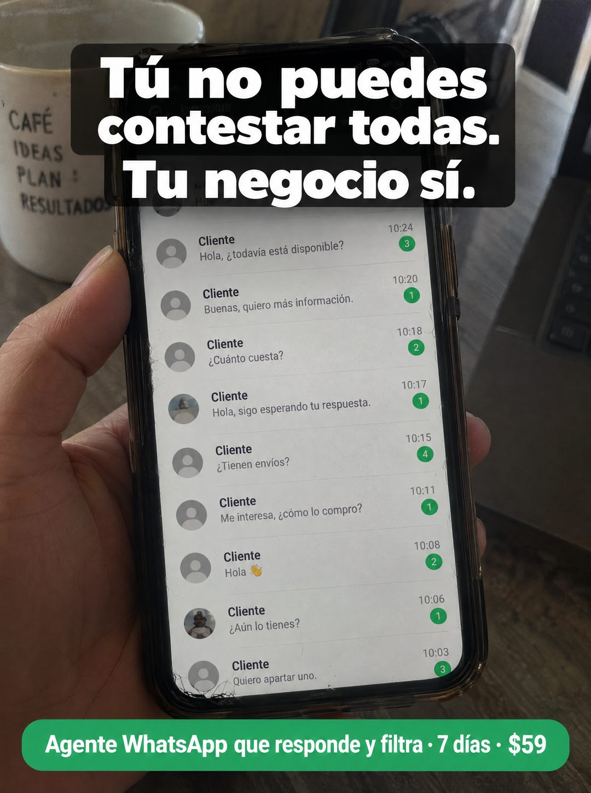

# 095 · Bandeja de chats sin contestar

**Familia:** Interfaz creíble · **Necesitas:** Nada · **Resultado en Meta:** Sin datos propios todavía



## Qué es
Una foto del teléfono en la mano con la bandeja de chats llena: nueve conversaciones de clientes sin contestar en veinte minutos, cada una con su contador de no leídos. El titular va arriba sobre una caja oscura translúcida y la oferta en una cápsula verde abajo.

## Por qué funciona
La lista larga se entiende de un vistazo: son ventas esperando y el dueño no da abasto. El titular no culpa al dueño, le da permiso (tú no puedes) y le pasa la tarea al negocio, que es justo lo que vende un agente.

## Cuándo usarlo
Público frío y tibio de comercios y servicios con mucho volumen de consultas por chat. Sirve para frenar el scroll y bajar la culpa del dueño antes de presentar la solución.

## Así lo hicimos para Imperio
- **Texto en la imagen:** Tú no puedes contestar todas. / Tu negocio sí. (blanco sobre caja oscura translúcida) / [bandeja con 9 chats Cliente sin contestar entre 10:03 y 10:24: Hola, todavía está disponible?, Cuánto cuesta?, Hola, sigo esperando tu respuesta., Me interesa, cómo lo compro?, Aún lo tienes?, entre otros, con contadores verdes] / [taza: CAFÉ IDEAS PLAN : RESULTADOS] / Agente WhatsApp que responde y filtra · 7 días · $59 (cápsula verde abajo)
- **Texto principal:**
  > Tú no puedes contestar todas. Tu negocio sí. Monta tu agente de WhatsApp en 7 dias. $59.
- **Titular:** Tú no puedes contestar todas

## Receta para tu marca
- **Escena:** foto del teléfono en la mano, con una taza y un portátil desenfocados detrás.
- **Pantalla:** bandeja con 8 o 9 chats llamados Cliente, avatares genéricos, [LAS CONSULTAS TÍPICAS DE TU RUBRO] y contadores de no leídos, con horas seguidas.
- **Titular:** [LO QUE TÚ NO PUEDES HACER]. / [QUIÉN SÍ PUEDE]. en letra blanca gruesa sobre una caja oscura translúcida, arriba.
- **Oferta:** cápsula de color abajo con [QUÉ HACE TU SOLUCIÓN] · [PLAZO] · [TU PRECIO]; el color puede ser el de tu marca.
- **Lo que no se toca:** la bandeja tiene que verse llena y real, con horas que muestren que todo llegó en poco rato.

## Prompt con que se hizo el de Imperio (GPT Image 2.5)
```
[Prompt reconstruido mirando la imagen: el original de Imperio no quedó guardado]
Amateur phone photo: a hand holds a smartphone in a clear case with a slightly cracked screen corner, in front of a blurred desk with a white mug printed 'CAFÉ' / 'IDEAS' / 'PLAN :' / 'RESULTADOS' and a laptop. The screen shows a light messaging chat list with nine rows, each named 'Cliente' with a grey default avatar, a message preview, a time and a green unread counter, from top to bottom: 'Hola, todavía está disponible?' at '10:24' with '3'; 'Buenas, quiero más información.' at '10:20' with '1'; 'Cuánto cuesta?' at '10:18' with '2'; 'Hola, sigo esperando tu respuesta.' at '10:17' with '1'; 'Tienen envíos?' at '10:15' with '4'; 'Me interesa, cómo lo compro?' at '10:11' with '1'; 'Hola 👋' at '10:08' with '2'; 'Aún lo tienes?' at '10:06' with '1'; 'Quiero apartar uno.' at '10:03' with '3'. At the top, over a dark translucent rounded box, a bold white sans-serif headline: 'Tú no puedes' / 'contestar todas.' / 'Tu negocio sí.'. At the bottom, a green rounded capsule with bold white text: 'Agente WhatsApp que responde y filtra · 7 días · $59'. Natural daylight, real screen glare. Vertical 4:5 Instagram/Facebook feed ad, sharp and professional. All on-image text is Spanish and must be rendered EXACTLY as written inside the quotes, with every accent and ñ correct and every digit exact. Never use inverted question marks or inverted exclamation marks. No em dashes. Do not add any other words, logos or watermarks.
```

## Ojo
- En el ejemplo de Imperio se colaron signos de apertura en el texto: pide en el prompt que no aparezcan.
- Todos los chats van como Cliente y sin fotos reconocibles: nunca uses una captura con nombres o números reales.
- Marca la casilla de contenido generado por IA en el Administrador de anuncios.
