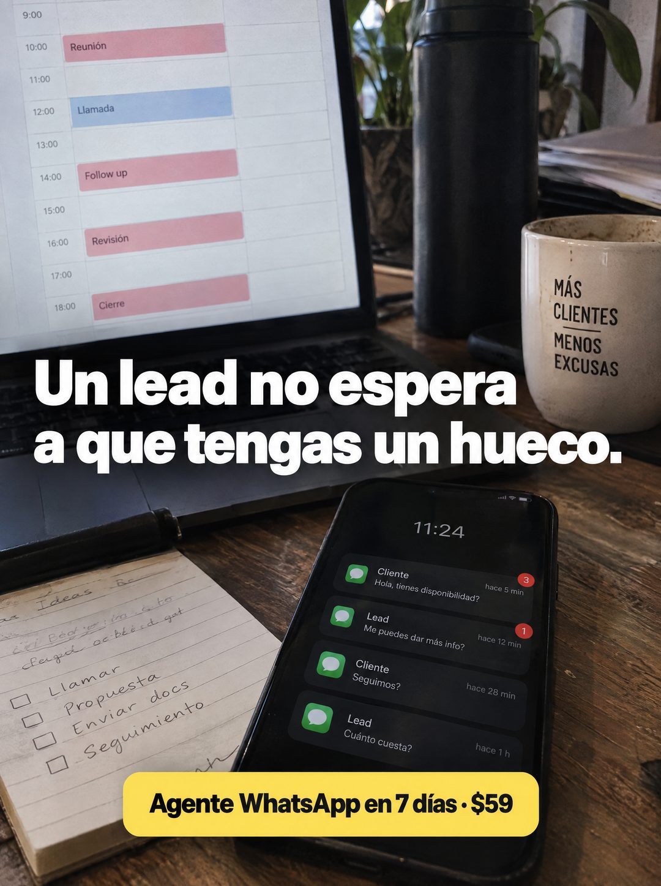

# 096 · Agenda llena y avisos esperando

**Familia:** Foto nativa · **Necesitas:** Nada · **Resultado en Meta:** Sin datos propios todavía



## Qué es
Una foto de escritorio donde conviven la agenda del día llena en el portátil y el teléfono bloqueado con avisos de clientes que esperan hace minutos u horas. El titular cruza la foto en letra blanca gruesa y la oferta va en una cápsula amarilla.

## Por qué funciona
Pone frente a frente las dos cosas que el dueño no puede atender a la vez: su agenda y sus clientes. Los avisos con minutos y horas de espera muestran el costo del tiempo sin dar una cifra, y los detalles (la taza con frase, la libreta con pendientes) lo vuelven un escritorio real.

## Cuándo usarlo
Público frío de profesionales y dueños con la agenda llena de reuniones (consultores, agencias, servicios). Sirve para frenar el scroll y nombrar el dolor de no tener tiempo para responder.

## Así lo hicimos para Imperio
- **Texto en la imagen:** [portátil con la agenda del día: Reunión, Llamada, Follow up, Revisión, Cierre] / [taza: MÁS CLIENTES MENOS EXCUSAS] / Un lead no espera a que tengas un hueco. (blanco, letra gruesa) / [teléfono bloqueado a las 11:24 con 4 avisos: Cliente, Hola, tienes disponibilidad?, hace 5 min / Lead, Me puedes dar más info?, hace 12 min / Cliente, Seguimos?, hace 28 min / Lead, Cuánto cuesta?, hace 1 h] / [libreta: Ideas, Llamar, Propuesta, Enviar docs, Seguimiento] / Agente WhatsApp en 7 días · $59 (cápsula amarilla abajo)
- **Texto principal:**
  > Un lead no espera a que tengas un hueco. Monta tu agente de WhatsApp en 7 dias. $59.
- **Titular:** Un lead no espera

## Receta para tu marca
- **Escena:** foto de escritorio con luz de ventana, [TU AGENDA O TU LISTA DEL DÍA] llena en la pantalla del portátil, una taza y una libreta con pendientes.
- **Protagonista:** el teléfono bloqueado en primer plano con 3 o 4 avisos de Cliente o Lead y su tiempo de espera (hace 5 min, hace 1 h).
- **Titular:** [LO QUE TU CLIENTE NO HACE] / [LO QUE TÚ NO TIENES] en letra blanca muy gruesa, cruzando la foto a media altura.
- **Oferta:** cápsula amarilla abajo con [QUÉ MONTAS] en [PLAZO] · [TU PRECIO]; el amarillo puede pasar al color de tu marca.
- **Lo que no se toca:** la agenda y los avisos en la misma toma, con los tiempos de espera visibles.

## Prompt con que se hizo el de Imperio (GPT Image 2.5)
```
[Prompt reconstruido mirando la imagen: el original de Imperio no quedó guardado]
Photorealistic phone photo of a rustic wooden desk in soft window light. In the background, an open laptop showing a day calendar with time slots from '9:00' to '18:00' and colored blocks: 'Reunión' at '10:00', 'Llamada' at '12:00' in blue, 'Follow up' at '14:00', 'Revisión' at '16:00' and 'Cierre' at '18:00' in pink. Behind it, a tall black water bottle and plants; on the right, a speckled cream mug with black capitals 'MÁS' / 'CLIENTES' / 'MENOS' / 'EXCUSAS' and a short line between the two phrases. In the foreground, a black smartphone lying on the desk with its lock screen showing '11:24' and four notifications with a green message icon: 'Cliente' / 'Hola, tienes disponibilidad?' / 'hace 5 min' with a red badge '3'; 'Lead' / 'Me puedes dar más info?' / 'hace 12 min' with a red badge '1'; 'Cliente' / 'Seguimos?' / 'hace 28 min'; 'Lead' / 'Cuánto cuesta?' / 'hace 1 h'. On the left, a notepad with a handwritten checklist 'Ideas', 'Llamar', 'Propuesta', 'Enviar docs', 'Seguimiento'. Across the middle, a big bold white sans-serif headline: 'Un lead no espera' / 'a que tengas un hueco.'. At the bottom, a yellow rounded capsule with bold black text: 'Agente WhatsApp en 7 días · $59'. Vertical 4:5 Instagram/Facebook feed ad, sharp and professional. All on-image text is Spanish and must be rendered EXACTLY as written inside the quotes, with every accent and ñ correct and every digit exact. Never use inverted question marks or inverted exclamation marks. No em dashes. Do not add any other words, logos or watermarks.
```

## Ojo
- Las notificaciones son una escena del problema: nombres genéricos (Cliente, Lead) y nada de números o datos reales.
- Si sale texto roto, manos deformes o cifras mal escritas, se rehace.
- Marca la casilla de contenido generado por IA en el Administrador de anuncios.
