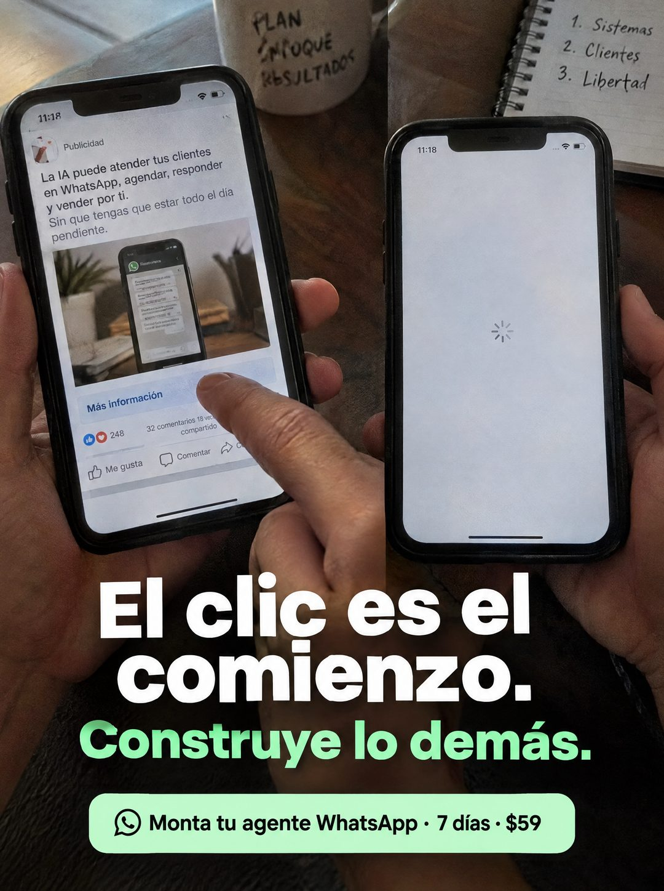

# 099 · Anuncio clicado y pantalla vacía

**Familia:** Interfaz creíble · **Necesitas:** Nada · **Resultado en Meta:** Sin datos propios todavía



## Qué es
Una foto de dos teléfonos en las manos: en el izquierdo, un dedo toca el botón de un anuncio en el feed; en el derecho, lo que se abre después del clic es una pantalla en blanco cargando. El titular dice qué falta entre uno y otro.

## Por qué funciona
Le habla al que ya pauta y cree que el anuncio es todo: el clic llega y después no hay nada que atienda. Las dos pantallas lado a lado cuentan un antes y un después en una sola foto, y el titular convierte la frustración en una tarea concreta (construir lo que pasa después del clic).

## Cuándo usarlo
Público tibio de negocios que ya hacen anuncios y ven clics sin ventas. Sirve para responder la objeción de que el problema es el anuncio y empujar a resolver lo que viene después.

## Así lo hicimos para Imperio
- **Texto en la imagen:** [teléfono izquierdo con un anuncio en el feed: Publicidad / La IA puede atender tus clientes en WhatsApp, agendar, responder y vender por ti. / Sin que tengas que estar todo el día pendiente. / Más información / 248 / 32 comentarios 18 veces compartido / Me gusta / Comentar] / [teléfono derecho: pantalla en blanco cargando] / [taza: PLAN ENFOQUE RESULTADOS; cuaderno: 1. Sistemas 2. Clientes 3. Libertad] / El clic es el comienzo. (blanco) / Construye lo demás. (verde menta) / Monta tu agente WhatsApp · 7 días · $59 (cápsula verde menta con ícono de WhatsApp)
- **Texto principal:**
  > El clic es el comienzo. Construye lo demás. Monta tu agente WhatsApp en 7 dias. $59.
- **Titular:** El clic es el comienzo

## Receta para tu marca
- **Escena:** dos teléfonos sostenidos con las manos sobre un escritorio, con una taza y un cuaderno desenfocados atrás.
- **Teléfono izquierdo:** [UN ANUNCIO TUYO O GENÉRICO] en el feed, con un dedo tocando el botón; reacciones y comentarios desenfocados o genéricos.
- **Teléfono derecho:** [LO QUE PASA DESPUÉS DEL CLIC CUANDO NADIE ATIENDE]: pantalla en blanco cargando, chat sin respuesta o formulario vacío.
- **Titular:** [EL CLIC NO ALCANZA] en blanco / [LO QUE HAY QUE CONSTRUIR] en el color de tu marca, en la parte baja.
- **Oferta:** cápsula del mismo color con [QUÉ MONTAS] · [PLAZO] · [TU PRECIO].
- **Lo que no se toca:** las dos pantallas en la misma foto, una al lado de la otra: el contraste entre el clic y la nada es el formato.

## Prompt con que se hizo el de Imperio (GPT Image 2.5)
```
[Prompt reconstruido mirando la imagen: el original de Imperio no quedó guardado]
Photorealistic phone photo of two hands, each holding a smartphone side by side above a dark wooden desk, with a white mug handwritten in black marker 'PLAN' / 'ENFOQUE' / 'RESULTADOS' and a spiral notebook with '1. Sistemas' / '2. Clientes' / '3. Libertad' blurred in the background. Left phone, time '11:18': a social media feed showing a sponsored post labeled 'Publicidad' with the text 'La IA puede atender tus clientes en WhatsApp, agendar, responder y vender por ti.' and, in lighter grey, 'Sin que tengas que estar todo el día pendiente.', a photo of a phone with a chat on a desk, a light blue 'Más información' button being tapped by an index finger from the other hand, a small reaction count '248', the line '32 comentarios 18 veces compartido', and the buttons 'Me gusta' and 'Comentar'. Right phone, time '11:18': an empty white screen with only a small grey loading spinner in the middle. Over the lower part, a bold headline: 'El clic es el' / 'comienzo.' in white and 'Construye lo demás.' in mint green. At the bottom, a mint green rounded capsule with a simple black outline chat icon and black text: 'Monta tu agente WhatsApp · 7 días · $59'. Natural indoor light, realistic fingers. Vertical 4:5 Instagram/Facebook feed ad, sharp and professional. All on-image text is Spanish and must be rendered EXACTLY as written inside the quotes, with every accent and ñ correct and every digit exact. Never use inverted question marks or inverted exclamation marks. No em dashes. Do not add any other words, logos or watermarks.
```

## Ojo
- El anuncio dentro del teléfono tiene que ser tuyo o genérico: nunca muestres el anuncio de otra marca ni reacciones y comentarios que parezcan prueba real.
- Si sale texto roto, manos deformes o cifras mal escritas, se rehace.
- Marca la casilla de contenido generado por IA en el Administrador de anuncios.
