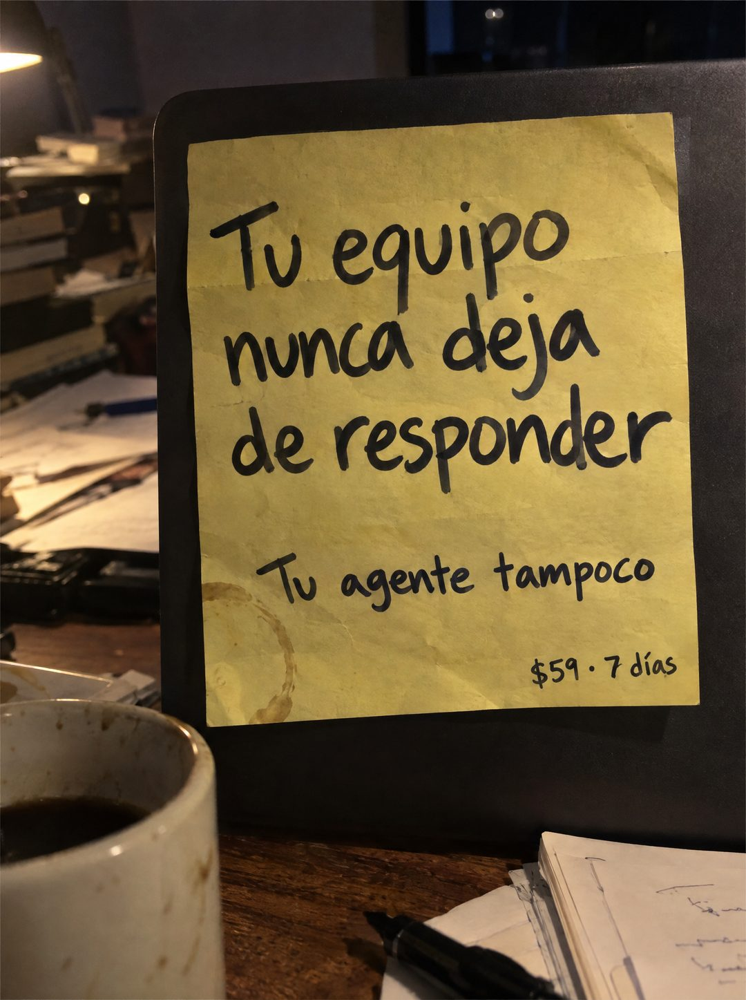

# 100 · Hoja amarilla pegada al portátil

**Familia:** Objeto físico con texto · **Necesitas:** Nada · **Resultado en Meta:** Sin datos propios todavía



## Qué es
Una hoja amarilla escrita con marcador negro y pegada sobre la tapa de un portátil cerrado, en un escritorio desordenado de noche, con una mancha de taza en la esquina. Se lee como una consigna para el equipo, con el precio en letra chica al pie.

## Por qué funciona
Un papel pegado en el portátil es lo que uno deja para que el equipo lo vea al llegar: se lee como una regla interna, no como publicidad. La escena de noche, con la taza a medio tomar y los papeles revueltos, pone el contexto de las horas extra sin decirlo.

## Cuándo usarlo
Público frío de dueños con un equipo chico de atención o ventas. Sirve para frenar el scroll con un objeto real y plantear la promesa de atención continua.

## Así lo hicimos para Imperio
- **Texto en la imagen:** Tu equipo nunca deja de responder / Tu agente tampoco / $59 · 7 días (abajo a la derecha, más chico; todo con marcador negro sobre papel amarillo con una mancha de café)
- **Texto principal:**
  > Tu equipo nunca deja de responder. Tu agente tampoco. Monta tu agente de WhatsApp en 7 dias. $59.
- **Titular:** Tu equipo nunca deja de responder

## Receta para tu marca
- **Escena:** escritorio de noche con una lámpara cálida, papeles, libros, una taza de café y un portátil cerrado al centro.
- **Objeto:** hoja amarilla grande pegada sobre la tapa del portátil, con una mancha de taza en una esquina.
- **Titular:** [LA CONSIGNA QUE TU CLIENTE QUIERE PARA SU EQUIPO] con marcador negro grande, en tres líneas.
- **Texto:** [EL REMATE QUE METE A TU PRODUCTO] más chico debajo, y [TU PRECIO] · [PLAZO] en letra chica abajo a la derecha.
- **Lo que no se toca:** todo escrito a mano en un solo papel y la escena fuera de horario; sin logos, colores de marca ni franjas de diseño.

## Prompt con que se hizo el de Imperio (GPT Image 2.5)
```
[Prompt reconstruido mirando la imagen: el original de Imperio no quedó guardado]
Photorealistic phone photo at night of a messy wooden desk lit by a warm desk lamp in the top left corner. In the center, a closed dark grey laptop standing upright, with a large sheet of yellow legal-pad paper taped flat on its lid and a faint brown coffee ring stain on the lower left of the paper. Handwritten in thick black marker, casual and large: 'Tu equipo' / 'nunca deja' / 'de responder', below in medium size 'Tu agente tampoco', and small at the bottom right '$59 · 7 días'. Around it: stacks of books and loose papers on the left, a calculator, a white mug of black coffee in the bottom left foreground, notes and a black marker in the bottom right. Moody low light, slight grain, real paper texture. Vertical 4:5 Instagram/Facebook feed ad, sharp and professional. All on-image text is Spanish and must be rendered EXACTLY as written inside the quotes, with every accent and ñ correct and every digit exact. Never use inverted question marks or inverted exclamation marks. No em dashes. Do not add any other words, logos or watermarks.
```

## Ojo
- No prometas atención continua si tu producto no la da: la frase de la hoja se lee como promesa.
- Si sale texto roto, manos deformes o cifras mal escritas, se rehace.
- Marca la casilla de contenido generado por IA en el Administrador de anuncios.
