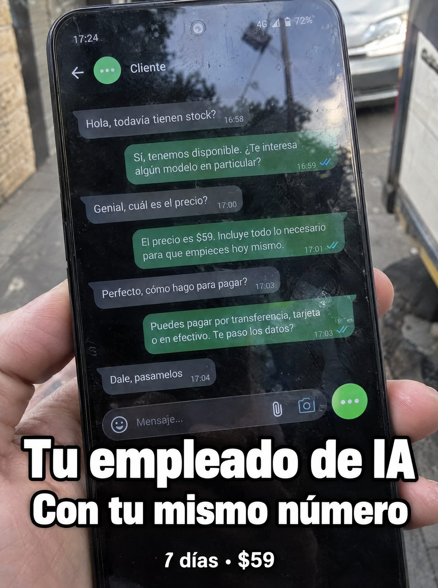

# 101 · Chat de venta en la calle

**Familia:** Interfaz creíble · **Necesitas:** Nada · **Resultado en Meta:** Sin datos propios todavía



## Qué es
Una foto del teléfono sostenido en la calle con una conversación completa donde el agente responde stock, precio y forma de pago hasta que el cliente pide los datos para pagar. El titular, en blanco con borde negro, dice qué es el producto y su promesa clave.

## Por qué funciona
Muestra el producto funcionando en vez de describirlo: se lee la conversación entera y termina en una venta. La foto en la calle, a pleno sol, dice que el dueño no está en el escritorio y el negocio igual vende, y lo de tu mismo número responde la duda práctica antes de que aparezca.

## Cuándo usarlo
Público tibio que ya entiende qué es un agente y quiere ver cómo conversa. Sirve para mostrar el producto en uso, responder la objeción de cambiar de número y empujar la compra.

## Así lo hicimos para Imperio
- **Texto en la imagen:** [chat en modo oscuro: 17:24, 4G, 72%, contacto Cliente] / Hola, todavía tienen stock? 16:58 / Sí, tenemos disponible. Te interesa algún modelo en particular? 16:59 / Genial, cuál es el precio? 17:00 / El precio es $59. Incluye todo lo necesario para que empieces hoy mismo. 17:01 / Perfecto, cómo hago para pagar? 17:03 / Puedes pagar por transferencia, tarjeta o en efectivo. Te paso los datos? 17:03 / Dale, pasamelos 17:04 / Mensaje... / Tu empleado de IA / Con tu mismo número (blanco con borde negro) / 7 días · $59
- **Texto principal:**
  > Tu empleado de IA. Con tu mismo número. Monta tu agente de WhatsApp en 7 dias. $59.
- **Titular:** Tu empleado de IA con tu número

## Receta para tu marca
- **Escena:** foto del teléfono sostenido con la mano en la calle, con luz de día y reflejos reales en la pantalla.
- **Chat:** conversación de demo entre Cliente y tu agente: [PREGUNTA DE DISPONIBILIDAD] / [RESPUESTA CON UNA PREGUNTA DE VUELTA] / [PREGUNTA DE PRECIO] / [TU PRECIO REAL Y QUÉ INCLUYE] / [PREGUNTA DE PAGO] / [TUS FORMAS DE PAGO REALES] / [CIERRE DEL CLIENTE].
- **Titular:** [QUÉ ES TU PRODUCTO EN 4 PALABRAS] / [LA OBJECIÓN QUE RESUELVE] en blanco grueso con borde negro, abajo.
- **Oferta:** [PLAZO] · [TU PRECIO] en una línea chica debajo del titular.
- **Lo que no se toca:** el chat termina con el cliente listo para pagar, con precio y formas de pago reales; los colores son los de la app, no los de tu marca.

## Prompt con que se hizo el de Imperio (GPT Image 2.5)
```
[Prompt reconstruido mirando la imagen: el original de Imperio no quedó guardado]
Amateur phone photo outdoors on a sunny city sidewalk: a hand holds up an Android smartphone close to the camera, with a parked car, a tree and a pole reflected on the glossy screen. The screen shows a dark-mode messaging chat: status '17:24', '4G' and '72%', a back arrow, a green round avatar with three dots and the name 'Cliente'. Incoming messages in dark grey bubbles on the left and outgoing messages in green bubbles on the right with blue double checks: incoming 'Hola, todavía tienen stock?' '16:58'; outgoing 'Sí, tenemos disponible. Te interesa algún modelo en particular?' '16:59'; incoming 'Genial, cuál es el precio?' '17:00'; outgoing 'El precio es $59. Incluye todo lo necesario para que empieces hoy mismo.' '17:01'; incoming 'Perfecto, cómo hago para pagar?' '17:03'; outgoing 'Puedes pagar por transferencia, tarjeta o en efectivo. Te paso los datos?' '17:03'; incoming 'Dale, pásamelos' '17:04'. The message field 'Mensaje...' with clip and camera icons and a green round button. Over the bottom part, a big bold white headline with a thick black outline: 'Tu empleado de IA' / 'Con tu mismo número', and below in smaller bold white text: '7 días · $59'. Harsh daylight, real reflections. Vertical 4:5 Instagram/Facebook feed ad, sharp and professional. All on-image text is Spanish and must be rendered EXACTLY as written inside the quotes, with every accent and ñ correct and every digit exact. Never use inverted question marks or inverted exclamation marks. No em dashes. Do not add any other words, logos or watermarks.
```

## Ojo
- Deja claro que el chat es una demostración de tu agente, nunca lo presentes como conversación real con un cliente.
- En el ejemplo de Imperio se colaron signos de apertura en el texto: pide en el prompt que no aparezcan.
- Marca la casilla de contenido generado por IA en el Administrador de anuncios.
