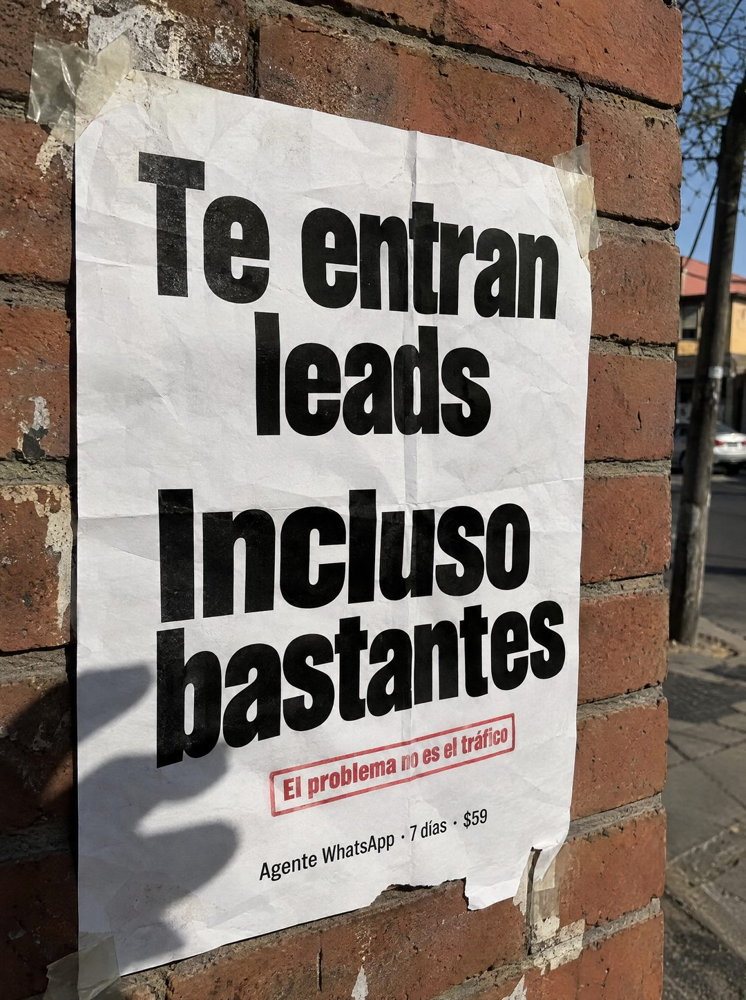

# 102 · Afiche pegado en la calle

**Familia:** Objeto físico con texto · **Necesitas:** Nada · **Resultado en Meta:** Sin datos propios todavía



## Qué es
Una hoja impresa pegada con cinta adhesiva a un muro de la calle, fotografiada con el celular a pleno sol. Lleva un titular negro enorme que nombra lo que el cliente ya tiene, un sello rojo que da el giro y la oferta en una línea chica.

## Por qué funciona
Parece un cartel real que alguien vio camino al trabajo, no un diseño hecho en Canva, y eso baja la guardia. El titular le da la razón al cliente (le entran leads) y el sello rojo mueve el problema de lugar: no es el tráfico, es lo que pasa después.

## Cuándo usarlo
Público frío que ya invierte en publicidad o recibe consultas. Sirve para cualquier negocio que quiera frenar el scroll corrigiendo una creencia del cliente antes de vender.

## Así lo hicimos para Imperio
- **Texto en la imagen:** Te entran leads / Incluso bastantes / El problema no es el tráfico (sello rojo en recuadro) / Agente WhatsApp · 7 días · $59 (letra chica, abajo)
- **Texto principal:**
  > Te entran leads. Incluso bastantes. El problema no es el tráfico. Monta el agente que filtra en 7 dias. $59.
- **Titular:** Te entran leads. Incluso bastantes.

## Receta para tu marca
- **Escena:** foto vertical tipo celular de una hoja blanca arrugada, pegada con cinta transparente a un muro de ladrillo, con calle, sol y sombras reales al fondo.
- **Titular:** [LO QUE TU CLIENTE YA TIENE] / [EL REMATE QUE LE DA LA RAZÓN], en dos bloques de letra negra condensada y gigante.
- **Giro:** un sello rojo en recuadro, apenas torcido: El problema no es [LO QUE TU CLIENTE CREE].
- **Oferta:** una línea chica al pie: [TU PRODUCTO] · [TU PLAZO] · [TU PRECIO].
- **Colores:** papel blanco, tinta negra y un solo acento rojo; tu marca no entra en el cartel.
- **Lo que no se toca:** que se vea pegado en un muro real (cinta, arrugas, sombra) y que el sello contradiga lo que el cliente cree.

## Prompt con que se hizo el de Imperio (GPT Image 2.5)
```
[Prompt reconstruido mirando la imagen: el original de Imperio no quedó guardado]
Photorealistic amateur phone photo, vertical. A sheet of thin white printer paper, slightly crumpled and wrinkled, taped at the corners with strips of clear tape onto a weathered red brick pillar on a city sidewalk, shot at a slight angle in bright afternoon sunlight. On the right, out of focus: a concrete utility pole, a parked white car, a low building with a red roof, bare tree branches and blue sky. The soft shadow of the person taking the photo falls across the lower left of the sheet. Printed on the sheet in heavy black condensed sans-serif, very large and centered: 'Te entran' / 'leads' and below, even bigger: 'Incluso' / 'bastantes'. Under it, a red rubber-stamp style rectangle, slightly tilted, with bold red text 'El problema no es el tráfico'. Near the bottom, a small black line: 'Agente WhatsApp · 7 días · $59'. The bottom right corner of the paper is torn, the tape is slightly peeling, real paper texture and creases. Vertical 4:5 Instagram/Facebook feed ad, sharp and professional. All on-image text is Spanish and must be rendered EXACTLY as written inside the quotes, with every accent and ñ correct and every digit exact. Never use inverted question marks or inverted exclamation marks. No em dashes. Do not add any other words, logos or watermarks.
```

## Ojo
- El sello tiene que corregir una creencia real de tu cliente: si de verdad su problema es el tráfico, cambia el giro.
- Marca la casilla de contenido generado por IA en el Administrador de anuncios.
