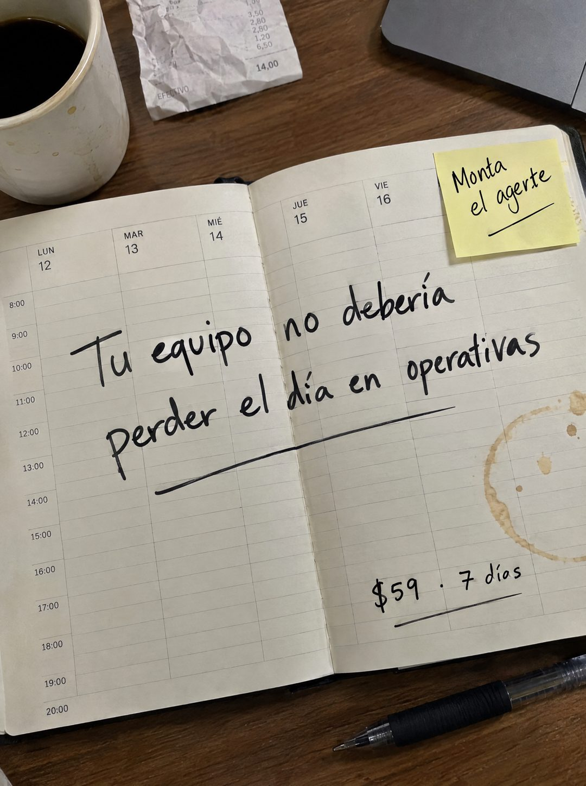

# 103 · Agenda semanal escrita a mano

**Familia:** Objeto físico con texto · **Necesitas:** Nada · **Resultado en Meta:** Sin datos propios todavía



## Qué es
Una agenda semanal abierta sobre el escritorio, con la frase escrita a mano con marcador atravesando las columnas de los días, como si alguien la hubiera anotado a mitad de semana. Un post-it amarillo trae la acción y la oferta va abajo, también a mano.

## Por qué funciona
La agenda es justo donde se ve el día perdido, así que la frase cae sobre el problema. La letra a mano y los detalles reales (taza, boleta, mancha de café) hacen que parezca la foto de la semana de alguien y no un anuncio.

## Cuándo usarlo
Público frío o tibio de dueños con equipo a cargo. Sirve para negocios que venden ahorro de tiempo operativo y quieren frenar el scroll con un dolor de rutina.

## Así lo hicimos para Imperio
- **Texto en la imagen:** Tu equipo no debería perder el día en operativas (a mano sobre la agenda, subrayado) / Post-it: Monta el agerte / $59 · 7 días (a mano, abajo a la derecha) / [agenda con LUN 12, MAR 13, MIÉ 14, JUE 15, VIE 16 y horas de 8:00 a 20:00] / [boleta arrugada con montos, 14,00 y EFECTIVO]
- **Texto principal:**
  > Tu equipo no debería perder el día en tareas operativas. Monta el agente que las hace. 7 dias. $59.
- **Titular:** No pierdas el día en operativas

## Receta para tu marca
- **Escena:** agenda semanal abierta sobre un escritorio de madera, vista desde arriba en diagonal, con taza de café, una boleta arrugada, un lápiz y la esquina de una laptop.
- **Titular:** [EL TIEMPO QUE PIERDE TU CLIENTE EN UNA FRASE], escrito a mano en negro, cruzando las dos páginas y con un subrayado largo.
- **Acción:** un post-it amarillo en la esquina con [TU VERBO DE ACCIÓN + LO QUE OFRECES].
- **Oferta:** [TU PRECIO] · [TU PLAZO] a mano, abajo a la derecha, subrayado.
- **Colores:** papel crema, tinta negra y el amarillo del post-it; sin colores de marca.
- **Lo que no se toca:** la grilla de días y horas debajo de la frase, porque dice 'tu semana' sin decirlo.

## Prompt con que se hizo el de Imperio (GPT Image 2.5)
```
[Prompt reconstruido mirando la imagen: el original de Imperio no quedó guardado]
Photorealistic overhead phone photo, slightly angled, of an open weekly planner lying on a dark wooden desk. The planner pages have a printed grid with day headers 'LUN 12', 'MAR 13', 'MIÉ 14' on the left page and 'JUE 15', 'VIE 16' on the right page, and hour labels down the left margin from '8:00' to '20:00'. Written across both pages in large, casual black felt-tip handwriting: 'Tu equipo no debería' / 'perder el día en operativas', with a long hand-drawn underline. A yellow sticky note is stuck at the top right corner of the right page with black handwriting 'Monta' / 'el agente' and a short underline. At the bottom right of the right page, smaller handwriting: '$59 · 7 días', underlined. Around the planner: a white ceramic mug of black coffee at the top left, a crumpled paper receipt with faded, mostly illegible small print, the corner of a gray laptop at the top right, a black ballpoint pen at the bottom right, and a light brown coffee ring stain on the right page. Warm indoor light, real paper texture, soft shadows. Vertical 4:5 Instagram/Facebook feed ad, sharp and professional. All on-image text is Spanish and must be rendered EXACTLY as written inside the quotes, with every accent and ñ correct and every digit exact. Never use inverted question marks or inverted exclamation marks. No em dashes. Do not add any other words, logos or watermarks.
```

## Ojo
- Si sale texto roto, manos deformes o cifras mal escritas, se rehace.
- Revisa letra por letra lo escrito a mano: en el ejemplo de Imperio el post-it salió con 'agerte' en vez de 'agente'.
- Marca la casilla de contenido generado por IA en el Administrador de anuncios.
