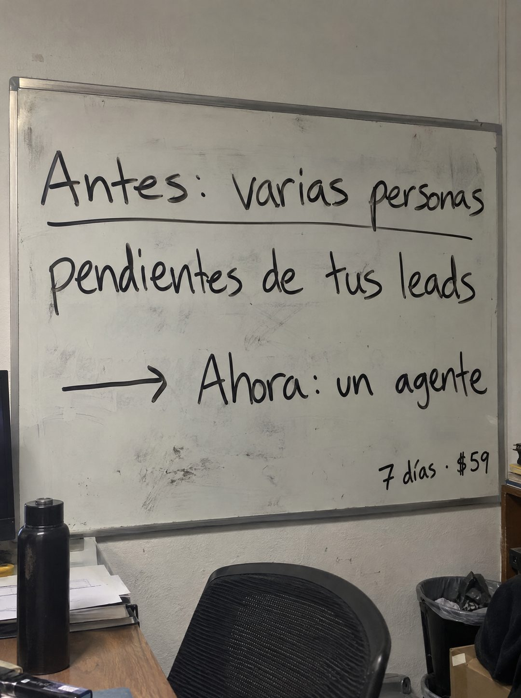

# 104 · Pizarra blanca de antes y ahora

**Familia:** Objeto físico con texto · **Necesitas:** Nada · **Resultado en Meta:** Sin datos propios todavía



## Qué es
Una pizarra blanca de oficina, algo gastada, con un antes y un después escrito con marcador negro: arriba cómo se trabaja hoy y, tras una flecha, cómo se trabaja con tu producto. La oferta va chica en la esquina.

## Por qué funciona
Es la pizarra donde un equipo anota cómo trabaja, así que se lee como una decisión interna y no como publicidad. El contraste es concreto (varias personas contra un agente) y no necesita adjetivos.

## Cuándo usarlo
Público frío o tibio de negocios con personas dedicadas a una tarea repetitiva. Sirve para mostrar el cambio de proceso en una línea y empujar a probar.

## Así lo hicimos para Imperio
- **Texto en la imagen:** Antes: varias personas (subrayado) / pendientes de tus leads / → Ahora: un agente / 7 días · $59 (chico, abajo a la derecha)
- **Texto principal:**
  > Antes: varias personas pendientes de tus leads. Ahora: un agente. Montalo en 7 dias. $59.
- **Titular:** Varias personas pendientes de tus leads

## Receta para tu marca
- **Escena:** pizarra blanca con marco de aluminio en una pared de oficina, con borrones viejos, y abajo objetos reales (silla, botella, papeles, basurero).
- **Línea de arriba:** Antes: [CÓMO SE HACE HOY EN TU RUBRO], en marcador negro y subrayada.
- **Línea de abajo:** una flecha dibujada y Ahora: [CÓMO SE HACE CON TU PRODUCTO].
- **Oferta:** [TU PLAZO] · [TU PRECIO], chico en la esquina inferior derecha.
- **Colores:** el blanco gastado de la pizarra y la tinta negra; nada de color de marca.
- **Lo que no se toca:** la estructura antes, flecha y ahora, con letra de marcador real y borrones de fondo.

## Prompt con que se hizo el de Imperio (GPT Image 2.5)
```
[Prompt reconstruido mirando la imagen: el original de Imperio no quedó guardado]
Photorealistic phone photo of a slightly worn white dry-erase whiteboard with a thin aluminum frame, mounted on a light gray office wall and shot from a slight angle. Faint ghost marks and smudges from old erased writing. Handwritten in black dry-erase marker, casual print handwriting: top line 'Antes: varias personas' with a long underline, second line 'pendientes de tus leads', then a hand-drawn arrow pointing right followed by 'Ahora: un agente'. Smaller, at the bottom right corner of the board: '7 días · $59'. Below the board, partly in frame: the back of a black mesh office chair, a matte black water bottle and a stack of papers on a wooden desk at the left, and a trash bin with a black bag at the right. Flat indoor light, realistic. Vertical 4:5 Instagram/Facebook feed ad, sharp and professional. All on-image text is Spanish and must be rendered EXACTLY as written inside the quotes, with every accent and ñ correct and every digit exact. Never use inverted question marks or inverted exclamation marks. No em dashes. Do not add any other words, logos or watermarks.
```

## Ojo
- El 'Ahora' tiene que ser verdad: no prometas que tu producto reemplaza a un equipo si en la práctica alguien lo sigue supervisando.
- Marca la casilla de contenido generado por IA en el Administrador de anuncios.
