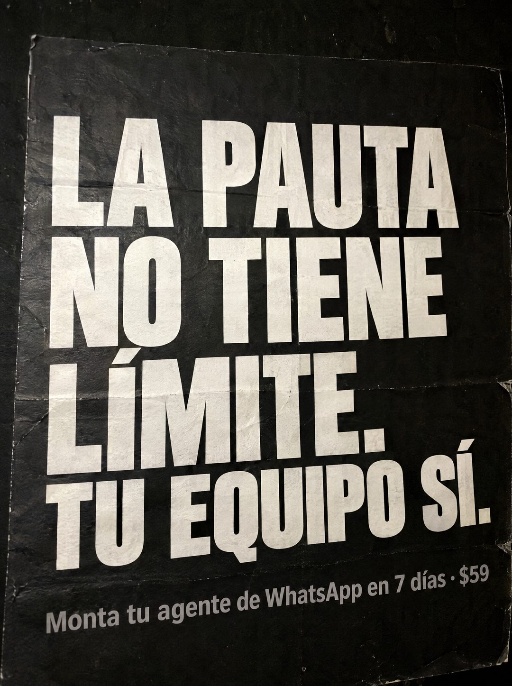

# 105 · Afiche negro de dos golpes

**Familia:** Tipografía dura · **Necesitas:** Nada · **Resultado en Meta:** Sin datos propios todavía



## Qué es
Un afiche negro impreso, con dobleces y arrugas, que lleva solo una frase en mayúsculas blancas gigantes y la oferta en gris al pie. La frase tiene dos golpes: una verdad que el cliente acepta y un remate corto que le da vuelta.

## Por qué funciona
Afirma algo concreto sin esconderse detrás de una foto: el límite no está en la publicidad, está en las personas. La textura de papel real le quita cara de diseño y el remate de tres palabras se lee en un segundo.

## Cuándo usarlo
Público frío que ya invierte en anuncios. Sirve para negocios que venden capacidad (automatización, personal, sistemas) y quieren frenar el scroll con una idea tajante.

## Así lo hicimos para Imperio
- **Texto en la imagen:** LA PAUTA NO TIENE LÍMITE. TU EQUIPO SÍ. / Monta tu agente de WhatsApp en 7 días · $59 (gris, abajo)
- **Texto principal:**
  > La pauta no tiene límite. Tu equipo sí. Monta el agente que escala lo que tu gente no puede. 7 dias. $59.
- **Titular:** La pauta no tiene límite. Tu equipo sí.

## Receta para tu marca
- **Formato:** foto cercana de un afiche negro impreso, con dobleces, arrugas y bordes gastados.
- **Titular:** dos frases en mayúsculas blancas condensadas que ocupan casi todo el afiche: [LO QUE NO TIENE LÍMITE] NO TIENE LÍMITE. [LO QUE SÍ LO TIENE] SÍ.
- **Oferta:** una línea gris abajo: [TU ACCIÓN] en [TU PLAZO] · [TU PRECIO].
- **Colores:** fondo negro y letra blanca; si quieres tu color de marca, úsalo solo en la línea chica.
- **Lo que no se toca:** cero imágenes y la estructura de dos golpes con punto final: verdad aceptada, remate corto.

## Prompt con que se hizo el de Imperio (GPT Image 2.5)
```
[Prompt reconstruido mirando la imagen: el original de Imperio no quedó guardado]
Photorealistic close-up phone photo of a printed black poster on a dark wall, filling the frame at a very slight angle. The paper is matte black with visible fold lines, small creases, wrinkles and worn edges. Huge white heavy condensed uppercase sans-serif lettering, left aligned, filling most of the poster: 'LA PAUTA' / 'NO TIENE' / 'LÍMITE.' / 'TU EQUIPO SÍ.', with the last line slightly smaller. Below it, a single line in medium gray sans-serif: 'Monta tu agente de WhatsApp en 7 días · $59'. Slight print grain on the white letters, soft low light, realistic paper texture. Vertical 4:5 Instagram/Facebook feed ad, sharp and professional. All on-image text is Spanish and must be rendered EXACTLY as written inside the quotes, with every accent and ñ correct and every digit exact. Never use inverted question marks or inverted exclamation marks. No em dashes. Do not add any other words, logos or watermarks.
```

## Ojo
- Revisa que las mayúsculas lleven tilde (LÍMITE, SÍ): sin ellas el remate se ve descuidado.
- Marca la casilla de contenido generado por IA en el Administrador de anuncios.
