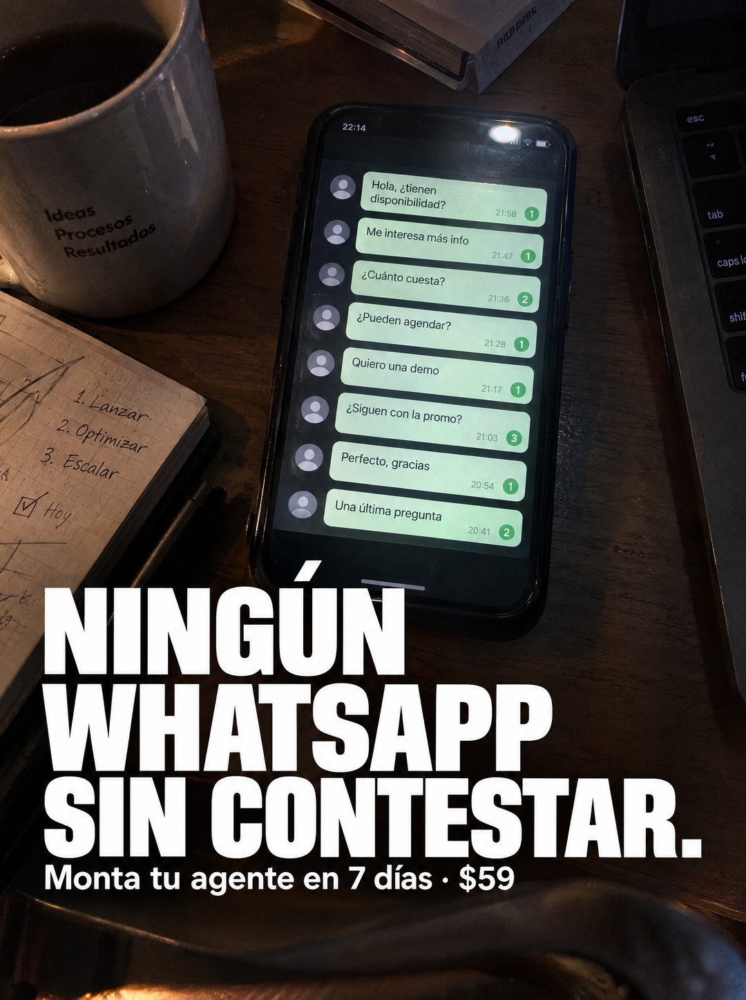

# 106 · Celular con mensajes sin contestar

**Familia:** Foto nativa · **Necesitas:** Nada. Si tienes una foto real de tu escritorio, mejor · **Resultado en Meta:** Sin datos propios todavía



## Qué es
Una foto nocturna de escritorio tomada desde arriba: el celular al centro muestra una columna de mensajes de clientes sin responder, cada uno con su contador verde, y el titular en mayúsculas blancas ocupa la parte de abajo.

## Por qué funciona
La pantalla muestra el problema en vez de describirlo: ocho consultas de compra (precio, agenda, demo, promoción) esperando hace horas. El dueño se reconoce en esa pantalla y el titular convierte la culpa en una promesa simple.

## Cuándo usarlo
Público frío o tibio de negocios que venden por mensajería. Sirve para frenar el scroll con un dolor que se ve y empujar a resolverlo.

## Así lo hicimos para Imperio
- **Texto en la imagen:** Pantalla (22:14): Hola, tienen disponibilidad? / Me interesa más info / Cuánto cuesta? / Pueden agendar? / Quiero una demo / Siguen con la promo? / Perfecto, gracias / Una última pregunta [cada globo con su hora y un contador verde de no leídos] / NINGÚN WHATSAPP SIN CONTESTAR. / Monta tu agente en 7 días · $59 / (fondo: taza con Ideas Procesos Resultados; cuaderno con 1. Lanzar 2. Optimizar 3. Escalar y la casilla Hoy marcada)
- **Texto principal:**
  > Que ningún WhatsApp se quede sin contestar. Monta tu agente de WhatsApp en 7 dias. $59.
- **Titular:** Ningún WhatsApp sin contestar

## Receta para tu marca
- **Escena:** escritorio de madera oscuro, de noche, visto desde arriba: celular al centro, taza, cuaderno con notas a mano y el borde de una laptop.
- **Pantalla:** una columna de 6 a 8 mensajes cortos con intención de compra ([PREGUNTA DE PRECIO], [PREGUNTA DE AGENDA], [PEDIDO DE INFORMACIÓN]), cada uno con hora y contador de no leídos.
- **Titular:** [NINGÚN MENSAJE SIN RESPUESTA EN TU CANAL] en mayúsculas blancas condensadas, abajo, sobre la foto.
- **Oferta:** una línea blanca chica: [TU ACCIÓN] en [TU PLAZO] · [TU PRECIO].
- **Colores:** los de la escena real, cálidos y oscuros; el titular siempre en blanco.
- **Lo que no se toca:** que los mensajes sean preguntas de compra y que las horas muestren que llevan rato esperando.

## Prompt con que se hizo el de Imperio (GPT Image 2.5)
```
[Prompt reconstruido mirando la imagen: el original de Imperio no quedó guardado]
Photorealistic top-down phone photo of a dark wooden desk at night, warm dim lamp light from the side. In the center, a black smartphone lies screen up, showing a dark interface with a vertical column of eight light green message bubbles, each with a gray default avatar circle on the left, a small time stamp and a green unread-count badge: 'Hola, tienen disponibilidad?' 21:58 badge 1, 'Me interesa más info' 21:47 badge 1, 'Cuánto cuesta?' 21:36 badge 2, 'Pueden agendar?' 21:28 badge 1, 'Quiero una demo' 21:17 badge 1, 'Siguen con la promo?' 21:03 badge 3, 'Perfecto, gracias' 20:54 badge 1, 'Una última pregunta' 20:41 badge 2. The status bar shows '22:14'. Around the phone: a gray ceramic mug of black coffee at the top left with small black printed text 'Ideas' / 'Procesos' / 'Resultados', an open grid notebook at the left with pencil notes '1. Lanzar' / '2. Optimizar' / '3. Escalar' and a ticked box next to 'Hoy', the edge of a laptop keyboard at the right and a closed book at the top. Overlaid on the bottom third, a huge white heavy condensed uppercase sans-serif headline, left aligned: 'NINGÚN' / 'WHATSAPP' / 'SIN CONTESTAR.' and below it a smaller white line: 'Monta tu agente en 7 días · $59'. Moody, realistic, slight film grain. Vertical 4:5 Instagram/Facebook feed ad, sharp and professional. All on-image text is Spanish and must be rendered EXACTLY as written inside the quotes, with every accent and ñ correct and every digit exact. Never use inverted question marks or inverted exclamation marks. No em dashes. Do not add any other words, logos or watermarks.
```

## Ojo
- En el ejemplo de Imperio se colaron signos de apertura en el texto: pide en el prompt que no aparezcan.
- Los mensajes de la pantalla son una escena de ejemplo: no los presentes como capturas de clientes reales.
- Marca la casilla de contenido generado por IA en el Administrador de anuncios.
