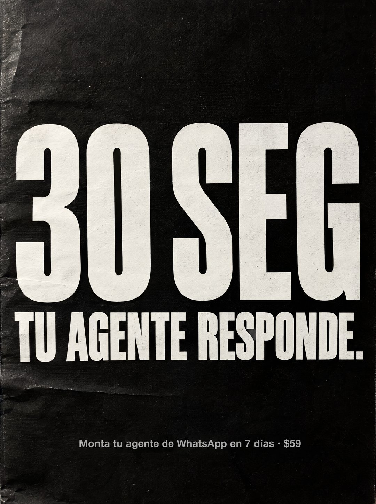

# 107 · Cifra gigante en papel negro

**Familia:** Tipografía dura · **Necesitas:** Nada · **Resultado en Meta:** Sin datos propios todavía



## Qué es
Una hoja negra impresa, con arrugas y textura de papel, donde lo único grande es una cifra con su unidad y una frase corta debajo que dice qué significa. La oferta va en gris, chica, al pie.

## Por qué funciona
La cifra ocupa la mitad de la pieza y se entiende antes de leer: es un dato concreto, no un adjetivo. La frase de abajo traduce el número a beneficio y la textura de papel evita que parezca un banner.

## Cuándo usarlo
Público frío o tibio que compara opciones. Sirve para negocios cuya ventaja cabe en un número verificable (tiempo de respuesta, plazo de entrega, horas ahorradas).

## Así lo hicimos para Imperio
- **Texto en la imagen:** 30 SEG / TU AGENTE RESPONDE. / Monta tu agente de WhatsApp en 7 días · $59 (gris, abajo)
- **Texto principal:**
  > Tu agente responde en 30 segundos. El lead no espera. Monta tu agente en 7 dias. $59.
- **Titular:** Responde en 30 segundos

## Receta para tu marca
- **Formato:** hoja negra impresa con arrugas leves y bordes gastados, fotografiada de frente.
- **Cifra:** [TU NÚMERO] [UNIDAD CORTA] en mayúsculas blancas extracondensadas, a todo el ancho.
- **Frase:** [QUÉ SIGNIFICA ESE NÚMERO PARA EL CLIENTE] en una línea blanca condensada, con punto final.
- **Oferta:** una línea gris chica abajo: [TU ACCIÓN] en [TU PLAZO] · [TU PRECIO].
- **Colores:** negro y blanco; si usas tu color de marca, que sea solo en la línea chica.
- **Lo que no se toca:** una sola cifra, sin imagen ni íconos, con mucho aire negro arriba y abajo.

## Prompt con que se hizo el de Imperio (GPT Image 2.5)
```
[Prompt reconstruido mirando la imagen: el original de Imperio no quedó guardado]
Photorealistic straight-on photo of a sheet of matte black printed paper filling the entire frame, with subtle wrinkles, a soft crease across the lower part, slight print grain and worn edges. In the middle, enormous white extra-condensed uppercase sans-serif characters spanning the full width: '30 SEG'. Directly below, a white condensed uppercase line: 'TU AGENTE RESPONDE.' Lots of empty black space above. Near the bottom, a single small light gray sans-serif line, centered: 'Monta tu agente de WhatsApp en 7 días · $59'. Even soft light, realistic paper texture. Vertical 4:5 Instagram/Facebook feed ad, sharp and professional. All on-image text is Spanish and must be rendered EXACTLY as written inside the quotes, with every accent and ñ correct and every digit exact. Never use inverted question marks or inverted exclamation marks. No em dashes. Do not add any other words, logos or watermarks.
```

## Ojo
- La cifra tiene que ser la que tu producto cumple de verdad: si respondes en dos minutos, no pongas 30 segundos.
- Marca la casilla de contenido generado por IA en el Administrador de anuncios.
