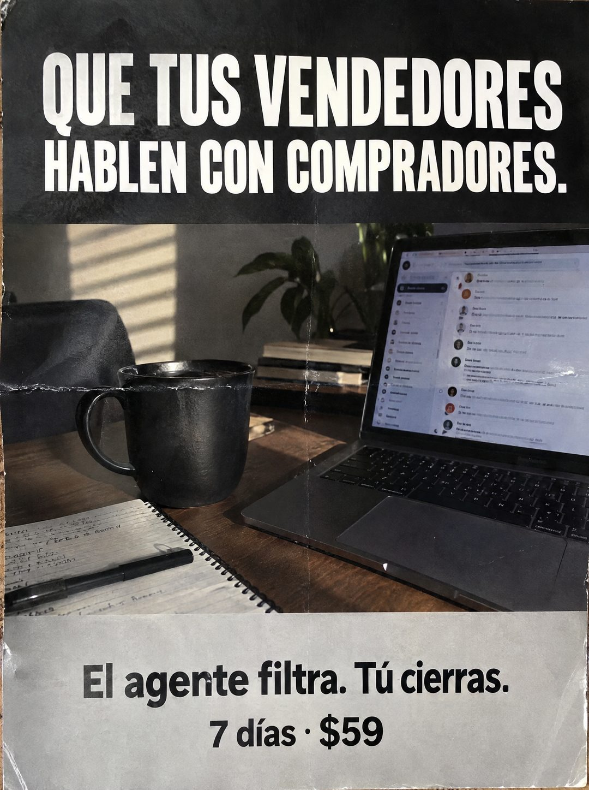

# 108 · Afiche de tres franjas con foto

**Familia:** Objeto físico con texto · **Necesitas:** Nada. Si tienes una foto real de tu lugar de trabajo, mejor · **Resultado en Meta:** Sin datos propios todavía



## Qué es
Un afiche impreso en tres franjas, fotografiado de frente con sus pliegues: arriba una franja negra con el titular en mayúsculas blancas, al medio una foto de escritorio con la bandeja de mensajes abierta y abajo una franja gris con el remate y la oferta.

## Por qué funciona
El titular describe el resultado que quiere quien dirige ventas (que su gente hable con compradores y no con curiosos) y el remate reparte los roles en cuatro palabras. Los pliegues del papel lo sacan del diseño plano y lo acercan a un objeto real.

## Cuándo usarlo
Público tibio de negocios con equipo de ventas que pierde tiempo con consultas que no compran. Sirve para responder la objeción de que sus vendedores ya contestan.

## Así lo hicimos para Imperio
- **Texto en la imagen:** QUE TUS VENDEDORES HABLEN CON COMPRADORES. / [foto de escritorio con una laptop que muestra una bandeja de chats desenfocada] / El agente filtra. Tú cierras. / 7 días · $59
- **Texto principal:**
  > Que tus vendedores hablen con compradores. El agente filtra. Tú cierras. Monta tu agente en 7 dias. $59.
- **Titular:** Que tus vendedores hablen con compradores

## Receta para tu marca
- **Formato:** afiche vertical impreso, con pliegues marcados y bordes gastados, fotografiado de frente.
- **Franja de arriba:** fondo negro con [EL RESULTADO QUE QUIERE TU CLIENTE] en mayúsculas blancas condensadas.
- **Foto del medio:** [EL LUGAR DE TRABAJO DE TU CLIENTE] con luz de ventana, la pantalla desenfocada, taza y cuaderno.
- **Franja de abajo:** gris claro, con [LO QUE HACE TU PRODUCTO]. [LO QUE HACE TU CLIENTE]. en negrita negra y debajo [TU PLAZO] · [TU PRECIO].
- **Colores:** negro, blanco y gris; tu color de marca puede ir en la franja de abajo.
- **Lo que no se toca:** el remate de dos frases cortas que reparten roles, y los pliegues del papel.

## Prompt con que se hizo el de Imperio (GPT Image 2.5)
```
[Prompt reconstruido mirando la imagen: el original de Imperio no quedó guardado]
Photorealistic straight-on phone photo of a printed vertical poster with visible fold lines, small creases, slight wrinkles and worn edges, filling the frame. The poster has three bands. Top band: solid black with a large white condensed uppercase sans-serif headline, centered on two lines: 'QUE TUS VENDEDORES' / 'HABLEN CON COMPRADORES.' Middle band: a warm natural photo of a wooden desk by a window with striped sunlight on the wall, a black ceramic mug, a spiral notebook with illegible handwriting and a black pen, a green plant, a small stack of books, and an open silver laptop showing a messaging inbox with small avatars and rows of text, out of focus and illegible. Bottom band: light gray with bold black sans-serif text, centered: 'El agente filtra. Tú cierras.' and below, larger: '7 días · $59'. Realistic print texture, soft even light. Vertical 4:5 Instagram/Facebook feed ad, sharp and professional. All on-image text is Spanish and must be rendered EXACTLY as written inside the quotes, with every accent and ñ correct and every digit exact. Never use inverted question marks or inverted exclamation marks. No em dashes. Do not add any other words, logos or watermarks.
```

## Ojo
- Cualquier pantalla de la foto va desenfocada: no muestres nombres ni mensajes de personas reales.
- Marca la casilla de contenido generado por IA en el Administrador de anuncios.
