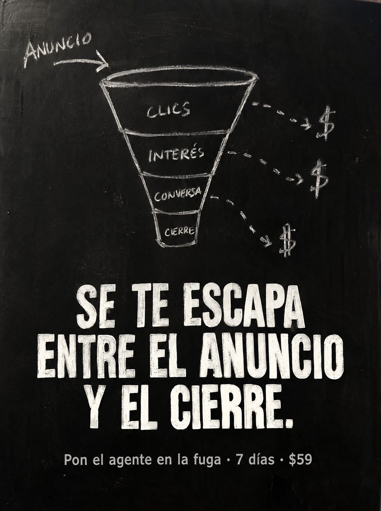

# 109 · Embudo con fugas en tiza

**Familia:** Diagrama y dato · **Necesitas:** Nada · **Resultado en Meta:** Sin datos propios todavía



## Qué es
Una pizarra negra con un embudo de ventas dibujado con tiza, donde cada etapa tiene una flecha punteada que se va hacia un signo de dólar. Debajo, el titular en mayúsculas de tiza dice dónde se pierde el dinero y la oferta va en una línea chica.

## Por qué funciona
El dibujo explica el problema en dos segundos: el dinero no se pierde en el anuncio, se escurre por los costados del embudo. Parece una clase o una reunión de estrategia, y la tiza le da cara de explicación honesta y no de diseño.

## Cuándo usarlo
Público frío o tibio que invierte en publicidad y no entiende por qué no vende. Sirve para negocios que resuelven una etapa concreta del proceso de venta y quieren mostrar dónde actúan.

## Así lo hicimos para Imperio
- **Texto en la imagen:** ANUNCIO (con flecha hacia el embudo) / CLICS / INTERÉS / CONVERSA / CIERRE (etapas del embudo, con flechas punteadas que se escapan hacia tres signos $) / SE TE ESCAPA ENTRE EL ANUNCIO Y EL CIERRE. / Pon el agente en la fuga · 7 días · $59 (gris, abajo)
- **Texto principal:**
  > Así se te escapa el dinero entre el anuncio y el cierre. Pon el agente en la fuga. 7 dias. $59.
- **Titular:** Se te escapa entre el anuncio y el cierre

## Receta para tu marca
- **Escena:** pizarra negra de tiza, con polvo y borrones, a todo el cuadro.
- **Diagrama:** [DE DÓNDE LLEGA TU CLIENTE] con una flecha que entra a un embudo de 4 etapas ([ETAPA 1] / [ETAPA 2] / [ETAPA 3] / [ETAPA FINAL]) y flechas punteadas que salen hacia signos $.
- **Titular:** [DÓNDE SE PIERDE EL DINERO EN TU RUBRO] en mayúsculas de tiza, grandes y centradas.
- **Oferta:** una línea gris chica: [DÓNDE ACTÚA TU PRODUCTO] · [TU PLAZO] · [TU PRECIO].
- **Colores:** negro de pizarra y blanco tiza; nada de color de marca.
- **Lo que no se toca:** las fugas hacia los signos $, que son la idea del anuncio.

## Prompt con que se hizo el de Imperio (GPT Image 2.5)
```
[Prompt reconstruido mirando la imagen: el original de Imperio no quedó guardado]
Photorealistic photo of a black chalkboard filling the entire frame, with chalk dust, faint eraser smudges and a slightly uneven surface. Top half: a hand-drawn chalk sales funnel. At the top left, the word 'ANUNCIO' in chalk with a curved arrow pointing into the wide mouth of the funnel. The funnel has four stacked sections labeled in small uppercase chalk letters: 'CLICS', 'INTERÉS', 'CONVERSA', 'CIERRE'. From the right side of the first three sections, dashed chalk arrows curve outward to three hand-drawn dollar signs '$'. Bottom half: large bold uppercase chalk-textured block letters, centered on three lines: 'SE TE ESCAPA' / 'ENTRE EL ANUNCIO' / 'Y EL CIERRE.' At the very bottom, a small light gray sans-serif line: 'Pon el agente en la fuga · 7 días · $59'. Soft even light, realistic chalk texture. Vertical 4:5 Instagram/Facebook feed ad, sharp and professional. All on-image text is Spanish and must be rendered EXACTLY as written inside the quotes, with every accent and ñ correct and every digit exact. Never use inverted question marks or inverted exclamation marks. No em dashes. Do not add any other words, logos or watermarks.
```

## Ojo
- Nombra las etapas como las vive tu cliente: si usas jerga de marketing, el dibujo deja de explicar.
- Marca la casilla de contenido generado por IA en el Administrador de anuncios.
