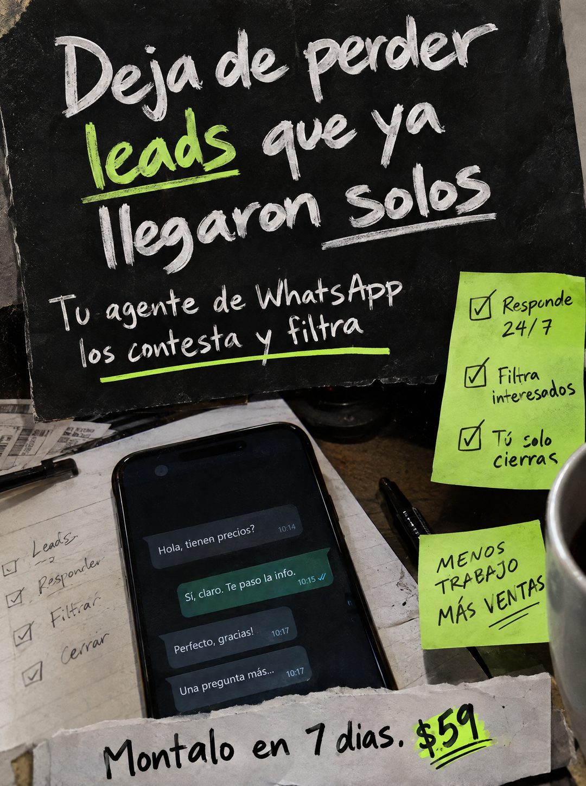

# 110 · Collage de papeles rasgados y post-its

**Familia:** Objeto físico con texto · **Necesitas:** Nada · **Resultado en Meta:** Sin datos propios todavía



## Qué es
Un collage fotográfico de escritorio armado con papeles: cartulina negra rasgada con el titular a tiza, post-its verde neón con los beneficios marcados, un celular con una conversación de ejemplo y una tira de papel rasgado con la oferta.

## Por qué funciona
Cada pedazo de papel cuenta una parte (dolor, beneficios, cómo funciona, precio) y el ojo los recorre en orden sin sentir que lee un anuncio. El verde neón repetido amarra la pieza y marca lo que importa: los leads y el precio.

## Cuándo usarlo
Público tibio que ya entiende el problema y quiere ver cómo se resuelve. Sirve para ofertas con varios beneficios concretos que tienen que caber en una sola pieza.

## Así lo hicimos para Imperio
- **Texto en la imagen:** Deja de perder leads que ya llegaron solos (tiza sobre cartulina negra rasgada, leads en verde) / Tu agente de WhatsApp los contesta y filtra / Post-it verde: Responde 24/7 / Filtra interesados / Tú solo cierras / Post-it verde: MENOS TRABAJO MÁS VENTAS / Pantalla: Hola, tienen precios? / Sí, claro. Te paso la info. / Perfecto, gracias! / Una pregunta más... / [hoja con checklist a mano: Leads, Responder, Filtrar, Cerrar] / Montalo en 7 dias. $59 (tira de papel rasgado, $59 resaltado en verde)
- **Texto principal:**
  > Deja de perder leads que ya llegaron solos. Tu agente de WhatsApp los contesta y filtra. Montalo en 7 dias. $59.
- **Titular:** Deja de perder leads que ya llegaron solos

## Receta para tu marca
- **Escena:** escritorio desordenado con luz baja, visto desde arriba: hoja con checklist a mano, lápiz, taza y un celular al centro.
- **Titular:** [EL DOLOR DE TU CLIENTE EN UNA FRASE] a tiza blanca sobre cartulina negra rasgada, con [LA PALABRA CLAVE] en verde y subrayada.
- **Beneficios:** un post-it neón con tres casillas marcadas ([BENEFICIO 1] / [BENEFICIO 2] / [BENEFICIO 3]) y otro con [TU FRASE CORTA DE RESULTADO].
- **Pantalla:** una conversación corta de ejemplo de tu producto respondiendo una consulta.
- **Oferta:** tira de papel rasgado al pie: [TU ACCIÓN] en [TU PLAZO]. [TU PRECIO], con el precio resaltado.
- **Lo que no se toca:** que todo se vea pegado a mano sobre un escritorio real, con un solo color de acento repetido.

## Prompt con que se hizo el de Imperio (GPT Image 2.5)
```
[Prompt reconstruido mirando la imagen: el original de Imperio no quedó guardado]
Photorealistic mixed-media desk collage photo, vertical, moody low warm light, seen from above. Top half: a large piece of torn black cardstock with rough edges, written in white chalk-style handwriting: 'Deja de perder' / 'leads que ya' / 'llegaron solos', with the word 'leads' in neon green chalk underlined in green and the word 'solos' underlined in white. Below on the same black paper, smaller white chalk handwriting: 'Tu agente de WhatsApp' / 'los contesta y filtra' with a neon green underline. On the right, a neon green sticky note with three hand-drawn ticked boxes and black marker handwriting: 'Responde 24/7', 'Filtra interesados', 'Tú solo cierras'. Lower right, a second neon green sticky note in black uppercase marker: 'MENOS' / 'TRABAJO' / 'MÁS VENTAS' with a double underline under 'VENTAS'. Center: a black smartphone lying on a sheet of paper, showing a dark chat screen with four bubbles: incoming 'Hola, tienen precios?' 10:14, outgoing green 'Sí, claro. Te paso la info.' 10:15 with blue double check marks, incoming 'Perfecto, gracias!' 10:17, incoming 'Una pregunta más...' 10:17. Left: a sheet of lined paper with a handwritten checklist with ticked boxes 'Leads', 'Responder', 'Filtrar', 'Cerrar', a black pen, and crumpled receipts at the top left. Right edge: part of a gray mug. Bottom: a torn strip of white paper with bold black marker handwriting 'Móntalo en 7 días.' and '$59' highlighted with a neon green marker swipe and underlined twice. Realistic paper textures and shadows. Vertical 4:5 Instagram/Facebook feed ad, sharp and professional. All on-image text is Spanish and must be rendered EXACTLY as written inside the quotes, with every accent and ñ correct and every digit exact. Never use inverted question marks or inverted exclamation marks. No em dashes. Do not add any other words, logos or watermarks.
```

## Ojo
- La conversación del celular es una demostración de tu producto: no la presentes como el chat de un cliente real.
- Revisa las tildes antes de publicar: en el ejemplo de Imperio salió 'Montalo en 7 dias' sin tildes.
- Marca la casilla de contenido generado por IA en el Administrador de anuncios.
