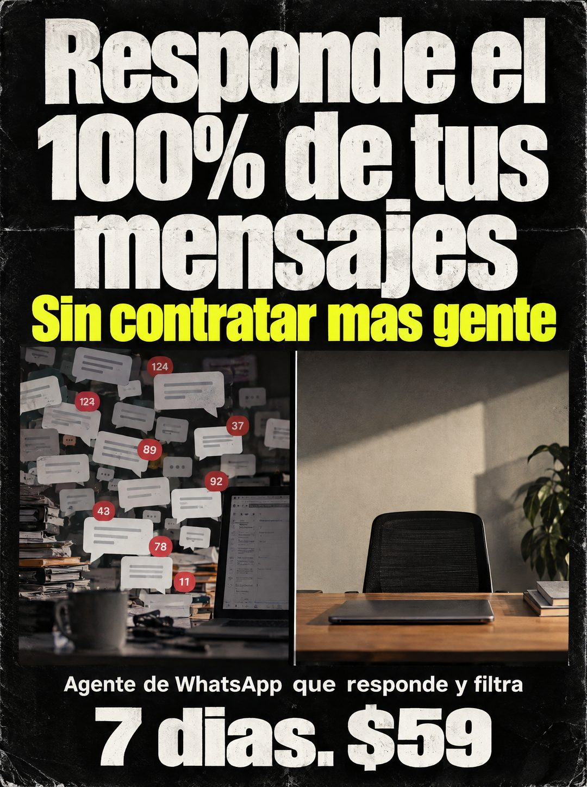

# 111 · Afiche grunge de caos contra calma

**Familia:** Diagrama y dato · **Necesitas:** Nada · **Resultado en Meta:** Sin datos propios todavía



## Qué es
Un afiche negro con textura gastada: titular blanco enorme arriba, una línea amarilla que quita la objeción y, al medio, dos fotos lado a lado, el escritorio desbordado de mensajes contra un escritorio tranquilo. Abajo, qué es y cuánto cuesta en letra gigante.

## Por qué funciona
La comparación se entiende sin leer: a la izquierda el caos con contadores rojos, a la derecha la calma. El titular promete algo medible (el 100%) y la línea amarilla responde la objeción del costo antes de que aparezca: sin contratar más gente.

## Cuándo usarlo
Público frío o tibio de negocios saturados de consultas. Sirve para responder la objeción de tener que contratar a alguien y mostrar el cambio en una sola mirada.

## Así lo hicimos para Imperio
- **Texto en la imagen:** Responde el 100% de tus mensajes / Sin contratar mas gente (amarillo) / [foto izquierda: escritorio desbordado de papeles con globos de chat y contadores rojos 124, 37, 89, 92, 43, 78, 11] / [foto derecha: escritorio ordenado y tranquilo, con la silla vacía] / Agente de WhatsApp que responde y filtra / 7 dias. $59
- **Texto principal:**
  > Responde el 100% de tus mensajes sin contratar más gente. Agente de WhatsApp que responde y filtra. 7 dias. $59.
- **Titular:** Responde el 100% sin contratar más gente

## Receta para tu marca
- **Formato:** afiche negro con textura de papel gastado, bordes rotos y grano.
- **Titular:** [TU PROMESA CON UN NÚMERO] en blanco, muy grande, y debajo [LA OBJECIÓN QUE ELIMINAS] en amarillo.
- **Comparación:** dos fotos lado a lado: [EL CAOS DE HOY EN TU RUBRO] a la izquierda y [LA CALMA CON TU PRODUCTO] a la derecha.
- **Cierre:** [QUÉ ES TU PRODUCTO EN UNA LÍNEA] y abajo [TU PLAZO]. [TU PRECIO] en letra gigante.
- **Colores:** negro, blanco y un amarillo de acento; puedes cambiar el amarillo por tu color de marca si es claro.
- **Lo que no se toca:** dos fotos del mismo tipo de lugar, una saturada y otra tranquila, para que la única diferencia sea el problema.

## Prompt con que se hizo el de Imperio (GPT Image 2.5)
```
[Prompt reconstruido mirando la imagen: el original de Imperio no quedó guardado]
Grungy printed poster photographed flat, vertical, black background with worn paper texture, scratches, dust, torn edges and slight creases. Top: huge distressed white heavy sans-serif lettering, centered on three lines: 'Responde el' / '100% de tus' / 'mensajes'. Directly below, a bold yellow condensed line: 'Sin contratar más gente'. Middle: two photos side by side separated by a thin black gap. Left photo: a chaotic dim desk with towering piles of papers and folders, an open laptop and a coffee mug, with dozens of floating white chat bubbles with gray placeholder lines and red circular notification badges reading '124', '37', '89', '92', '43', '78', '11'. Right photo: the calm version, a clean wooden desk with a closed laptop, an empty black mesh office chair, a plant and a small stack of books, soft warm sunlight on a bare wall. Bottom: a white bold sans-serif line 'Agente de WhatsApp que responde y filtra' and below it huge distressed white letters '7 días. $59'. High contrast, realistic print grain. Vertical 4:5 Instagram/Facebook feed ad, sharp and professional. All on-image text is Spanish and must be rendered EXACTLY as written inside the quotes, with every accent and ñ correct and every digit exact. Never use inverted question marks or inverted exclamation marks. No em dashes. Do not add any other words, logos or watermarks.
```

## Ojo
- Promete el 100% solo si tu producto responde todos los mensajes de verdad, sin excepciones de horario ni de canal.
- Revisa las tildes antes de publicar: en el ejemplo de Imperio salieron 'mas' y 'dias' sin tilde.
- Marca la casilla de contenido generado por IA en el Administrador de anuncios.
