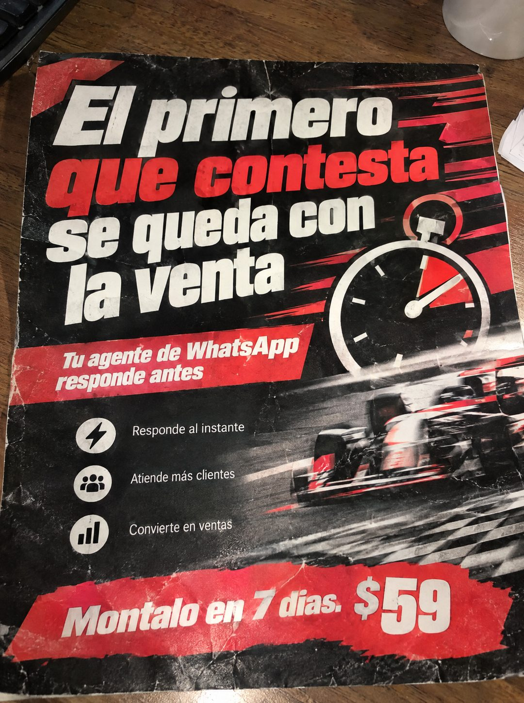

# 112 · Flyer de carreras sobre la mesa

**Familia:** Objeto físico con texto · **Necesitas:** Nada · **Resultado en Meta:** Sin datos propios todavía



## Qué es
Un flyer impreso con estética de carrera (auto de Fórmula 1 borroso, cronómetro, brochazos rojos) sobre una mesa de madera, fotografiado con el celular. Lleva titular, tres beneficios con íconos y el precio en una franja roja.

## Por qué funciona
La metáfora de la carrera hace sentir la velocidad sin explicarla: el que llega primero gana. El titular es una regla que cualquier vendedor acepta, y que se vea como un flyer gastado sobre una mesa lo hace parecer algo que circuló de verdad.

## Cuándo usarlo
Público frío de rubros donde el cliente cotiza con varios a la vez (servicios, inmobiliarias, autos, seguros). Sirve para frenar el scroll y vender rapidez de respuesta.

## Así lo hicimos para Imperio
- **Texto en la imagen:** El primero que contesta se queda con la venta (que contesta en rojo) / Tu agente de WhatsApp responde antes (franja roja) / Responde al instante / Atiende más clientes / Convierte en ventas (con íconos) / Montalo en 7 dias. $59 (franja roja de brocha, abajo)
- **Texto principal:**
  > El primero que contesta se queda con la venta. Tu agente de WhatsApp responde antes. Montalo en 7 dias. $59.
- **Titular:** El primero que contesta se queda con la venta

## Receta para tu marca
- **Escena:** flyer impreso, arrugado y con bordes gastados, sobre una mesa de madera, en foto de celular desde arriba con luz cálida de interior.
- **Visual:** [UNA METÁFORA DE VELOCIDAD O COMPETENCIA] con desenfoque de movimiento y un cronómetro, en negro, blanco y rojo.
- **Titular:** [LA REGLA DE TU RUBRO QUE TODOS ACEPTAN] en blanco, con [LAS PALABRAS CLAVE] en rojo.
- **Beneficios:** una franja roja con [LO QUE HACE TU PRODUCTO] y tres líneas con íconos: [BENEFICIO 1] / [BENEFICIO 2] / [BENEFICIO 3].
- **Oferta:** franja roja de brocha abajo: [TU ACCIÓN] en [TU PLAZO]. [TU PRECIO].
- **Lo que no se toca:** que se vea impreso y usado sobre una mesa real, no como un diseño plano en pantalla.

## Prompt con que se hizo el de Imperio (GPT Image 2.5)
```
[Prompt reconstruido mirando la imagen: el original de Imperio no quedó guardado]
Photorealistic overhead phone photo of a printed flyer lying on a wooden table, slightly crumpled, with creases, worn corners and scuffed ink, warm indoor light; the edge of a dark keyboard at the top left, a white mug at the top right corner and a few papers at the right edge. The flyer design: black background with dynamic red brush strokes and speed streaks. Top left, a bold italic white sans-serif headline on four lines: 'El primero' / 'que contesta' (in bold red) / 'se queda con' / 'la venta'. On the right, a large white stopwatch illustration with a red segment. Lower right, a generic red and white open-wheel race car with heavy motion blur, no logos and no sponsor names. A tilted red banner with white bold italic text: 'Tu agente de WhatsApp' / 'responde antes'. Below it, three white circular icons with text on the right: a lightning bolt with 'Responde al instante', a group of people with 'Atiende más clientes', a bar chart with 'Convierte en ventas'. Bottom: a wide red brush-stroke banner with white bold italic text 'Móntalo en 7 días.' and a bigger '$59'. Realistic paper texture and wear. Vertical 4:5 Instagram/Facebook feed ad, sharp and professional. All on-image text is Spanish and must be rendered EXACTLY as written inside the quotes, with every accent and ñ correct and every digit exact. Never use inverted question marks or inverted exclamation marks. No em dashes. Do not add any other words, logos or watermarks.
```

## Ojo
- No uses autos, escuderías ni patrocinadores reconocibles: el auto tiene que ser genérico y sin logos.
- Revisa las tildes antes de publicar: en el ejemplo de Imperio salió 'Montalo en 7 dias' sin tildes.
- Marca la casilla de contenido generado por IA en el Administrador de anuncios.
