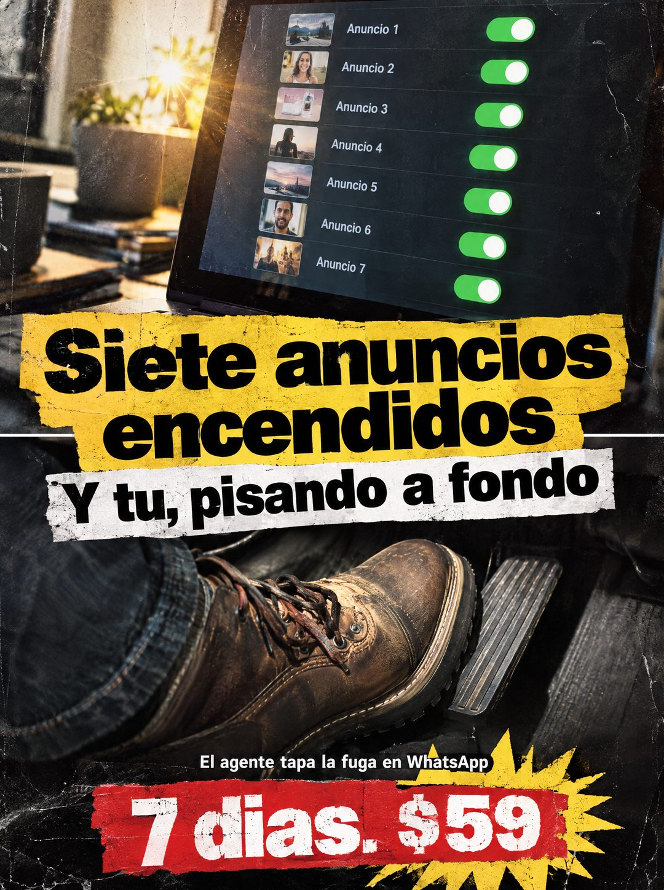

# 113 · Collage del pie en el acelerador

**Familia:** Humor y meme · **Necesitas:** Nada · **Resultado en Meta:** Sin datos propios todavía



## Qué es
Un collage oscuro con etiquetas de papel rasgado: arriba una pantalla con siete anuncios encendidos, al medio el titular en etiquetas amarilla y blanca, y abajo una bota que pisa el acelerador a fondo. La oferta va en una etiqueta roja sobre un estallido amarillo.

## Por qué funciona
Toma una frase hecha (pisar a fondo) y la muestra al pie de la letra, así que se entiende y se recuerda. Le habla al que gasta en anuncios sin mirar qué pasa después, y la última línea dice dónde se va el dinero: la fuga está en WhatsApp.

## Cuándo usarlo
Público frío o tibio que ya invierte en publicidad pagada. Sirve para frenar el scroll con una imagen fuerte y llevar la atención del gasto en anuncios al seguimiento de las consultas.

## Así lo hicimos para Imperio
- **Texto en la imagen:** [pantalla con 7 filas: Anuncio 1 a Anuncio 7, cada una con su miniatura y el interruptor verde encendido] / Siete anuncios encendidos (etiqueta amarilla rasgada) / Y tu, pisando a fondo (etiqueta blanca rasgada) / El agente tapa la fuga en WhatsApp / 7 dias. $59 (etiqueta roja con estallido amarillo)
- **Texto principal:**
  > Siete anuncios encendidos. Y tú, pisando a fondo. El agente tapa la fuga en WhatsApp. 7 dias. $59.
- **Titular:** Siete anuncios encendidos. Y tú, pisando a fondo

## Receta para tu marca
- **Formato:** collage vertical oscuro con textura de afiche gastado y etiquetas de papel rasgado pegadas encima.
- **Arriba:** [LA PANTALLA U OBJETO QUE MUESTRA CUÁNTO INVIERTE TU CLIENTE], con luz cálida de escritorio.
- **Titular:** [LO QUE TU CLIENTE YA HACE] en etiqueta amarilla y [EL REMATE CON UNA FRASE HECHA] en etiqueta blanca, en letra negra gruesa.
- **Imagen:** [LA FRASE HECHA MOSTRADA AL PIE DE LA LETRA], en primer plano.
- **Oferta:** [LO QUE HACE TU PRODUCTO] en blanco y [TU PLAZO]. [TU PRECIO] en etiqueta roja con un estallido amarillo.
- **Lo que no se toca:** la imagen literal de la frase hecha: sin ella queda solo un titular sobre una foto.

## Prompt con que se hizo el de Imperio (GPT Image 2.5)
```
[Prompt reconstruido mirando la imagen: el original de Imperio no quedó guardado]
Gritty vertical poster collage with worn paper texture, scratches and dust, dramatic warm side light. Top third: a close photo of a laptop screen on a desk with a sunlit plant in the background, showing a dark list of seven rows, each with a small photo thumbnail (a landscape, a smiling woman, a product, a woman at sunset, a city skyline, a bearded man, a street scene), a label 'Anuncio 1', 'Anuncio 2', 'Anuncio 3', 'Anuncio 4', 'Anuncio 5', 'Anuncio 6', 'Anuncio 7' and a bright green toggle switch turned on at the right. Middle: two torn paper labels glued on top: a yellow label with huge black heavy sans-serif text 'Siete anuncios' / 'encendidos' and below it a white label with black heavy text 'Y tú, pisando a fondo'. A thin white horizontal line runs behind the labels. Bottom half: a close-up photo of a worn brown leather work boot with laces and dark jeans pressing a car accelerator pedal all the way down, dark car interior. Near the bottom, a small white bold line 'El agente tapa la fuga en WhatsApp' and below it a torn red label with huge distressed white letters '7 días. $59' over a jagged yellow starburst. High contrast, realistic. Vertical 4:5 Instagram/Facebook feed ad, sharp and professional. All on-image text is Spanish and must be rendered EXACTLY as written inside the quotes, with every accent and ñ correct and every digit exact. Never use inverted question marks or inverted exclamation marks. No em dashes. Do not add any other words, logos or watermarks.
```

## Ojo
- Si la pantalla muestra caras en las miniaturas, que sean generadas o tuyas: nunca uses fotos de terceros sin permiso.
- Revisa las tildes antes de publicar: en el ejemplo de Imperio salieron 'Y tu' y '7 dias' sin tilde.
- Marca la casilla de contenido generado por IA en el Administrador de anuncios.
