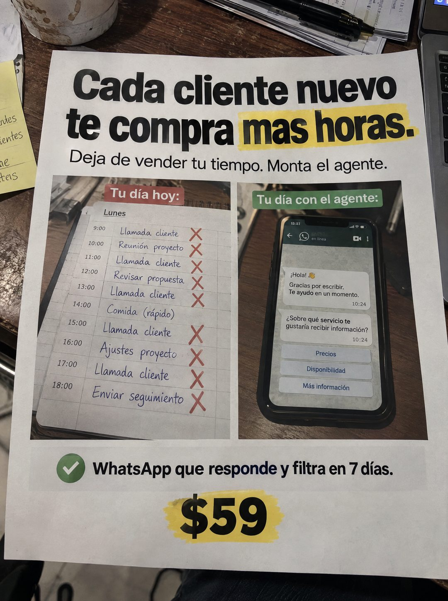

# 114 · Hoja impresa de antes y después

**Familia:** Diagrama y dato · **Necesitas:** Nada · **Resultado en Meta:** Sin datos propios todavía



## Qué es
Una hoja tamaño carta impresa, sostenida sobre un escritorio desordenado, con titular, dos fotos comparadas con etiquetas de color (tu día hoy contra tu día con el agente) y el precio resaltado con marcador amarillo.

## Por qué funciona
Pone dos días lado a lado: una agenda llena de llamadas tachadas contra un chat que atiende solo y ofrece botones. El cliente ve su propia semana en la foto de la izquierda, y la hoja impresa parece material que alguien llevó a una reunión, no un anuncio.

## Cuándo usarlo
Público tibio de profesionales y servicios que cobran por hora y sienten que crecer les quita tiempo. Sirve para mostrar el cambio de rutina y empujar a probar.

## Así lo hicimos para Imperio
- **Texto en la imagen:** Cada cliente nuevo te compra mas horas. (mas horas resaltado en amarillo) / Deja de vender tu tiempo. Monta el agente. / Tu día hoy: [agenda del Lunes de 9:00 a 18:00 con Llamada cliente, Reunión proyecto, Revisar propuesta, Comida (rápido), Ajustes proyecto y Enviar seguimiento, casi todo con X rojas] / Tu día con el agente: Hola! 👋 Gracias por escribir. Te ayudo en un momento. / Sobre qué servicio te gustaría recibir información? / Precios / Disponibilidad / Más información / WhatsApp que responde y filtra en 7 días. / $59 (resaltado en amarillo)
- **Texto principal:**
  > Cada cliente nuevo te compra más horas. Deja de vender tu tiempo. Monta el agente de WhatsApp que responde y filtra. 7 dias. $59.
- **Titular:** Cada cliente nuevo te compra más horas

## Receta para tu marca
- **Escena:** hoja impresa sostenida sobre un escritorio real (taza, papeles, lápiz, laptop), en foto de celular desde arriba.
- **Titular:** [LA PARADOJA DE TU CLIENTE] en negro grueso, con [LAS PALABRAS QUE DUELEN] resaltadas en amarillo, y debajo [LA SALIDA EN UNA FRASE].
- **Comparación:** dos fotos, cada una con su etiqueta: [CÓMO ES HOY] en rojo sobre [UNA AGENDA O LISTA LLENA DE X] y [CÓMO ES CON TU PRODUCTO] en verde sobre [TU PRODUCTO FUNCIONANDO].
- **Cierre:** un check verde con [QUÉ HACE TU PRODUCTO Y EN CUÁNTO TIEMPO] y [TU PRECIO] grande, resaltado en amarillo.
- **Colores:** hoja blanca y negro, con rojo y verde solo en las etiquetas; tu color de marca puede ir en el resaltado.
- **Lo que no se toca:** las etiquetas de color sobre cada foto, que hacen la comparación sin explicarla.

## Prompt con que se hizo el de Imperio (GPT Image 2.5)
```
[Prompt reconstruido mirando la imagen: el original de Imperio no quedó guardado]
Photorealistic overhead phone photo of a printed letter-size white sheet held flat above a cluttered wooden desk, with a stained ceramic mug at the top left, a yellow sticky note with handwriting at the left edge, a stack of papers with a black pen at the top and the corner of a silver laptop at the right. The sheet is printed in black bold sans-serif: a headline on two lines 'Cada cliente nuevo' / 'te compra más horas.' with 'más horas.' highlighted by a yellow marker swipe, and below a regular weight line 'Deja de vender tu tiempo. Monta el agente.' Middle: two photos side by side. Left photo, with a red label 'Tu día hoy:', shows a paper planner page titled 'Lunes' with times from '9:00' to '18:00' and handwritten blue entries 'Llamada cliente', 'Reunión proyecto', 'Llamada cliente', 'Revisar propuesta', 'Llamada cliente', 'Comida (rápido)', 'Llamada cliente', 'Ajustes proyecto', 'Llamada cliente', 'Enviar seguimiento', every entry except lunch marked with a red hand-drawn X. Right photo, with a green label 'Tu día con el agente:', shows a smartphone on a desk with a chat app (generic header, contact name blurred, 'en línea', no app logo): a bubble 'Hola! 👋' / 'Gracias por escribir.' / 'Te ayudo en un momento.' 10:24, a bubble 'Sobre qué servicio te gustaría recibir información?' 10:24, and three button rows 'Precios', 'Disponibilidad', 'Más información'. Below the photos: a light gray bar with a green circle check icon and bold text 'WhatsApp que responde y filtra en 7 días.' and a large bold '$59' highlighted with a yellow marker swipe. Realistic paper, natural light. Vertical 4:5 Instagram/Facebook feed ad, sharp and professional. All on-image text is Spanish and must be rendered EXACTLY as written inside the quotes, with every accent and ñ correct and every digit exact. Never use inverted question marks or inverted exclamation marks. No em dashes. Do not add any other words, logos or watermarks.
```

## Ojo
- En el ejemplo de Imperio se colaron signos de apertura en el texto: pide en el prompt que no aparezcan.
- Revisa tildes y logos antes de publicar: en el ejemplo de Imperio salió 'mas horas' sin tilde y el chat lleva el ícono de WhatsApp, que es de terceros.
- Marca la casilla de contenido generado por IA en el Administrador de anuncios.
