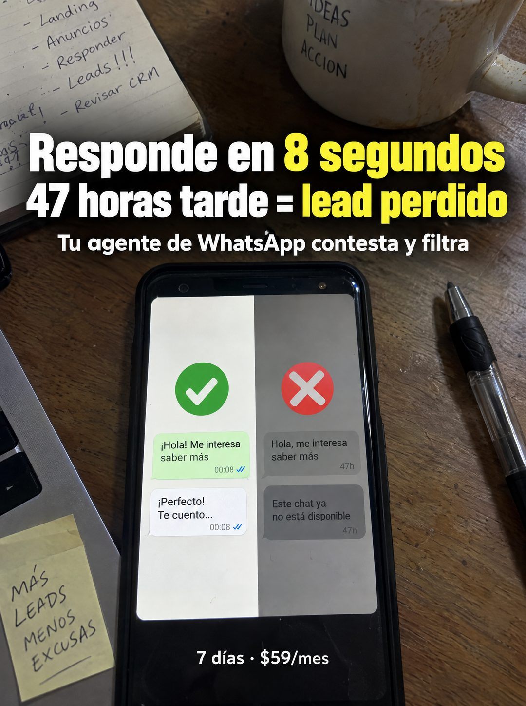

# 115 · Celular con pantalla partida

**Familia:** Diagrama y dato · **Necesitas:** Nada · **Resultado en Meta:** Sin datos propios todavía



## Qué es
Una foto de escritorio desde arriba con el celular al centro y la pantalla partida en dos: a la izquierda, con un check verde, el chat respondido en segundos; a la derecha, en gris y con una X roja, el mismo mensaje sin respuesta a las 47 horas. El titular de dos líneas pone los dos tiempos frente a frente.

## Por qué funciona
Dos números (8 segundos y 47 horas) cuentan toda la historia y el cliente ya sabe en cuál de los dos lados está. La pantalla partida hace la comparación dentro de un objeto cotidiano y el escritorio con notas a mano le da contexto real.

## Cuándo usarlo
Público frío o tibio que recibe consultas y las contesta tarde. Sirve para negocios cuyo beneficio es la rapidez y para mostrar el costo de no responder.

## Así lo hicimos para Imperio
- **Texto en la imagen:** Responde en 8 segundos (8 segundos en amarillo) / 47 horas tarde = lead perdido (lead perdido en amarillo) / Tu agente de WhatsApp contesta y filtra / Pantalla, lado claro con check verde: Hola! Me interesa saber más 00:08 / Perfecto! Te cuento... 00:08 / Lado gris con X roja: Hola, me interesa saber más 47h / Este chat ya no está disponible 47h / 7 días · $59/mes / (fondo: cuaderno con Landing, Anuncios, Responder, Leads!!!, Revisar CRM; taza con IDEAS PLAN ACCION; post-it con MÁS LEADS MENOS EXCUSAS)
- **Texto principal:**
  > Responde en 8 segundos. 47 horas tarde = lead perdido. Tu agente de WhatsApp contesta y filtra. Montalo en 7 dias. $59.
- **Titular:** Responde en 8 segundos

## Receta para tu marca
- **Escena:** escritorio de madera visto desde arriba, con el celular al centro, un cuaderno con lista a mano, taza, lápiz, laptop y un post-it.
- **Pantalla:** partida en dos: izquierda clara con check verde y [LA RESPUESTA RÁPIDA DE TU PRODUCTO]; derecha gris con X roja y [LO QUE PASA CUANDO NADIE RESPONDE].
- **Titular:** [TU PROMESA CON NÚMERO] / [EL COSTO DE NO HACERLO CON NÚMERO], con las cifras clave en amarillo.
- **Bajada:** [QUÉ HACE TU PRODUCTO] en blanco y, abajo, [TU PLAZO] · [TU PRECIO].
- **Colores:** madera y luz natural; verde, rojo y amarillo solo para marcar lo bueno y lo malo.
- **Lo que no se toca:** el mismo mensaje del cliente en los dos lados, para que la única diferencia sea el tiempo.

## Prompt con que se hizo el de Imperio (GPT Image 2.5)
```
[Prompt reconstruido mirando la imagen: el original de Imperio no quedó guardado]
Photorealistic overhead phone photo of a worn wooden desk in soft daylight. In the center, a black smartphone lying screen up with a split screen. Left half: light background with a large green circle check mark icon, a light green bubble 'Hola! Me interesa' / 'saber más' with '00:08' and blue double check marks, and a white bubble 'Perfecto!' / 'Te cuento...' with '00:08' and blue double check marks. Right half: grayed-out background with a large red circle X icon, a gray bubble 'Hola, me interesa' / 'saber más' with '47h', and a darker gray bubble 'Este chat ya' / 'no está disponible' with '47h'. Around the phone: an open notebook at the top left with a handwritten list '- Landing', '- Anuncios', '- Responder', '- Leads!!!', '- Revisar CRM'; a stained white mug at the top right with hand-lettered 'IDEAS' / 'PLAN' / 'ACCIÓN'; a clear ballpoint pen at the right; the corner of a silver laptop at the left with a yellow sticky note reading 'MÁS' / 'LEADS' / 'MENOS' / 'EXCUSAS', underlined. Overlaid near the top, a bold white condensed sans-serif headline with a soft dark shadow: 'Responde en 8 segundos' with '8 segundos' in yellow, a second line '47 horas tarde = lead perdido' with 'lead perdido' in yellow, and a smaller white line 'Tu agente de WhatsApp contesta y filtra'. At the bottom center, over the phone, small white text: '7 días · $59/mes'. Realistic. Vertical 4:5 Instagram/Facebook feed ad, sharp and professional. All on-image text is Spanish and must be rendered EXACTLY as written inside the quotes, with every accent and ñ correct and every digit exact. Never use inverted question marks or inverted exclamation marks. No em dashes. Do not add any other words, logos or watermarks.
```

## Ojo
- En el ejemplo de Imperio se colaron signos de apertura en el texto: pide en el prompt que no aparezcan.
- Usa como promesa el tiempo de respuesta que tu sistema cumple de verdad, no uno ideal.
- Marca la casilla de contenido generado por IA en el Administrador de anuncios.
