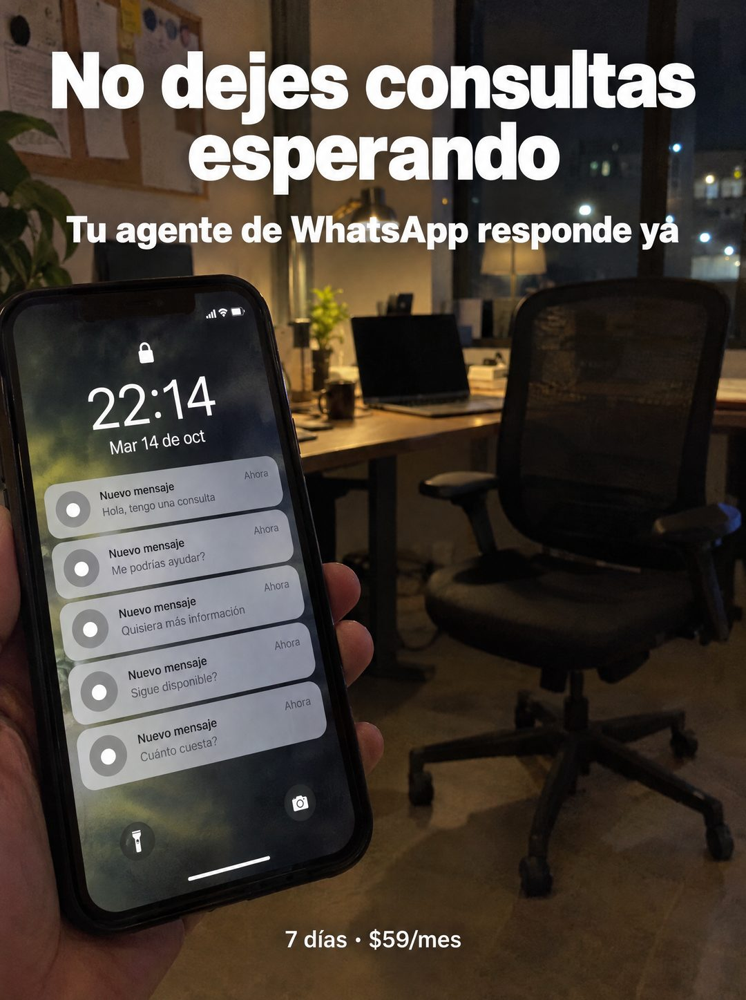

# 116 · Pantalla de bloqueo con consultas

**Familia:** Interfaz creíble · **Necesitas:** Nada · **Resultado en Meta:** Sin datos propios todavía



## Qué es
Una mano sostiene el celular con la pantalla de bloqueo llena de notificaciones de consultas nuevas, de noche, con la oficina vacía y a oscuras detrás. El titular va arriba en blanco y la oferta, chica, al pie.

## Por qué funciona
La pantalla de bloqueo es lo que todos miran decenas de veces al día, así que se lee como una foto propia y no como un anuncio. Cinco consultas a las 22:14 con la silla vacía detrás cuentan, sin palabras, que nadie va a contestar.

## Cuándo usarlo
Público frío de negocios que reciben consultas fuera de horario. Sirve para frenar el scroll con una escena reconocible y vender atención a toda hora.

## Así lo hicimos para Imperio
- **Texto en la imagen:** No dejes consultas esperando / Tu agente de WhatsApp responde ya / Pantalla de bloqueo: 22:14 / Mar 14 de oct / Nuevo mensaje: Hola, tengo una consulta / Nuevo mensaje: Me podrías ayudar? / Nuevo mensaje: Quisiera más información / Nuevo mensaje: Sigue disponible? / Nuevo mensaje: Cuánto cuesta? (todas marcadas Ahora) / 7 días • $59/mes (abajo)
- **Texto principal:**
  > No dejes consultas esperando. Tu agente de WhatsApp responde ya. Montalo en 7 dias. $59.
- **Titular:** No dejes consultas esperando

## Receta para tu marca
- **Escena:** una mano sostiene el celular en primer plano, de noche, con [TU LUGAR DE TRABAJO VACÍO] desenfocado detrás (silla sola, escritorio, luces de ciudad).
- **Pantalla:** pantalla de bloqueo con [UNA HORA FUERA DE HORARIO] y [UNA FECHA], y 4 o 5 notificaciones Nuevo mensaje con [CONSULTAS TÍPICAS DE TU CLIENTE], todas en Ahora.
- **Titular:** [NO DEJES QUE TU CLIENTE ESPERE, DICHO EN TU RUBRO] en blanco grande arriba, con una bajada que diga [LO QUE HACE TU PRODUCTO].
- **Oferta:** [TU PLAZO] • [TU PRECIO] en letra chica blanca al pie.
- **Colores:** los de la escena nocturna; nada de color de marca encima.
- **Lo que no se toca:** la hora tarde en grande y la oficina vacía: juntas dicen que nadie va a contestar.

## Prompt con que se hizo el de Imperio (GPT Image 2.5)
```
[Prompt reconstruido mirando la imagen: el original de Imperio no quedó guardado]
Photorealistic phone photo at night inside a dark modern office. In the foreground on the left, a hand holds a black smartphone showing the lock screen: a lock icon, a large time '22:14', the date 'Mar 14 de oct', and five stacked light gray notifications, each with a plain gray circular icon (no app logo), the bold title 'Nuevo mensaje', the label 'Ahora' at the right and a preview line: 'Hola, tengo una consulta', 'Me podrías ayudar?', 'Quisiera más información', 'Sigue disponible?', 'Cuánto cuesta?'. Flashlight and camera buttons at the bottom of the screen. Background out of focus: an empty black mesh office chair, a desk with a laptop, a mug and a warm desk lamp, a cork board with papers on the left wall, a plant, and a large window with city lights at night. Top: a large bold white sans-serif headline, centered on two lines: 'No dejes consultas' / 'esperando', and below a smaller bold white line 'Tu agente de WhatsApp responde ya'. Bottom center: small white text '7 días • $59/mes'. Natural hand with five fingers, realistic low light. Vertical 4:5 Instagram/Facebook feed ad, sharp and professional. All on-image text is Spanish and must be rendered EXACTLY as written inside the quotes, with every accent and ñ correct and every digit exact. Never use inverted question marks or inverted exclamation marks. No em dashes. Do not add any other words, logos or watermarks.
```

## Ojo
- Si sale texto roto, manos deformes o cifras mal escritas, se rehace.
- Usa íconos genéricos en las notificaciones: nada de logos de apps de terceros.
- Marca la casilla de contenido generado por IA en el Administrador de anuncios.
