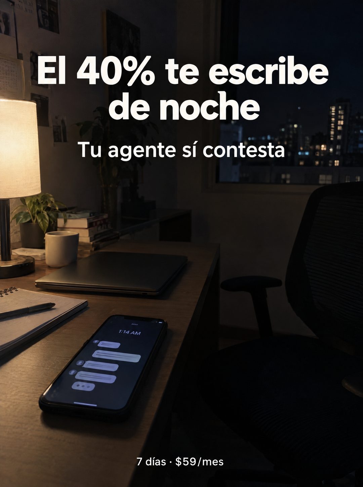

# 117 · Cifra sobre escritorio de noche

**Familia:** Diagrama y dato · **Necesitas:** Una cifra real de tu negocio (por ejemplo, cuándo te escriben) · **Resultado en Meta:** Sin datos propios todavía



## Qué es
Una foto de un escritorio en casa, de noche, con la lámpara encendida, la laptop cerrada y el celular recibiendo mensajes a la 1:14 AM. Encima, un titular blanco con un porcentaje y una bajada que responde.

## Por qué funciona
Un porcentaje concreto convierte una sospecha (me escriben tarde) en un dato que obliga a hacer la cuenta. La escena tranquila, sin nadie y con el celular encendido, muestra el momento exacto en que se pierde la venta.

## Cuándo usarlo
Público frío de negocios con consultas fuera de horario, para frenar el scroll con una cifra. Úsalo solo si tienes el dato real de tu negocio o de una fuente que puedas citar.

## Así lo hicimos para Imperio
- **Texto en la imagen:** El 40% te escribe de noche / Tu agente sí contesta / Pantalla del celular: 1:14 AM [globos de chat sin texto legible] / 7 días · $59/mes (abajo)
- **Texto principal:**
  > El 40% te escribe de noche. Tu agente sí contesta. Montalo en 7 dias. $59.
- **Titular:** El 40% te escribe de noche

## Receta para tu marca
- **Escena:** escritorio en casa, de noche: lámpara encendida, laptop cerrada, taza, cuaderno, planta, ventana con luces de ciudad y la silla vacía.
- **Protagonista:** el celular sobre el escritorio con [UNA HORA DE MADRUGADA] y mensajes entrando, sin texto legible.
- **Titular:** El [TU PORCENTAJE REAL] [LO QUE HACEN TUS CLIENTES FUERA DE HORARIO], en blanco grande arriba.
- **Bajada:** [LO QUE HACE TU PRODUCTO EN ESE MOMENTO] y, al pie, [TU PLAZO] · [TU PRECIO].
- **Colores:** los de la escena nocturna, cálidos y bajos; el texto siempre en blanco.
- **Lo que no se toca:** la cifra arriba y en grande, y la escena sin personas.

## Prompt con que se hizo el de Imperio (GPT Image 2.5)
```
[Prompt reconstruido mirando la imagen: el original de Imperio no quedó guardado]
Photorealistic phone photo of a home office desk at night, dark and moody. On the left, a table lamp with a warm glowing fabric shade lights the scene; next to it a small potted plant, a stack of books and a white mug. On the desk: a closed gray laptop, a spiral notebook with a pen, and in the foreground a black smartphone lying screen up showing '1:14 AM' at the top and a few incoming chat bubbles with blurred placeholder lines, no legible text, plus a typing indicator. On the right, an empty black mesh office chair; in the background a window with city buildings and lit windows at night, and a wall with a few pinned papers. Top: a large bold white rounded sans-serif headline, centered on two lines: 'El 40% te escribe' / 'de noche', and a smaller white line below: 'Tu agente sí contesta'. Bottom center: small white text '7 días · $59/mes'. Realistic low light, slight grain. Vertical 4:5 Instagram/Facebook feed ad, sharp and professional. All on-image text is Spanish and must be rendered EXACTLY as written inside the quotes, with every accent and ñ correct and every digit exact. Never use inverted question marks or inverted exclamation marks. No em dashes. Do not add any other words, logos or watermarks.
```

## Ojo
- Imprime solo cifras reales y verificables: el porcentaje del titular tiene que salir de tus datos o de una fuente que puedas mostrar.
- Marca la casilla de contenido generado por IA en el Administrador de anuncios.
