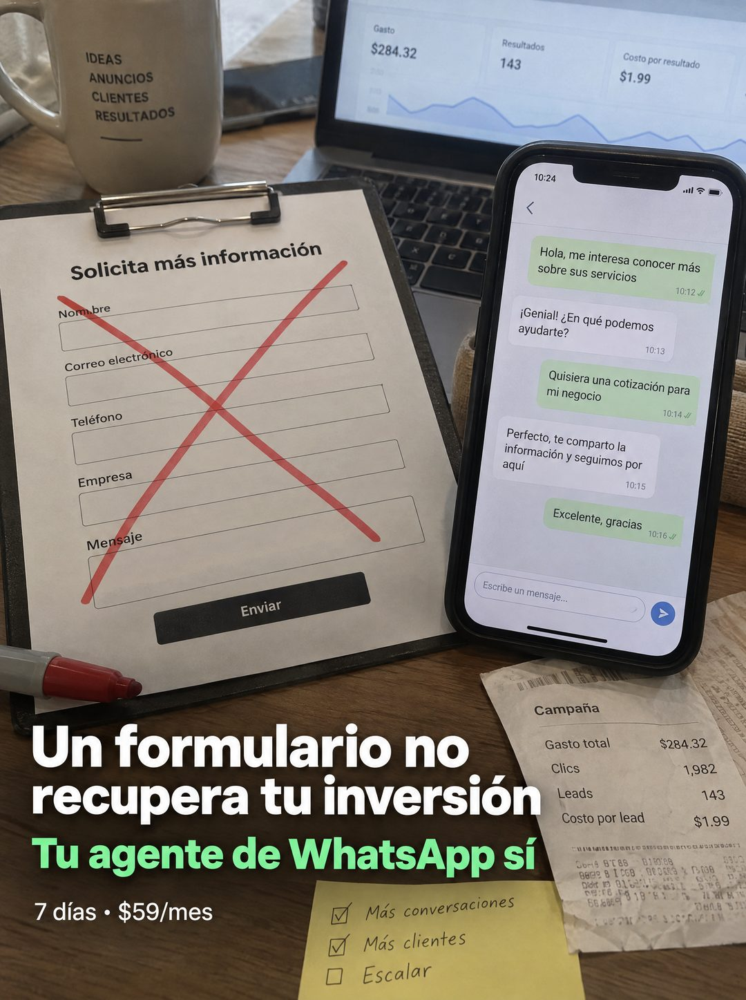

# 118 · Formulario tachado contra chat

**Familia:** Diagrama y dato · **Necesitas:** Nada. Si muestras cifras de campaña, usa las tuyas · **Resultado en Meta:** Sin datos propios todavía



## Qué es
Una escena de escritorio que enfrenta dos formas de recibir clientes: un formulario impreso en un portapapeles, tachado con marcador rojo, contra un celular con una conversación que avanza. Alrededor, el panel de anuncios y una boleta de campaña recuerdan que la inversión ya está hecha.

## Por qué funciona
Tacha algo que el cliente usa hoy (el formulario) y le muestra el reemplazo funcionando al lado, sin explicación. El titular habla de recuperar la inversión, que es lo que le duele al que paga anuncios, y la boleta de campaña lo aterriza en dinero.

## Cuándo usarlo
Público tibio que ya invierte en anuncios con formularios de contacto. Sirve para responder la objeción de que ya tiene un formulario y empujar el cambio de canal.

## Así lo hicimos para Imperio
- **Texto en la imagen:** Portapapeles (tachado con X roja): Solicita más información / Nombre / Correo electrónico / Teléfono / Empresa / Mensaje / Enviar / Celular: Hola, me interesa conocer más sobre sus servicios / Genial! En qué podemos ayudarte? / Quisiera una cotización para mi negocio / Perfecto, te comparto la información y seguimos por aquí / Excelente, gracias / [panel de anuncios en la laptop: Gasto $284.32, Resultados 143, Costo por resultado $1.99] / Boleta: Campaña / Gasto total $284.32 / Clics 1,982 / Leads 143 / Costo por lead $1.99 / Post-it: Más conversaciones / Más clientes / Escalar / Taza: IDEAS ANUNCIOS CLIENTES RESULTADOS / Un formulario no recupera tu inversión / Tu agente de WhatsApp sí (verde) / 7 días • $59/mes
- **Texto principal:**
  > Un formulario no recupera tu inversión. Tu agente de WhatsApp sí. Montalo en 7 dias. $59.
- **Titular:** Un formulario no recupera tu inversión

## Receta para tu marca
- **Escena:** escritorio de madera con luz de día: portapapeles a la izquierda, celular a la derecha, laptop con el panel de anuncios atrás, taza, boleta y post-it.
- **Lo viejo:** [LA HERRAMIENTA QUE TU CLIENTE USA HOY] en papel, tachada con una X roja de marcador.
- **Lo nuevo:** [TU PRODUCTO FUNCIONANDO] en el celular, con una conversación corta de ejemplo que avanza hacia la compra.
- **Titular:** [LO VIEJO] no [EL RESULTADO QUE QUIERE TU CLIENTE] en blanco y [TU PRODUCTO] sí en verde, abajo a la izquierda.
- **Oferta:** [TU PLAZO] • [TU PRECIO] en letra chica blanca.
- **Lo que no se toca:** la X roja sobre lo viejo y lo nuevo funcionando al lado, en la misma foto.

## Prompt con que se hizo el de Imperio (GPT Image 2.5)
```
[Prompt reconstruido mirando la imagen: el original de Imperio no quedó guardado]
Photorealistic phone photo of a wooden desk in soft daylight, slightly angled. Left: a black clipboard holding a printed white form titled 'Solicita más información' with labeled empty fields 'Nombre', 'Correo electrónico', 'Teléfono', 'Empresa', 'Mensaje' and a dark button 'Enviar', crossed out with a big red marker X; a red marker lies at the bottom left. Top left: a white ceramic mug printed 'IDEAS' / 'ANUNCIOS' / 'CLIENTES' / 'RESULTADOS' with a short line below. Top center: an open laptop showing an ads dashboard with three cards, 'Gasto' '$284,32', 'Resultados' '143', 'Costo por resultado' '$1,99', and a blue line chart. Right: a smartphone standing upright showing a light chat screen with the time '10:24': a right-aligned green bubble 'Hola, me interesa conocer más sobre sus servicios' 10:12, a left-aligned white bubble 'Genial! En qué podemos ayudarte?' 10:13, a green bubble 'Quisiera una cotización para mi negocio' 10:14, a white bubble 'Perfecto, te comparto la información y seguimos por aquí' 10:15, a green bubble 'Excelente, gracias' 10:16, and a message field 'Escribe un mensaje...'. Bottom right: a crumpled printed receipt titled 'Campaña' with rows 'Gasto total $284,32', 'Clics 1.982', 'Leads 143', 'Costo por lead $1,99' and faded illegible print below. Bottom center: a yellow sticky note with handwritten checkboxes, two ticked 'Más conversaciones', 'Más clientes' and one empty 'Escalar'. Overlaid at the bottom left: a bold white sans-serif headline 'Un formulario no' / 'recupera tu inversión', a bold green line 'Tu agente de WhatsApp sí', and small white text '7 días • $59/mes'. Realistic. Vertical 4:5 Instagram/Facebook feed ad, sharp and professional. All on-image text is Spanish and must be rendered EXACTLY as written inside the quotes, with every accent and ñ correct and every digit exact. Never use inverted question marks or inverted exclamation marks. No em dashes. Do not add any other words, logos or watermarks.
```

## Ojo
- Las cifras del panel y de la boleta tienen que ser tuyas y reales, o ir desenfocadas: nunca inventes resultados de campaña.
- En el ejemplo de Imperio se colaron signos de apertura en el texto: pide en el prompt que no aparezcan.
- Marca la casilla de contenido generado por IA en el Administrador de anuncios.
